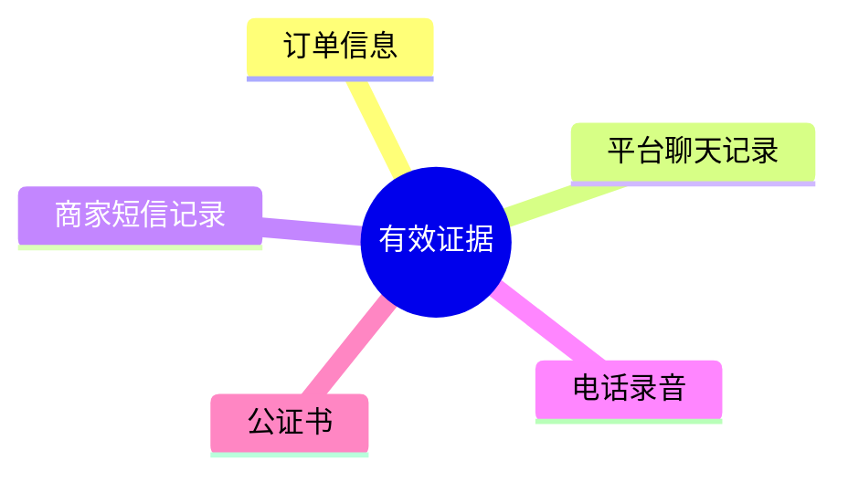
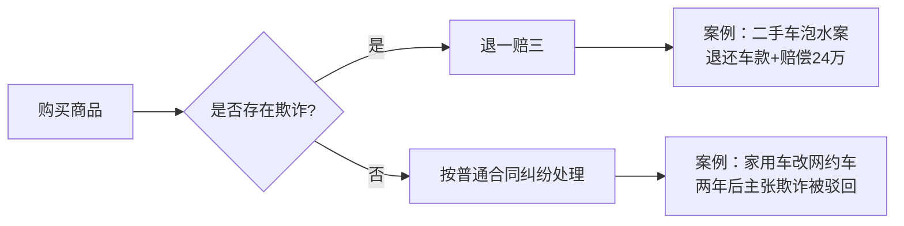

# 第04课：买到假货给差评，被商家骚扰、威胁怎么办？

## Learning Objectives

- 掌握买到假货后通过平台投诉和报警两种维权路径
- 学会收集和保存有效电子证据，了解原始凭证规则
- 理解《民法典》第512条对网购交付时间的认定
- 掌握退一赔三和举证倒置对消费者的保护机制

---

## 一、商家骚扰威胁的常见手段

商家为了掩盖假货事实，常采用以下手段逼迫买家妥协：

- 发送羞辱、谩骂、威逼的短信或电话
- 寄送刀片、冥币等恐吓物品
- 威胁将买家身份信息卖到色情网站
- 威胁上门报复

> [!warning] 商家的行为不仅违反网购平台规则，也违反法律规定。面对威胁不要忍气吞声。

---

## 二、两种维权途径

### 途径一：平台投诉

以淘宝为例，买家可在"我的淘宝"找到对应交易，点击"投诉卖家"，选择"恶意骚扰"维权。

| 处罚等级 | 扣分 | 后果 |
|---------|------|------|
| 一般情节 | 12分 | 曝光量大幅降低，短期内无法正常经营 |
| 情节严重 | 48分 | 永久封店，店主身份证无法再开淘宝店 |

### 途径二：报警

根据《治安管理处罚法》第42条：

> [!law] 《治安管理处罚法》第42条
> 对多次发送淫秽、侮辱、恐吓或者其他信息，干扰他人正常生活的；写恐吓信或者以其他方式威胁他人人身安全的，处**五日以下拘留或者五百元以下罚款**；情节较重的，处**五日以上十日以下拘留，可以并处五百元以下罚款**。

---

## 三、证据收集 —— 维权成败的关键

### 3.1 可作为证据的内容

### 3.2 取证注意事项

> [!danger] 取证三大铁律
> 1. **使用平台内置聊天软件沟通** —— 淘宝加微信的聊天记录，平台维权时不认可
> 2. **电话录音需确认对方身份** —— 接通电话先让商家自报身份，否则警方无法证明是商家本人
> 3. **保存原始凭证** —— 截图可以PS，只有原始设备中的原始记录才是有效证据

### 3.3 证据保全公证

在条件允许的情况下，对原始凭证进行证据保全公证：

- 公信力高，平台和警方一般直接采信
- 即使原始凭证丢失，公证书仍有效
- 也可使用**网络存证平台**，成本低、效果相同

---

## 四、民法典对网购消费者的新保障

> [!law] 《民法典》合同编第512条
> 通过互联网等信息网络订立的电子合同的标的为交付商品并采用快递物流方式交付的，**收货人的签收时间为交付时间**。

这意味着：商品物流信息、签收时间、电子凭证等都具有法律效力，成为产生纠纷时的举证关键。

---

## 五、消费者保护的核心制度

### 5.1 举证倒置原则

> [!tip] 举证倒置
> 对**机动车、电视机、洗衣机、电冰箱**等耐用商品和装饰装修服务，在购买**六个月以内**发生瑕疵和争议的，**由经营者承担举证责任**——即商家自证清白。

### 5.2 退一赔三制度

**适用条件**：经营者存在**欺诈行为**（故意隐瞒真实情况，使消费者作出错误购买决定）。

### 5.3 消费公益诉讼

中国消费者协会以及省级消费者协会，可以公益诉讼主体的身份向人民法院提起诉讼，为消费者维权提供支持——**不需要消费者自己花一分钱**。

### 5.4 假一赔十（食品法）

食品领域的特别惩罚性赔偿规定。

---

## 六、典型案例分析

### 案例一：二手车泡水案（胜诉）

- 女士购买二手车，合同约定"无火烧、无泡水"
- 提车一个月后发现座椅、电瓶有泡水锈蚀痕迹
- 鉴定结果为泡水车
- 法院认定合同欺诈，**判决退一赔三，二审维持原判**

### 案例二：家用车改网约车案（败诉）

- 车主购车两年后，将家用车改为网约车
- 两年行驶10万公里，维修26次
- 主张退一赔三被驳回
- 法院认定：**无法证明商家存在欺诈，属于使用和维修争议**

> [!quote] 诚信原则
> 不管是商家还是消费者，都要遵循诚信原则。商家要诚信经营，消费者也要诚信消费。

---

## 课后思考

1. 网购时商家要求加微信沟通，你应注意什么风险？
2. 收到假货后，第一步应该做什么？
3. 退一赔三的适用前提是什么？

---

> [!summary] 本课小结
> - 买到假货被骚扰，可通过**平台投诉**（扣12-48分）或**报警**（治安拘留）维权
> - 证据收集要注意：使用平台内置聊天、电话录音确认身份、保存原始凭证
> - 法律对消费者有"举证倒置""退一赔三""公益诉讼"等多重保护
> - 诚信是市场经济的基石，消费者和商家都应遵守