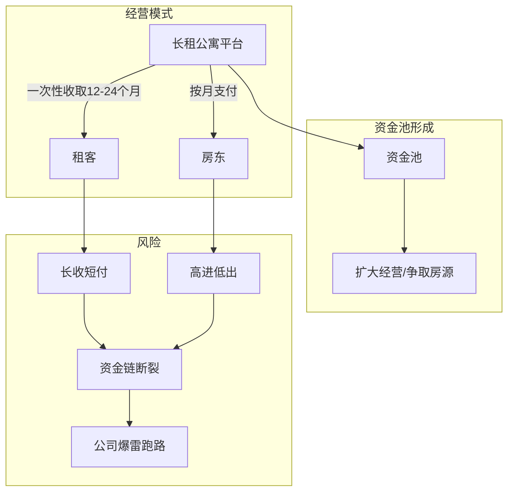
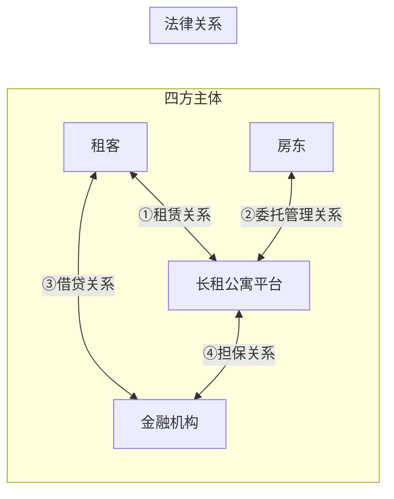
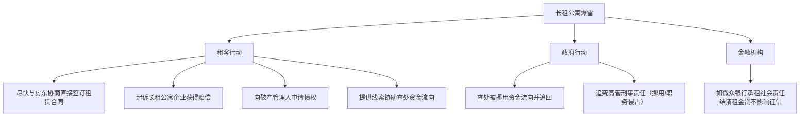

# 第05课：长租公寓暴雷跑路，租金贷又一坑？

## Learning Objectives

- 理解长租公寓"长收短付""高进低出"的商业模式及其风险
- 掌握租金贷的法律结构（四方主体、多重法律关系）
- 学会蛋壳公寓式爆雷后租客和房东的维权策略
- 掌握签订租房合同时避免掉坑的实操建议

---

## 一、长租公寓模式解析

### 1.1 什么是长租公寓

长租公寓（白领公寓/单身合租公寓）是将业主房屋租过来，进行装修改造，配齐家具家电，以单间形式出租的商业模式。

| 类型 | 特点 |
|------|------|
| **集中式** | 利用自有土地开发或楼宇整租改造运营 |
| **分散式** | 整合房东房源，重新装修管理，类似二房东 |

### 1.2 商业模式中的风险基因

**两种危险经营手段：**
- **长收短付**：向租客一次性收12-24个月租金，向房东按月支付
- **高进低出**：向房东承诺较高房费吸引房源，向租客报较低租金吸引入住

---

## 二、租金贷的法律结构

### 2.1 什么是租金贷

租客资金不足时，长租公寓企业鼓励租客与合作的金融机构签订贷款合约，一次性向平台支付长期租金，租客再按月向金融机构还款。

> [!warning] 租金贷本身不是问题，问题在于谁在用、怎么用。

### 2.2 四方主体与多重法律关系

### 2.3 租金贷的坑

爆雷后，租客面临**两难境地**：
1. 房东要求腾房
2. 还要继续偿还租金贷

---

## 三、爆雷后房东与租客的法律关系

### 3.1 房东能否驱赶租客？

> [!law] 《民法典》第722条
> 承租人无正当理由未支付或者迟延支付租金的，出租人可以请求承租人在合理期限内支付；承租人逾期不支付的，出租人可以解除合同。

**结论**：租客已按时缴纳租金，房东无权解除租赁关系。即使房东单方解除与平台的委托管理合同，也**无权直接驱赶租客**。

### 3.2 房东的过激手段及应对

| 房东行为 | 租客应对 |
|---------|---------|
| 断水断电 | 收集证据后搬离，向法院起诉要求房东赔偿损失 |
| 骚扰（进入房屋） | 报警（超过三次可主动搬离，起诉索赔） |

> [!tip] 法院通常会支持租客的损失赔偿请求。

---

## 四、避坑指南

### 4.1 给房东的建议

1. **尽量直接与租客签订合同**，约定压一付三或更长，明确逾期违约金和解除权
2. **如果委托平台出租**，仔细阅读违约条款，明确房屋能动/不能动的范围，收回时恢复原状
3. **最好签居间合同**而非委托管理合同——中介只负责推荐租客，合同仍由房东与租客直接签订

> [!quote] 居间合同模式
> 合同主体三方：甲方（出租方/房东）、乙方（承租方/租客）、丙方（中介/仅负责介绍）

### 4.2 给租客的建议

1. **避免一次性支付6个月以上的租金**，最长不超过半年
2. **尽量与房东直接签署协议**，租金直接交给房东并保留凭证
3. **看清合同性质**：要求由房东作为出租方、平台仅作为委托代管服务方
4. **条款约定**：支付给平台的租金应视为支付给房东，义务已履行完毕

### 4.3 租金贷的监管趋势

> [!law] 住建部通知（2020年9月）
> 针对存在"高进低出""长收短付"行为的住房租赁企业，房产管理部门应将其列入经营异常名单，加强对租金、押金使用等经营情况的监管。

---

## 五、爆雷后的救济措施

---

## 思考题回顾

> [!question] 思考题
> 我租的房子热水器坏了，让房东找师傅来修。师傅修完了，房东说维修费500元由我来承担。我是付还是不付？

**答案要点**：
- 《民法典》第712条：出租人应当履行租赁物的维修义务，但当事人另有约定的除外
- 维修前经业主同意，应由业主承担
- 但如果是**人为破坏或使用不当造成**，由承租人承担
- **核心看合同约定**——合同中约定由谁承担就由谁承担

---

> [!summary] 本课小结
> - 长租公寓的"长收短付+高进低出"模式形成资金池，缺乏监管易爆雷
> - 租金贷涉及四方主体、多重法律关系，爆雷后租客最受伤
> - 蛋壳式爆雷后的法律规则：租客按时交租，房东无权驱赶
> - 避坑核心：房东直接与租客签约，租客避免一次性支付长期租金
> - 2020年后住建部已加强对长租公寓的监管