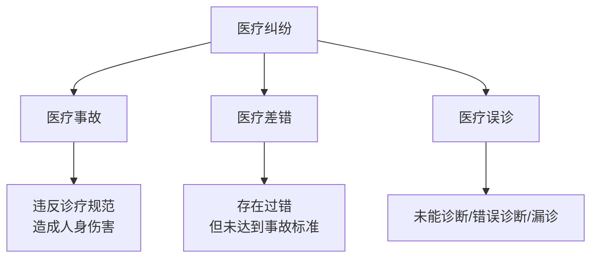
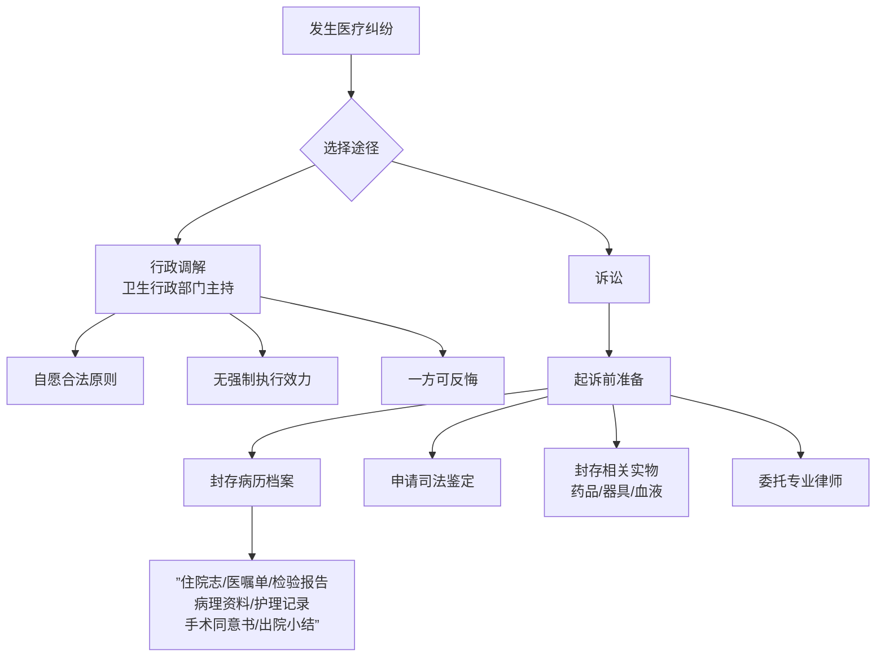

# 第06课：常见的医疗纠纷损害维权需要注意什么？

## Learning Objectives

- 区分医疗事故、医疗差错、医疗误诊三种医疗纠纷类型
- 掌握医疗过错鉴定的申请流程和关键节点
- 理解医疗纠纷中的举证责任倒置原则及其适用范围
- 知道诉讼发生后封存病历、固定证据的具体操作步骤

---

## 一、医疗纠纷的类型

### 1.1 定义

**医疗损害责任纠纷**：患者一方认为在医疗活动中受到损害，要求医疗机构承担侵权责任而引起的纠纷。

### 1.2 三种类型（程度由重到轻）

### 1.3 医疗事故的四级划分

| 级别 | 标准 |
|------|------|
| **一级** | 造成患者死亡、重度残疾 |
| **二级** | 造成患者中度残疾、器官组织损伤导致严重功能障碍 |
| **三级** | 造成患者轻度残疾、器官组织损伤导致一般功能障碍 |
| **四级** | 造成患者明显人身损害的其他后果 |

- **医疗过失责任程度**：完全责任 → 主要责任 → 次要责任 → 轻微责任

---

## 二、医疗纠纷的特点

与其他民事案件相比，医疗纠纷具有以下显著特点：

> [!warning] 医疗纠纷四大特点
> 1. **矛盾大、调解难** —— 医患双方对立情绪严重
> 2. **专业性强、举证难** —— 患者大多不具备医疗专业知识
> 3. **鉴定多、程序难** —— 需要专业鉴定，程序复杂耗时长
> 4. **诉求高、处理难** —— 患者被视为弱势群体，诉讼期望值高

---

## 三、常见医疗纠纷表现形式

### 3.1 误诊

医务人员工作不负责任或专业技术水平未达标，导致未能诊断、错误诊断或漏诊。

> [!example] 误诊案例
> 一位男性因腹痛、恶心、呕吐就诊，医生未进行全身检查即诊断为"急性完全性肠梗阻"并安排手术。手术中发现实为**右侧腹股沟斜疝**，并非肠梗阻，给病人造成不应有的损害。

### 3.2 无证行医与超范围经营

常见于美容场所。根据《民法典》第1222条，**直接推定医疗机构存在过错**。

### 3.3 侵害患者知情权
- 未向患者说明病情和医疗措施
- 未告知治疗风险及替代方案
- 未取得患者明确同意
- 伪造、篡改或违法销毁病历

---

## 四、医疗纠纷的维权流程

### 4.1 诉讼时效

> [!law] 诉讼时效
> 医疗纠纷的诉讼时效为 **三年**，自权利人知道或者应当知道权利受到损害之日起计算。

### 4.2 医院应履行的告知义务

根据《医疗纠纷预防和处理条例》，医患纠纷发生后，医疗机构应向患者告知：
1. 解决医疗纠纷的合法途径
2. 有关病历资料、现场实物封存和启封的规定
3. 有关病历资料的查阅、复制规定
4. 患者死亡的，还应告知近亲属有关尸检的规定

---

## 五、举证责任的分配

### 5.1 举证责任倒置

> [!law] 举证责任倒置
> 依据最高院《关于民事诉讼证据的若干规定》第4条第8项：因医疗行为引起的侵权诉讼，**由医疗机构**就医疗行为与损害结果之间不存在因果关系及不存在医疗过错**承担举证责任**。

即**医院自证清白**。

### 5.2 患者仍需要举证的内容
- 与医院之间存在诊疗关系
- 诊疗行为存在过错
- 是否造成损害
- 过错与损害之间的关系

### 5.3 不适用举证倒置的情形

> [!warning] 以下情形适用"谁主张谁举证"，而非举证倒置：
> - 病历真伪问题
> - 病人在医院摔倒、财务被盗
> - 医院未尽注意义务（护理不周、未给病人穿衣盖被等）
> - 侵犯名誉权、隐私权、处分权等普通民事侵权

---

## 六、两种高败诉风险情形

### 6.1 病历书写不规范

| 类型 | 影响 |
|------|------|
| **实质性影响** | 隐匿、篡改、伪造病历 → 法院推定医方有过错 |
| **非实质性影响** | 病历存在瑕疵但无因果关系 → 不能推定过错 |

### 6.2 无资质和超范围经营

> [!danger] 警惕无资质机构
> 不要因为贪图便宜就去小诊所和没有资质的地方诊疗。一旦发生医疗损害，维权会十分困难。

> [!example] 微整形失败案例
> 一位女士去某医院做去眼袋手术，医生下手太重，导致下眼睑向外翻、眼睛难以完全闭合。经查，该医生**没有资质**。医院承担全部责任，患者可通过协商要求退费或法院起诉。

---

## 思考题回顾

> [!question] 复习题
医疗纠纷诉讼的时效是几年？

**答案**：**三年**。自权利人知道或者应当知道权利受到损害之日起计算。

---

> [!summary] 本课小结
> - 医疗纠纷分为医疗事故、医疗差错、医疗误诊，程度由重到轻
> - 维权路径：行政调解（无强制执行力）或诉讼（有强制执行力）
> - 诉讼时效三年，起诉前务必封存病历、申请司法鉴定
> - 医疗侵权纠纷适用举证责任倒置——医院自证清白
> - 病历书写不规范和无资质经营是患者胜诉的两大有利因素