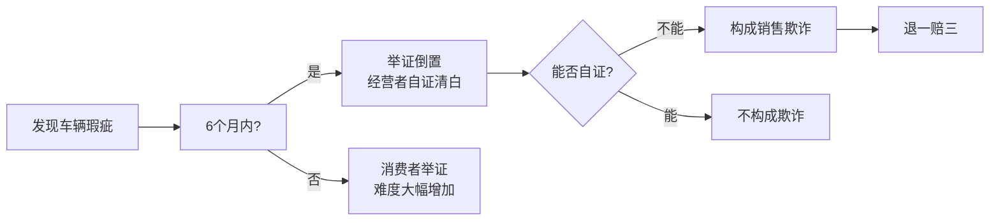
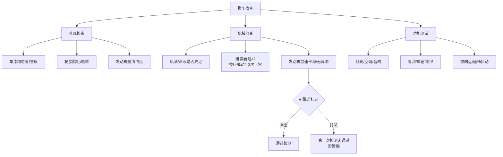

# 第07课：买新车？车主一定要知道的法律点和注意事项

## Learning Objectives

- 掌握提车验车的全流程检查清单
- 理解"退一赔三"的适用条件和举证倒置原则
- 识别商家以瑕疵车、事故车、试驾车充当新车的诈骗手法
- 了解临时牌照的种类、有效期和使用规范

---

## 一、典型案例 —— 退一赔三

> [!example] 王女士购车维权案
> 王女士在某4S店购买宝骏白色轿车，支付7.3万元。一个月后在洗车时发现有维修痕迹。经专业检测：前引擎盖右前方有补漆痕迹、A柱与翼子板凹槽处有锈迹、前引擎盖内左侧螺丝有拆卸痕迹。
> 
> **法院判决**：4S店构成销售欺诈，**退一赔三**——退还7.3万元购车款，赔偿21.9万元（三倍购车款）。

**法律依据**：《消费者权益保护法》第55条第1款 + 第23条第3款（举证倒置）

---

## 二、提车检查全流程清单

### 2.1 证件信息检查（查身份户口）

| 检查项目 | 具体内容 |
|---------|---------|
| **查证** | 发票、合格证、强制产品认证一致性证书、机动车登记证书、车辆使用手册、新车交付确认表、三包凭证、维修保养手册 |
| **查铭牌** | 核对发动机号、车架号、出厂年月日与合格证一致 |
| **查日期** | 出厂日期、到货日期——三个月内正常，超半年即为库存车需仔细检查 |

### 2.2 外观检查

> [!tip] 检查车漆时变换不同光线环境
> 将车辆停在室外光线充足处，变换室内/室外、顺光/逆光不同角度检查：
> - 车漆是否均匀、有无划痕、有无色差
> - 轮胎胎毛是否完整（决定行驶里程）
> - 轮毂尺寸是否匹配

### 2.3 内部及机械检查

---

## 三、六种常见购车陷阱

| 陷阱类型 | 说明 |
|---------|------|
| 1. **瑕疵车当新车卖** | 运输中受损后修理，或试驾车调里程表 |
| 2. **特殊用途车当家用车卖** | 长途试驾车、试验车、驾校教练车 |
| 3. **事故修复车当新车卖** | 在交警大队有案可查，可查维修记录 |
| 4. **黑车当手续齐全车卖** | 被抢车辆——不知情需归还，知情购买则承担刑责 |
| 5. **拼装车当正规车卖** | 无法通过正常途径获得车牌 |
| 6. **出租车当家用车卖** | 使用频率高，磨损大 |

---

## 四、临时牌照注意事项

### 4.1 四种类型

| 类型 | 有效期 | 颜色 |
|------|--------|------|
| 本辖区内临时牌照 | 不超过15天 | 蓝色 |
| 跨区域临时牌照 | 不超过30天 | 黄色 |
| 试验用临时牌照 | — | — |
| 特型机动车临时牌照 | — | — |

### 4.2 悬挂位置

- 前窗：粘贴在车内前风窗玻璃**右上角**，不影响视线位置
- 后窗：粘贴在车内后风窗玻璃**左上角**

> [!warning] 临时牌照过期后上路，将面临**扣车、罚款、扣分**。

---

## 五、销售者的八项法定义务

销售家用汽车时，销售者应当符合以下要求：

1. 向消费者交付车辆的同时交付随车文件
2. 明确告知车辆的性能、用途、使用方法等
3. 提供有效的三包凭证
4. 妥善处理消费者的投诉
5. 按照合同约定提供售后服务
6. 不得销售不符合国家标准的车辆
7. 不得隐瞒车辆的真实情况
8. 法律、法规规定的其他义务

---

## 思考题回顾

> [!question] 思考题
> 我买了一辆新车，确实知道它是新车。但购买后第五个月开车上路发生了交通事故，车子刮蹭掉了漆。我想赖4S店说车子有瑕疵、不是新车，向法院提起退一赔三的诉讼，能成功吗？

**答案**：**不能成功**。因为：
1. 造成损失与商家无关
2. 师傅通过车漆薄厚、掉漆凹凸情况可肉眼分辨新旧伤
3. 第三方技术认定可检测出损害产生的时间和因果关系
4. 诬告将承担法律责任

> [!quote] 诚信消费
> 消费者也要本着诚信消费，不能利用法律工具进行恶意维权。

---

> [!summary] 本课小结
> - 提车时做好"三查"（查证、查铭牌、查日期）+ 外观机械功能全检查
> - 购车6个月内发现瑕疵，举证责任在商家（举证倒置）
> - 商家有欺诈行为可主张退一赔三
> - 警惕六种购车陷阱，保存好所有购车凭证
> - 临时牌照分本辖区（蓝15天）和跨区域（黄30天），过期上路会被处罚