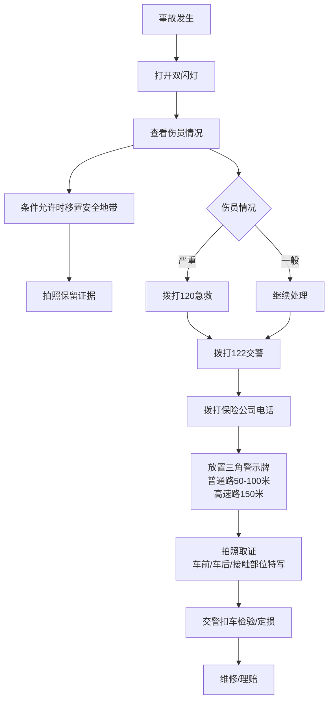
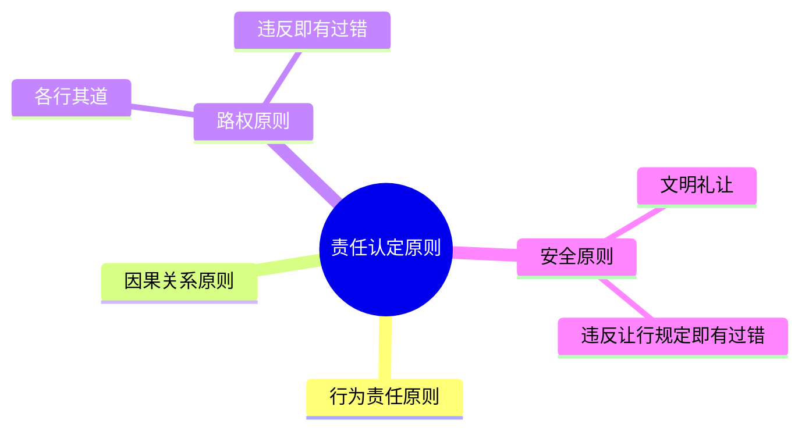

# 第08课：遇到撞车、撞人等意外事故时应该怎么处理？

## Learning Objectives

- 掌握严重事故和轻微事故的现场处理流程
- 理解交通事故责任认定的四大原则（行为责任、因果关系、路权、安全）
- 掌握机动车与行人/非机动车发生事故的责任划分规则
- 了解人身伤亡和财产损失的法定赔偿项目
- 理解交强险的赔偿范围和限额

---

## 一、交通事故现场处理流程

### 1.1 严重事故处理流程

依据《道路交通安全法》第70条：发生交通事故造成人身伤亡的，车辆驾驶人应当**立即停车、保护现场、抢救受伤人员、报告交警**。

### 1.2 轻微事故处理流程

依据《道路交通安全法》第86条：未造成人身伤亡，当事人对事实无争议的，可记录以下信息后撤离现场：

- 事故时间、地点
- 双方姓名、联系方式
- 车牌号、驾驶证号、保险凭证号
- 撞击部位

**双方共同签字后自行协商损害赔偿事宜。**

> [!warning] 双方无法达成一致时，不要挪动车辆——放置警示牌后等待交警到场出具《事故认定书》。

---

## 二、交通事故责任认定

### 2.1 认定四项原则

### 2.2 责任划分规则

| 情形 | 责任承担 |
|------|---------|
| 当事人逃逸 | 承担**全部责任**（对方有过错可减轻） |
| 故意破坏、伪造现场、毁灭证据 | 承担**全部责任** |
| 一方过错导致事故 | **全部责任** |
| 双方过错 | 根据过错程度分为**主要/同等/次要责任** |
| 各方均无过错（意外事故） | 各方**无责任** |

### 2.3 刑事责任触发条件

发生交通事故致人死亡，若满足以下条件，构成**交通肇事罪**：

- 违反交通运输管理法规
- 发生重大事故
- 造成**一人死亡或三人以上重伤**
- 负事故**全部责任或主要责任**

---

## 三、机动车与行人/非机动车的责任划分

### 3.1 法律原则

> [!law] 《道路交通安全法》第76条 —— 严格责任原则
> 机动车与行人、非机动车驾驶人发生交通事故，**一般由机动车一方承担民事责任**，除非证明损害是由受害人**故意**造成的。

### 3.2 行人横穿马路被撞的责任界定

| 情形 | 责任 |
|------|------|
| 行人走人行横道、未闯红灯 | 行人无责，机动车**全责** |
| 行人未走人行横道，在机动车道上被撞 | 机动车**主责**，行人**次责** |
| 行人乱穿马路，与正常行驶机动车相撞 | **行人责任** |
| 行人突然闯入机动车道，刹车无法避免 | 需认定机动车是否超速、刹车是否合规 |
| 机动车不礼让斑马线、强行加速撞人 | **机动车责任** |

### 3.3 非机动车与机动车发生事故

| 情形 | 责任 |
|------|------|
| 非机动车驾驶人无过错 | 机动车**全部赔偿** |
| 非机动车驾驶人有过错（如逆行、闯红灯） | **非机动车驾驶人责任** |
| 双方均无过错 | 双方**协商分担** |
| 非机动车/行人故意造成事故 | 机动车**不承担赔偿责任** |

---

## 四、事故认定时间

| 情形 | 时限 |
|------|------|
| 一般现场勘查 | **10日内**制作认定书 |
| 需要检验鉴定 | **5日内**制作认定书 |
| 调解期限 | **10日** |
| 调解成功 | 制作调解书，双方签字生效 |
| 调解不成功 | 制作调解终结书，当事人可向法院**提起民事诉讼** |

---

## 五、交强险

### 5.1 基本概念

**交强险**（机动车交通事故责任强制保险）：由保险公司对被保险机动车发生道路交通事故造成**本车人员、被保险人以外的**受害人的人身伤亡、财产损失，在责任限额内予以赔偿的强制性责任保险。

### 5.2 关键数据

| 项目 | 数据 |
|------|------|
| 最高赔偿额 | **12.2万元** |
| 不投保后果 | 扣留机动车 + 应缴保费**两倍罚款** |

---

## 六、赔偿项目

### 6.1 财产损失赔偿

1. **维修费用**：维修车辆所支付的费用
2. **车载物品损失**：车辆所载物品的损失
3. **施救费用**：拖车、救援过程中产生的费用
4. **车辆重置费用**：车辆灭失或无法修复时
5. **停运损失**：经营性车辆（如出租车）无法经营的合理停运损失
6. **替代交通费**：非经营性车辆，修车期间的打车费

### 6.2 人身伤亡赔偿

- 医疗费、护理费、误工费
- 残疾赔偿金、死亡赔偿金
- 丧葬费
- 被扶养人生活费
- 精神损害抚慰金

### 6.3 贬值损失

> [!warning] 贬值损失一般不予支持
> 一般情况下，主张维修费用的同时又主张贬值损失的，**法院不予支持**。
> 
> **例外情形**：
> 1. 停在4S店**尚未出售的新车**被刮蹭
> 2. **在售或运输中的新车**受到损害（如运载新车的运输车被撞）

---

## 思考题回顾

> [!question] 思考题
> 我开车赶时间，等红灯后着急启动时追尾了前车。双方车子都没有明显的刮蹭和掉漆，但对方司机一定要我给他400元私了。我该怎么办？

**答案要点**：
- 追尾是**后车全责**
- 虽然肉眼看不见明显痕迹，但对新车车主来说确实有损失
- 可以答应私了（400元并不多）——**花钱买平安，花钱买了事**
- 实际案例：非常轻微的印记，看似500元能解决的事，最后修车花了5000元

---

> [!summary] 本课小结
> - 严重事故：停车→救人→报警→放置警示牌→拍照→定损→维修
> - 轻微事故：记录信息→签字→自行协商（达不成一致则等交警）
> - 责任认定遵循行为责任、因果关系、路权、安全四项原则
> - 机动车与行人/非机动车：一般为机动车责任（严格责任原则）
> - 交强险最高赔12.2万元，不投保要罚款
> - 赔偿项目包括维修费、停运费、替代交通费等，贬值损失一般不赔