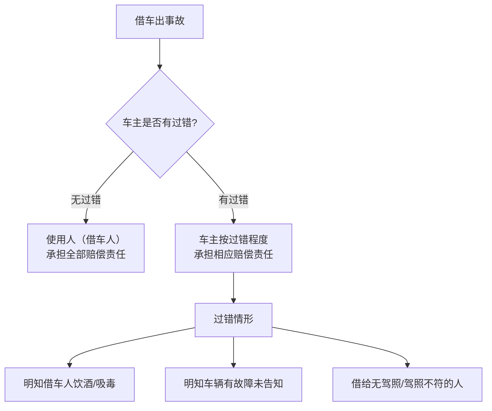

# 第09课：车借别人出现事故，责任由谁担？车牌借给别人有什么风险？

## Learning Objectives

- 掌握借车出事故后"使用人担责、车主有过错才担责"的核心原则
- 学会出借车辆前的"三查"（查车、查照、查人）标准流程
- 理解车牌租赁协议无效的法律后果
- 了解车牌出租人和承租人的双向法律风险

---

## 一、借车出事故 —— 责任由谁承担？

### 1.1 核心法律规则

> [!law] 《民法典》第1209条
> 因租赁、借用等情形，机动车所有人、管理人与使用人不是同一人时，发生交通事故造成损害，属于该机动车一方责任的，**由机动车使用人承担赔偿责任**。机动车所有人、管理人对损害的发生有过错的，承担相应的赔偿责任。



### 1.2 车主的三种过错情形

| 过错情形 | 说明 |
|---------|------|
| 明知借车人饮酒、吸毒仍借车 | 需注意：若借车人**借到车后**才饮酒/吸毒，车主无责 |
| 明知车辆有故障未告知、未维修 | 指动力系统、刹车、轮胎等影响安全行驶的故障 |
| 借给无驾照、驾照吊销或准驾车型不符的人 | 不仅要看有无驾照，还要看**准驾范围**和**有效期** |

---

## 二、出借车辆"三查"标准

> [!tip] 做好"三查"，安心出借
> 1. **查车** —— 检查刹车、制动、车灯、胎压等是否存在故障
> 2. **查照** —— 查验驾照是否合法、准驾车型是否匹配
> 3. **查人** —— 确认借车人是否饮酒、吸毒，精神状态是否正常

**三项都查清楚且没有问题，车主无需担责。**

---

## 三、违法处理与极端情况

### 3.1 借车违章处理

| 情形 | 处理方式 |
|------|---------|
| 能证明是借车人驾驶 | 由借车人处理违章 |
| 不能证明是谁驾驶 | 由**车主**承担违章责任 |

### 3.2 借车人肇事逃逸

**处理步骤**：
1. 暂时承担连带责任（着急用车可先代赔取车）
2. 法院可用**公告方式送达**，为找人提供便利
3. 找到事故人后向其追偿

---

## 四、车牌租赁 —— 一个更大的坑

### 4.1 租赁协议无效

> [!danger] 车牌租赁协议一律无效
> 车牌租赁/指标有偿使用协议，合同目的为租用北京市小客车配置指标，**因违反公共秩序而无效**。无论合同签得多细致，责任约定多清晰，**均不受法律保护**。

**法律依据**：《北京市小客车数量调控暂行规定实施细则》第33条

### 4.2 车牌出租人的风险

```mermaid
flowchart TD
    A[出租车牌] --> B[出租人风险]
    
    B --> C[交通事故责任]
    C --> C1[非法出租车牌本身即为过错]
    C --> C2[可能被法院认定承担相应责任]
    
    B --> D[无法收回车牌]
    D --> D1[承租人不配合时]<br/>行政机关无权强制移走车牌
    D --> D2[导致永久丧失购车指标]
    
    B --> E[行政处罚]
    E --> E1[公布指标作废]
    E --> E2[撤销机动车登记]
    E --> E3[三年内不予受理指标申请]
```

### 4.3 车牌承租人的风险

| 风险类型 | 具体情形 |
|---------|---------|
| **车辆被查封** | 车登记在出租人名下，出租人涉诉时，车辆可能被法院财产保全或执行 |
| **无法办理手续** | 车辆交易过户、投保理赔、补办证照都需要出租人配合 |
| **出租人勒索** | 出租人恶意要求额外报酬才配合办理 |
| **出租人失联** | 承租人无法正常使用和处置车辆 |

> [!warning] 风险警示
> 借他人名义买车，自己出的钱但车登记在别人名下——一旦对方涉诉成为老赖，你的车会被法院查封。你只能作为案外人提出执行异议之诉，维权成本极高。

---

## 五、车牌已借出的补救建议

1. 先处理违章
2. 寻找实际使用人索赔
3. 实在找不到人，**直接向法院起诉**

---

## 思考题回顾

> [!question] 思考题
> 你家的宠物狗借给朋友玩耍。朋友带出去遛狗期间，因为外人的挑逗导致小狗咬伤了人。这种情况下责任由谁承担？

**分析方向**：
- 需考虑《民法典》关于饲养动物损害责任的规定
- 动物饲养人与管理人之间的责任划分
- 第三人挑逗导致动物伤人的介入因素

---

> [!summary] 本课小结
> - 借车出事故：**使用人担责为主，车主有过错才担责**
> - 车主过错三种情形：明知借车人饮酒吸毒、明知车辆有故障、明知无驾照或准驾不符
> - 出借前做好"三查"：查车、查照、查人
> - **车牌租赁协议一律无效**，不受法律保护
> - 出租车牌对出租人和承租人都有巨大法律风险，切勿心存侥幸