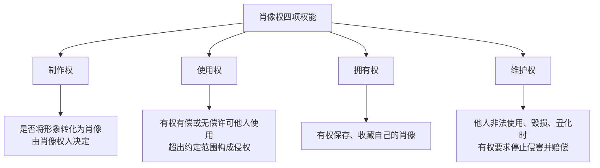
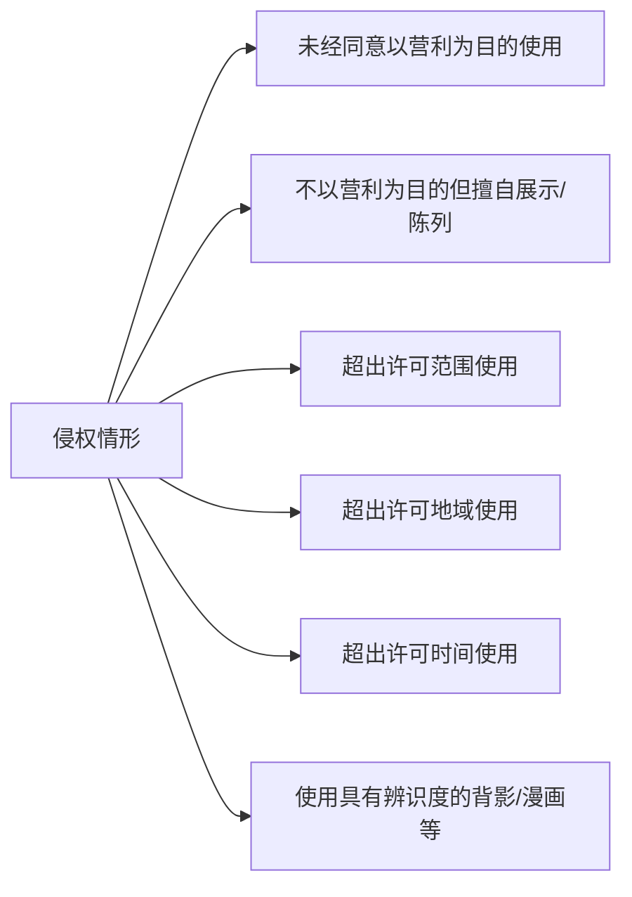
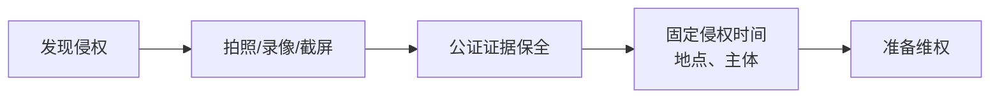

# 第10课：民法典肖像权新规，你的表情包还安全吗？

## Learning Objectives

- 理解肖像权的法律定义与四项权能（制作权、使用权、拥有权、维护权）
- 掌握民法典生效前后肖像权侵权的判断标准变化
- 识别六种常见的肖像权侵权情形
- 学会肖像权被侵犯时的取证与维权步骤

---

## 一、什么是肖像权

> 民法典第1018条：自然人享有肖像权，有权依法制作、使用、公开或者许可他人使用自己的肖像。

肖像是指通过**摄影、雕塑、绘画**等方式在一定载体上所反映的**特定自然人可被识别的外部形象**。肖像不一定必须是正面照，也不一定是脸部——只要能够被识别出特定个人，**背影、漫画形象**等同样属于肖像。

### 肖像权的四项权能

---

## 二、肖像权侵权判断标准

### 民法典生效前（旧标准）

- 以**营利为目的**为侵权前提
- 不以营利为目的、无丑化贬损，一般不认定侵权

### 民法典生效后（新标准，2021年1月1日起）

> 民法典第1019条：任何组织或者个人不得以丑化、污损或者利用技术手段伪造等方式侵害他人的肖像权。未经肖像权人同意，不得制作、使用、公开肖像权人的肖像。

满足以下**两个要件之一**即构成侵权：

1. **未经他人同意**，擅自使用他人肖像
2. **擅自制作、使用、公开**他人的肖像

> [!warning] 关键变化
> **不再以"营利为目的"为必要要件。** 即使没有商业用途，未经同意发布他人照片也可能构成侵权。

### 对比案例

| 案例 | 行为 | 结果 | 原因 |
|------|------|------|------|
| 胡歌诉翘玲珑公司 | 使用胡歌肖像为火锅店宣传 | 构成侵权，赔偿10万元 | 有营利目的+未经同意 |
| 鞠婧祎诉花椰菜大王 | 公众号分析评论发型 | 不构成侵权 | 评论性使用，无丑化贬损，公众人物负容忍义务 |

---

## 三、六种侵权情形

1. **未经同意以营利为目的**：如影楼未经允许将顾客婚纱照挂在橱窗
2. **不以营利但擅自展示**：摄影爱好者未经同意将他人肖像作品拿去参展
3. **超出许可范围**：同意A产品使用，却在B产品上也使用
4. **超出许可地域**：同意中国境内使用，却在境外使用
5. **超出许可时间**：许可使用两年期满后继续使用
6. **使用可识别形象**：使用他人背影、漫画等可被识别的外部形象

> [!example] 经典案例
> **田田肖像权案**：父母将孩子照片发朋友圈，后被报社用于教育广告。法院认定报社侵权，判赔4万元并公开道歉。

---

## 四、肖像合理使用的例外情形

民法典对肖像权的保护并非绝对，下列情形下可以**不经同意**使用他人肖像（但不得损害肖像权人合法权益）：

- 为个人学习、艺术欣赏、课堂教学或者科学研究在必要范围内使用
- 为实施新闻报道不可避免地使用
- 为依法履行职责（如公安机关通缉）
- 为展示特定公共环境不可避免地使用
- 为维护公共利益或者肖像权人合法权益（如寻人启事）

---

## 五、遇到肖像权被侵犯怎么办

### 第一步：取证（最关键）

> [!tip] 取证要点
> - 第一时间拍照、录像、截屏
> - 建议做**证据保全公证**
> - 记录侵权人/单位的名称、侵权持续时间
> - 注意收集对方的**获利数据**（销售额、宣传数据等）

### 第二步：选择维权方式

1. **协商解决**（情节轻微时）
   - 要求侵权人删除/撤掉肖像
   - 要求公开道歉
   - 协商赔偿金额
   - 诉讼时间金钱成本高，轻微侵权建议先协商

2. **提起诉讼**
   - 要求删除/撤掉肖像
   - 要求公开道歉
   - 要求赔偿损失

### 赔偿金额的考量因素

| 因素 | 说明 |
|------|------|
| 被侵权人知名度 | 明星高于普通人 |
| 侵权时间长短 | 持续侵权情节更严重 |
| 主观恶意程度 | 多次侵权、故意侵权 |
| 侵权人获利情况 | 以公开销售额等为依据 |
| 是否有贬损行为 | 丑化、污损等恶劣行为 |

### 法律依据

> 民法典第179条：侵害人格权的，受害人有权请求停止侵害、排除妨碍、消除危险、消除影响、恢复名誉、赔礼道歉，并可主张赔偿损失。

---

## 六、特别风险提示

### 自媒体/网红/UGC创作者

- 使用他人面部制作表情包、鬼畜视频，即使不以营利为目的，也可能构成侵权
- 使用AI换脸技术需取得被换脸人同意
- 街拍路人并上传网络需谨慎

### 摄影爱好者/摄影师

- 即使拥有照片著作权，未经肖像权人同意也不得公开/展览/发表
- 建议在拍摄前签署肖像权使用授权协议

### 普通用户

- 朋友圈发他人照片需谨慎
- 制作朋友表情包可能构成侵权
- 转发他人照片需征得同意

---

## 思考题

假如你是周杰伦，发现广告牌上有一个"周杰棍"（长相与你极其相似的人）在代言产品，你是否可以维权？

> 分情况讨论：
> - 如果广告牌用的就是周杰伦本人的脸但写着"周杰棍"→**构成肖像权侵权**
> - 如果有人确实长得像周杰伦且名字叫周杰棍→**难以维权**，长相相似和名字相似不构成法律侵权

---

## 知识图谱

- [[lessons/0012-privacy-protection|第11课：个人信息被贩卖、被盗用该怎么办？]] → 人格权保护的延伸
- 相关法律：民法典第1018条、第1019条、第179条
- 关联概念：[[../reference/glossary|人格权]] > [[../reference/glossary|肖像权]] > [[../reference/glossary|隐私权]]

---

> 笔记来源：第10课 民法典肖像权新规
> 核心观点：民法典大幅加强肖像权保护，未经同意即侵权，不再要求营利目的