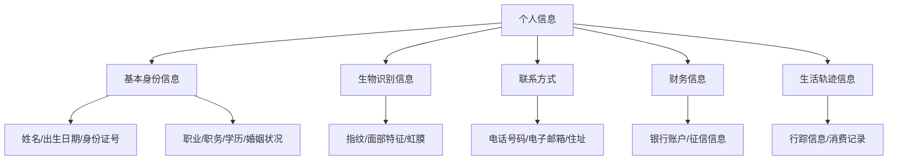
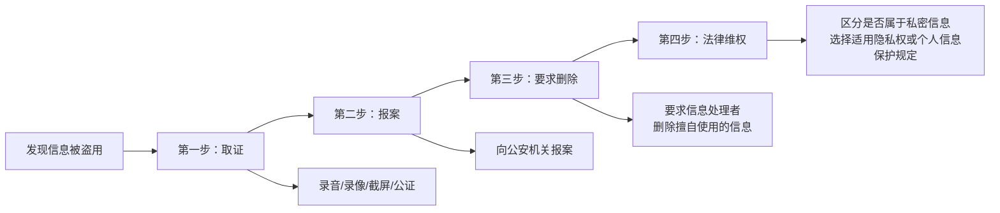

# 第11课：个人信息被贩卖、被盗用该怎么办？

## Learning Objectives

- 明确个人信息的法律定义与范围
- 区分个人信息与私密信息，准确适用法律
- 掌握个人信息泄露后的维权步骤和救济途径
- 了解侵犯个人信息犯罪的刑事处罚标准

---

## 一、什么是个人信息

> 民法典第1034条：个人信息是以电子或者其他方式记录的能够单独或者与其他信息结合识别特定自然人的各种信息。

### 个人信息范围

### 个人信息的三个法律特征

1. **与公民个人直接相关**——反映公民局部或整体特点，一经取得即具有专属性
2. **具有法律保护特征**——承载公民个人特征及各种权利，泄露将导致公民处于受侵害危险
3. **保护不以权利人请求为前提**——除非基于公共利益或权利人意愿，任何组织和个人均无权泄露和获取

## 二、个人信息 vs 私密信息的区分

> [!important] 法律适用差异
> - 属于**私密信息**的 → 适用 [[../reference/glossary|隐私权]]保护规定
> - **不属私密信息**的 → 适用个人信息保护法律规定

### 什么是隐私

> 民法典第1032条：隐私是自然人的私人生活安宁和不愿为他人知晓的私密空间、私密活动、私密信息。

**隐私范围示例**：
- 个人住所
- 身体缺陷
- 夫妻生活
- 家庭成员信息
- 私人生活安宁（不被电话、短信等侵扰）

### 侵犯隐私权的典型行为

根据民法典第1033条，以下行为构成侵犯隐私权：

| 行为类型 | 举例 |
|----------|------|
| 侵扰生活安宁 | 骚扰电话、垃圾短信 |
| 侵入私密空间 | 擅入他人住宅、酒店房间 |
| 窥视私密活动 | 偷拍、窃听 |
| 拍摄私密部位 | 偷拍身体敏感部位 |
| 
| 处理私密信息 | 非法公开他人病历、家庭信息 |

> [!example] 经典案例：人肉搜索第一案
> 北京女白领姜岩跳楼自杀，其丈夫王某被人肉搜索，个人信息（姓名、照片、住址、身份证、工作单位）全部被公开。法院判决：
> - 张某（发起人）赔偿精神抚慰金5000元
> - 两家网站经营者赔偿3000元和5000元
> - 天涯在线因及时删除侵权帖子，不构成侵权

## 三、个人信息被贩卖/盗用怎么办

### 维权四步法

### 身份证被冒用的紧急处理

> [!warning] 身份证丢失后的关键步骤
>
> 1. 立即到公安局**报案挂失**，开具证明
> 2. 挂失后身份证仍可能被使用，但挂失可减小损失
> 3. 建议在身份证复印件正面**盖章**，注明使用范围和期限

### 日常防护建议

- **不要轻易连接免费WiFi**
- **陌生电话不轻易接听**
- **警惕信息收集陷阱**：
  - 性格测试
  - 投票获奖、集赞获奖品
  - 筹款治病、拼团买水果
  - 帮忙砍价、转发免费送
- 身份证复印件上注明"只限于XX用途"

## 四、刑事法律责任

### 刑法第253条

> 违反国家有关规定，向他人出售或者提供公民个人信息，情节严重的，处**三年以下有期徒刑或者拘役**，并处或者单处罚金；情节特别严重的，处**三年以上七年以下有期徒刑**，并处罚金。

### 两个罪名

1. **出售、非法提供公民个人信息罪**
2. **非法获取公民个人信息罪**

### 情节严重认定标准

| 信息类型 | 情节严重（条数） | 情节特别严重（条数） |
|----------|:--------------:|:-----------------:|
| 行踪轨迹、通信内容、征信、财产信息 | 50条以上 | 500条以上 |
| 住宿信息、通信记录、健康生理信息等 | 500条以上 | 5000条以上 |
| 一般个人信息 | 5000条以上 | 50000条以上 |

| 其他情节 | 情节严重 | 情节特别严重 |
|---------|:-------:|:-----------:|
|违法所得 | 数额较大 | 5万元以上 |
| 严重后果 | — | 死亡/重伤/精神失常/被绑架/重大经济损失 |

## 五、个人信息泄露的深层原因

在市场经济和信息社会条件下，个人信息已成为重要的市场资源：

- 电信诈骗、网络诈骗等非接触型犯罪
- 抢劫、敲诈勒索等暴力犯罪
- 非法商业竞争
- 调查公司/私家侦探非法调查

> [!tip] 维权时效特别提示
> 依据民法典第995条，**人格权受侵害的请求权不受诉讼时效限制**（一般诉讼时效为3年）。
>
> 肖像权、名誉权、隐私权等人格权的保护，在20年内均可向法院起诉。

---

## 六、明星追星中的隐私权问题

> [!caution] 私生饭行为可能构成侵权
> 跟踪、偷窥、偷拍明星日常，骚扰明星私生活，属于侵犯隐私权。如发生严重后果，可起诉追责。

明星作为公众人物，对公众评价负有一定容忍义务，但不意味着其隐私权完全不受保护。

---

## 知识图谱

- [[lessons/0011-portrait-rights|第10课：民法典肖像权新规]] → 人格权保护的延续
- 相关法律：民法典第1032条、第1033条、第995条；刑法第253条
- 关联概念：[[../reference/glossary|人格权]] > [[../reference/glossary|隐私权]] > [[../reference/glossary|个人信息权]]

---

> 笔记来源：第11课 个人信息被贩卖、被盗用怎么办
> 核心观点：个人信息保护和隐私权保护并重，发现泄露后及时取证、报案、要求删除，严重者可追究刑责