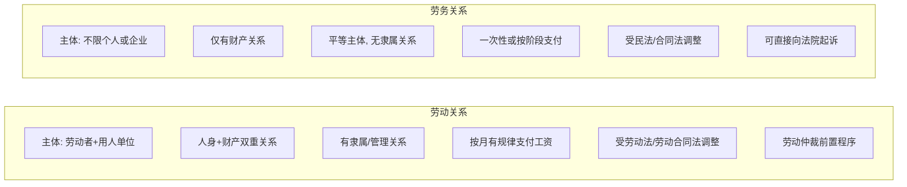
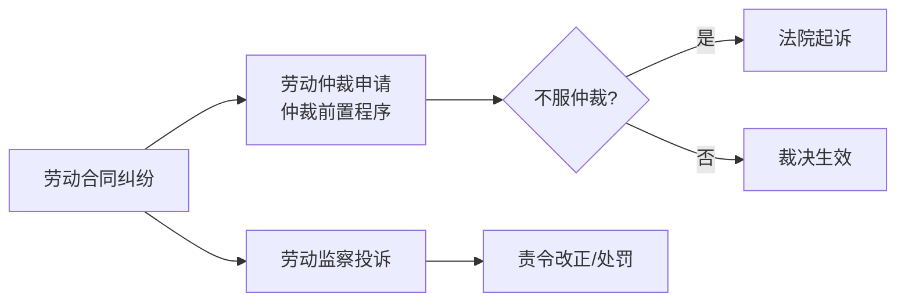

# 第12课：劳动合同还是劳务合同？

## Learning Objectives

- 理解劳动关系与劳务关系的核心区别
- 掌握劳动合同的必备内容与法律特征
- 学会识别"名为劳务、实为劳动"的合同陷阱
- 了解不同用工形式下的争议解决路径

---

## 一、引入案例：杨某的"劳务合同"之争

杨某2018年6月应聘到某公司工作，同年9月签订**一年期"劳务合同"**，约定了工作岗位（电子工程师）、按月支付工资（9000元）、劳动安全规程、公司规章制度、保密义务等内容。2019年9月合同到期前5天，公司通知不再续签。杨某主张应提前30天通知，公司以"劳务合同非劳动合同"为由拒绝。

> [!question] 核心争议
> 合同名称写的是"劳务合同"，内容却具备劳动合同的全部要素，到底应认定为哪种法律关系？

**仲裁裁决**：认定双方存在**劳动关系**，公司需支付25个工作日工资的赔偿金（5000余元）。理由是：内容包含起止时间、工作岗位、按月支付工资、规章制度约束等，具备劳动合同的基本要素；公司未能证明杨某与其他单位存在劳动关系。

---

## 二、劳动关系 vs 劳务关系

### 什么是劳动关系？

劳动关系是指用人单位与劳动者之间，劳动者接受用人单位管理、从事安排的工作、成为单位成员、定期领取报酬并受劳动保护所产生的法律关系。即使未签书面合同，只要实际履行上述权利义务，就形成**事实劳动关系**。

### 什么是劳务关系？

劳务关系是劳动者与用工单位根据约定，由劳动者提供一次性或定期的劳动服务，用工单位支付劳务报酬的**平等有偿服务**法律关系。

### 六大区别对比

> [!tip] 核心判定标准
> 界定劳动关系还是劳务关系的关键在于：**双方是否存在管理和被管理的隶属关系**，以及是否**有规律地支付劳动报酬**。不能简单从合同名称或档案存放地判断。

---

## 三、劳动合同的必备内容

根据《劳动合同法》，劳动合同应当包含：

| 必备条款 | 说明 |
|---------|------|
| 合同期限 | 固定期限/无固定期限/以完成一定工作为期限 |
| 工作内容 | 工作岗位、职责范围 |
| 劳动保护与条件 | 安全卫生、防护措施 |
| 劳动报酬 | 工资标准、支付方式、支付时间 |
| 劳动纪律 | 规章制度、考勤管理 |
| 终止条件 | 合同终止的情形 |
| 违约责任 | 违反合同的法律后果 |

---

## 四、四类常见劳务关系

> [!example] 以下四类情形通常属于劳务关系而非劳动关系：

1. **保姆**：个人雇佣个人，无法构成劳动法意义上的"用人单位"
2. **学生兼职**：在校大学生兼职，不成立正式劳动关系
3. **退休返聘**：已享受养老保险待遇者返聘，劳动关系已终止
4. **承包人/承揽人**：施工队、加工承揽等，按合同约定完成工作

---

## 五、争议处理路径

### 劳动合同纠纷

- 可向劳动局或劳动监察部门投诉
- 申请劳动仲裁（**必经前置程序**）
- 未签劳动合同可主张**双倍工资**
- 以拖欠工资为由解除劳动关系，可要求**经济补偿金**

### 劳务合同纠纷

- 直接向法院起诉（侵权或合同违约为由）
- 无需经过劳动仲裁

---

## 六、签订劳务合同的注意事项

> [!warning] 风险提示
> 若名义上是劳务用工，实际上按劳动用工管理（如规定加班费、迟到扣款、应出勤天数、社保等），发生争议时劳动部门会按**劳动争议**处理。

签订劳务合同时应避免出现劳动合同的特征条款，劳务报酬结构中不应出现：
- 加班费、迟到扣款
- 应出勤天数、请假时数
- 固定加班、自由加班、奖金
- 社保、房租水电、工会费等涉及管理的项目

---

## 七、思考题回顾

> 女孩小赵2015年来北京务工，经朋友介绍到赵姓人家当保姆，约定包吃包住、月报酬4000元。一个月期满，赵家只给了3000元将其辞退。小赵想用《劳动合同法》维权，能否受到保护？为什么？

> [!question] 下节课预告
> [[0014-social-insurance|第13课：公司没交五险一金怎么维权？]]