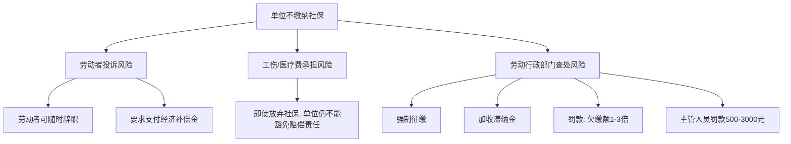

# 第13课：公司没交五险一金怎么维权？

## Learning Objectives

- 了解五险一金的法定构成和作用
- 明确用人单位缴纳五险一金的法定义务性质
- 掌握单位未缴纳五险一金的维权步骤
- 理解"自愿放弃社保"声明的法律效力

---

## 一、思考题回顾：保姆小赵的维权

> 上节课案例：小赵做保姆被克扣工资，能否用《劳动合同法》维权？

**答案**：不能。赵家不是用人单位（个体工商户指雇佣7人以下的商户），小赵不是劳动法意义上的劳动者，双方形成的是**劳务关系**而非劳动关系，只能依据《合同法》提起诉讼，不能适用《劳动合同法》。

---

## 二、什么是五险一金？

| 险种 | 说明 | 缴纳方式 |
|------|------|---------|
| **养老保险** | 退休后领取养老金 | 企业+个人共同缴纳 |
| **医疗保险** | 报销医疗费用 | 企业+个人共同缴纳 |
| **失业保险** | 失业期间的生活保障 | 企业+个人共同缴纳 |
| **工伤保险** | 工作中受伤的医疗和补偿 | 企业单独承担 |
| **生育保险** | 生育相关的医疗和津贴 | 企业单独承担 |
| **住房公积金** | 住房储蓄金 | 企业+个人共同缴纳 |

> [!tip] 特别提醒
> **五险是法定的**，其中养老保险、医疗保险、失业保险由企业和个人共同缴纳；**工伤保险和生育保险**由企业承担，个人无需缴纳。住房公积金同样必须依法缴纳。

---

## 三、缴纳五险一金的法律规定

### 何时开始缴纳？

> **《社会保险法》第58条**：用人单位应当自用工之日起**30日内**为其职工向社会保险经办机构申请办理社会保险登记。

> [!warning] 常见误区
> 有人认为"试用期满转正后才办理缴纳手续"——这是**错误且违法**的。试用期同样属于劳动关系的存续期间，用人单位必须为试用期员工缴纳社保。

### 员工自愿放弃是否合法？

**不合法。** 员工签署的放弃社保声明、申请或协议均**不具有法律效力**。

- 《劳动法》第72条：用人单位和劳动者**必须**依法参加社会保险
- 权利可以放弃，**义务必须履行**——这是法律的基本原则
- 将社保费折现发给员工同样违法

---

## 四、单位不缴纳社保的法律风险

---

## 五、维权步骤

> [!example] 遇到单位不缴纳五险一金，按以下步骤操作：

### 第一步：收集证据

证明劳动关系的材料：
- 劳动合同
- 工资条、工资发放记录
- 盖了章的证明、工作服、工作证
- 考勤记录、招聘登记表

### 第二步：与单位协商

采用柔性策略，了解不缴纳的原因。有些小企业并非刻意不缴，可能是其他原因（如执照审验等）。

### 第三步：向劳动部门投诉

- 向当地**劳动行政部门（社会保障局）**举报
- 由主管部门责令限期缴纳
- 逾期不改正的，处以罚款

### 第四步：解除劳动关系并索赔

若单位未依法提供足额报酬或未及时缴纳社保，劳动者享有**法定的单方解除权**，无需提前通知，可随时离职（不视为违约），并可要求**支付经济补偿金**。

---

## 六、特别说明

### 关于住房公积金

住房公积金同样是**法定的**，不是"可上可不上"。用人单位必须依法为职工缴存住房公积金。

### 关于入职建议

> [!tip] 律师建议
> 入职时一定要签订劳动合同，优先选择各项规章制度较为完善的企业，这样权益能获得更好的保障。

---

## 七、思考题回顾

> 公积金是不是可上可不上？

---

## 相关课程

- [[0015-waive-social-insurance|第14课：自愿放弃社保有什么风险？]]
- [[0013-labor-vs-service-contract|第12课：劳动合同还是劳务合同？]]