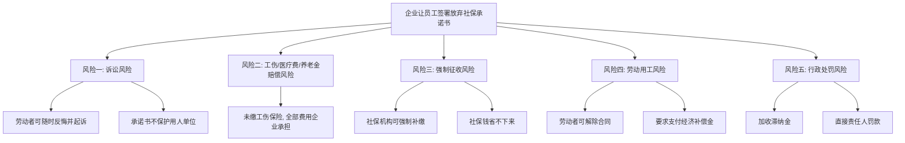

# 第14课：自愿放弃社保有什么风险？

## Learning Objectives

- 理解"自愿放弃社保承诺书"的法律效力
- 掌握放弃社保对企业和员工的双向风险
- 了解五种可以不缴纳社保的例外情形
- 学会在被迫签署放弃社保承诺书后的维权方法

---

## 一、引入案例：吴女士的工伤索赔

吴女士与公司签署《自愿放弃缴纳社保承诺书》，公司每月将社保费折现500元发给吴女士。后吴女士在工作中受伤，被认定为**工伤八级**，医疗费共花费25.4万元。

> [!question] 承诺书是否有效？
> 法院认定：社保费用征缴系**国家强制性规定**，不因当事人约定而免除。公司未缴工伤保险，全部赔偿责任由公司承担。

**最终赔偿清单：**

| 赔偿项目 | 金额 |
|---------|------|
| 全部医疗费用 | 25.4万元 |
| 一次性伤残补助金 | 4.4万元 |
| 一次性伤残就业补助金 | 3.5万元 |
| 一次性工伤医疗补助金 | 8万元 |
| 停工留薪期工资 | 2.8万元 |
| 住院伙食补助费 | 1740元 |
| 护理费 | 5200元 |
| 经济补偿金 | (另计) |
| **总计** | **约45.7万元** |

---

## 二、放弃社保的法律效力

> [!warning] 核心原则
> **社保缴纳是用人单位与劳动者的法定义务，不能通过双方约定免除。** 无论放弃社保承诺书写得多么周密，都是**无效的**，对双方均不具有法律约束力。

---

## 三、对企业的五大风险

### 经济补偿金计算标准

- 每工作满一年支付一个月工资
- 六个月以上不满一年的，按一年计算
- 不满六个月的，支付半个月工资

---

## 四、对劳动者的风险

> [!example] 老胡的教训
> 老胡入职时主动要求不缴纳社保，签署了放弃社保承诺书。工作6个月后，以公司未缴纳社保为由辞职并要求经济补偿金。

- **一审**：老胡自愿放弃社保，是对自身权利的处分，驳回请求
- **二审**：老胡作为完全民事行为能力人，应意识到签署承诺书的后果，维持原判

> [!tip] 关键提醒
> 如果**劳动者本人自愿放弃社保**，事后又以"单位未缴纳社保"为由主张经济补偿金，**法院可能不予支持**。建议劳动者不要太贪小便宜，拒绝签署放弃社保承诺书。

---

## 五、五种可以不缴纳社保的情形

| 情形 | 说明 |
|------|------|
| ① 离退休人员返聘 | 已享受养老保险待遇，劳动合同已终止 |
| ② 兼职人员 | 已有本职工作，另一单位缴纳社保 |
| 
| ③ 劳务派遣人员 | 由劳务派遣公司缴纳社保 |
| ④ 在校实习生 | 不成立事实劳动关系 |
| ⑤ 个体户外包业务 | 签订劳务合同，完成一定工作量 |

---

## 六、思考题回顾

> 如果你和人力资源服务公司签了合同，被劳务派遣到A公司工作，在工作中发生工伤，能找A公司赔偿吗？

**答案**：原则上不应找A公司，而应找**劳务派遣公司**（用人单位）。劳务派遣单位是用人单位，有义务办理工伤保险；但A公司作为用工单位，若未尽安全保障义务，也可能承担连带责任。

---

## 相关课程

- [[0014-social-insurance|第13课：公司没交五险一金怎么维权？]]
- [[0022-workplace-injury|第21课：工伤认定有哪些标准？]]