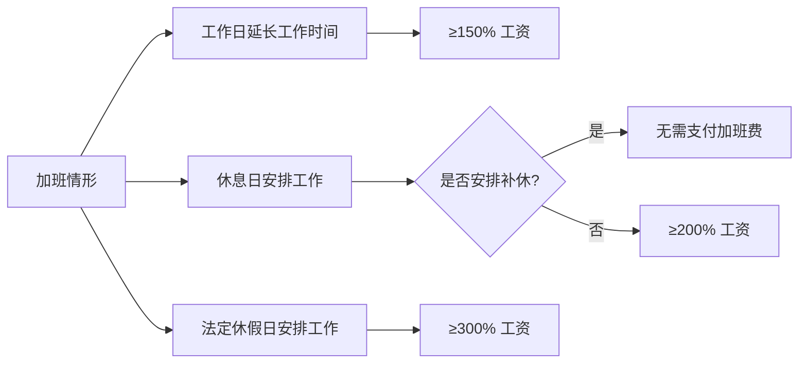

# 第15课：加班费如何获得？带薪年假不让休怎么办？

## Learning Objectives

- 掌握加班费的三档计算标准
- 理解带薪年休假的享受条件和天数规定
- 学会应休未休年假的工资折算方法
- 了解劳动仲裁的时效规定及特殊情形

---

## 一、思考题回顾：串岗受伤是否构成工伤

> 刘某在上班期间离开自己的车间到隔壁车间清理堵塞的抓棉机，导致右臂被打断并被截肢。公司以"串岗、违反工作纪律"为由拒绝认定工伤。

**结论**：应当认定为工伤。凡是完成工作任务的所在区域都应认定为工作场所。刘某的动机是防止机器设备受损，法律的精神是**最大可能保护主观上无恶意的劳动者**。串岗受伤也构成工伤。

---

## 二、加班费的法律规定

### 什么是加班费？

《劳动法》第31条：用人单位应当严格执行劳动定额标准，不得强迫或变相强迫劳动者加班。安排加班的，应按国家规定支付加班费。

### 加班费三档标准



### 法定节假日

元旦、春节、清明、劳动节、端午节、中秋节、国庆节等。

> [!attention] 注意区分
> 国庆节放假7天中，只有**10月1日-3日**是法定假日（300%），其余4天属于双休日调休（200%或安排补休）。

### 补休和调休

休息日安排劳动者工作后安排补休的，**不能主张加班费**。企业有权决定是安排补休还是支付加班费。

---

## 三、带薪年休假的规定

### 享受条件

连续工作满**一年**（含在其他单位的工作时间），即可享受带薪年休假。

### 休假天数

| 累计工作年限 | 年休假天数 |
|------|------|
| 满1年不满10年 | 5天 |
| 满10年不满20年 | 10天 |
| 满20年 | 15天 |

### 应休未休的折算

> 单位因工作需要不能安排休假的，对职工应休未休的年假天数，按该职工**日工资收入的300%**支付工资报酬。

---

## 四、年休假与其他假期的关系

### 要冲抵的情形

- 享受寒暑假且天数多于年休假的
- 事假累计20天以上且单位不扣工资的
- 病假达到一定天数（按工作年限递增）

### 不冲抵的情形

探亲假、婚丧假、产假、工伤停工留薪期——**不计入年休假假期**。

---

## 五、年休假未获批准怎么办

> [!tip] 双方权利边界
> - 劳动者：享受年休假是权利
> - 用人单位：如何安排年休假是用人单位的权利

员工**不能擅自休假**。若公司不批准年假申请而员工自行休假，可能被认定为旷工，严重者可导致解除劳动合同。

> 安排年假是用人单位的权利，也是**不可推卸的义务**。

---

## 六、离职时未休年假的处理

### 折算公式

```
当年度日历天数 ÷ 365 × 职工全年应享年休假天数 = 应享天数
```

### 多休的年假

用人单位已安排职工休假但离职时实际折算后多休的，**不再扣回**。

---

## 七、仲裁时效

> [!warning] 时效关键点
> - 劳动争议仲裁时效：**一年**（从知道或应当知道权利被侵害之日起计算）
> - 劳动关系存续期间的劳动报酬争议：**不受一年限制**
> - 劳动关系终止后：**自终止之日起一年内**必须提出

---

## 八、思考题回顾

> 刘某是某纺织公司推卷工，上班期间离开自己车间到邻车间清理抓棉机堵塞，导致右臂被打断截肢。公司认为不是工作场所、未经安排私自串岗，不应认定工伤。你怎么看？

---

## 相关课程

- [[0017-year-end-bonus|第16课：年底离职是否能主张年终奖金？]]
- [[0018-labor-arbitration|第17课：劳动仲裁对于解决常见劳动争议有用吗？]]