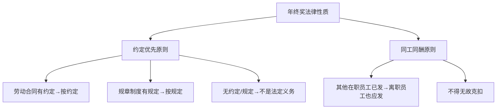

# 第16课：年底离职，是否能主张年终奖金？

## Learning Objectives

- 理解年终奖金的法律性质（约定性 vs 法定性）
- 掌握约定优先与同工同酬两大原则
- 学会在年底离职时主张年终奖的法律依据
- 了解仲裁时效对主张年终奖的影响

---

## 一、思考题回顾：串岗受伤工伤认定

> 上一节课的思考题——刘某串岗受伤是否构成工伤？

**答案**：构成工伤。虽然刘某是擅自离开自己的车间到邻车间，但有关部门和法院认定，刘某的动机是防止机器设备受损，符合"与工作相关的活动"，最终认定为工伤。立法的精神是**最大可能保护主观上无恶意的劳动者**。

---

## 二、引入案例：陈某的年终奖之争

陈某2015年2月入职A公司任项目经理，2019年8月调岗为大客户经理，2019年11月7日被公司以"不能胜任"为由解除劳动关系。陈某申请仲裁，主张：
1. 违法解除劳动合同的赔偿金
2. **2019年1月1日至10月28日期间的年终奖金**

> [!question] 公司应否支付年终奖？
> 公司主张：陈某考核未达标，且服务不满一个财务年度。

**裁决结果**：支持陈某主张。公司解除行为属于违法解除，陈某考核结果为合格，符合年终奖支付条件，公司未能提供有效反证。

---

## 三、年终奖金的法律性质

### 约定优先原则

- 若劳动合同或规章制度中对年终奖的发放时间、标准、条件有明确约定，按约定执行
- 若双方对此没有明确约定，发放年终奖**并非用人单位的法定义务**

### 同工同酬原则

即使没有明确约定，若其他在职员工都发放了年终奖，根据**同工同酬原则**，离职员工同样有权主张。

---

## 四、离职主张年终奖的条件

> [!tip] 满足以下条件之一的，离职后仍可主张年终奖：

| 条件 | 说明 |
|------|------|
| ① 合同/制度有明确约定 | 且已通过考核 |
| ② 公司对离职员工未考核负有责任 | 如违法解除导致无法考核 |
| ③ 无约定但其他员工已发 | 援引同工同酬原则 |

---

## 五、对劳动者和用人单位的建议

### 对劳动者

- 入职时将薪酬待遇（含年终奖）写入**书面劳动合同**
- 保存相关证据：劳动合同、规章制度、薪酬问题的录音录像等
- 离职后一年内提出仲裁申请

### 对用人单位

- 制定经过**民主程序**并公示的规章制度
- 完善劳动合同和薪酬管理办法
- 明确规定离职员工不能享受年终奖（但需注意合理性）
- 离职手续上由员工签字确认"经济事项已结算完毕无争议"

---

## 六、仲裁时效提醒

> [!warning] 时效红线
> 主张年终奖的仲裁时效为**自劳动关系终止之日起一年内**。超过一年未提出，将丧失胜诉权。

---

## 七、思考题回顾

> 陈某被公司以"不能胜任"为由解除劳动关系，此时距离年底还有不到两个月。陈某要求公司支付当年的年终奖，能否得到支持？

**答案**：如果陈某通过了年度考核且考核合格，公司又属于违法解除，应支持其主张。

---

## 相关课程

- [[0016-overtime-paid-leave|第15课：加班费获得与带薪年假]]
- [[0018-labor-arbitration|第17课：劳动仲裁对于解决常见劳动争议有用吗？]]