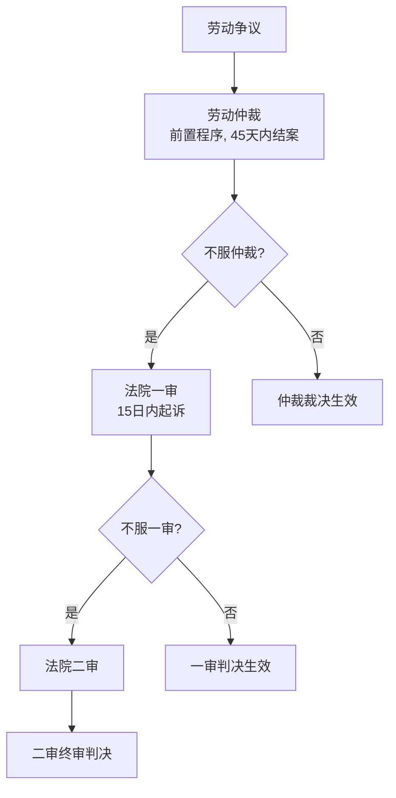
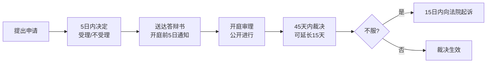

# 第17课：劳动仲裁对于解决常见劳动争议有用吗？

## Learning Objectives

- 理解劳动关系与劳动争议的基本概念
- 掌握劳动仲裁的"一裁两审"程序
- 了解一裁终局的适用范围
- 识别七类常见劳动争议
- 学会劳动争议解决的四种途径

---

## 一、思考题回顾

> 张小元因相貌不佳被公司辞退，认为公司违法解除，想直接去法院起诉。法院能受理吗？

**答案**：**不能受理**。劳动法规定了劳动争议的**前置程序是劳动仲裁**，人民法院不会直接受理。应先去劳动人事争议仲裁委员会申请仲裁，对仲裁不服的才能向法院起诉。

---

## 二、劳动关系与劳动争议

### 什么是劳动关系？

用人单位和劳动者符合法律法规规定的主体资格，存在管理和被管理关系，劳动者提供的劳动是单位业务的组成部分，单位向劳动者支付劳动报酬。

- **凭证**：劳动合同
- **事实劳动关系**：未签合同但存在实际用工关系

### 什么是劳动争议？

劳动关系当事人之间因执行劳动法律法规、履行劳动合同而发生的权利义务纠纷。

> [!tip] 特殊主体问题
> 劳动合同签约人与实际用人单位不一致时，仲裁时应将具有利害关系的单位均列为当事人，仲裁机构或法院有权追加被申请人。

---

## 三、劳动仲裁的管辖

- **管辖机构**：单位所在地的劳动仲裁委员会
- **程序制度**：**一裁两审**（裁→审→审）

### 为什么要有仲裁前置？

因为劳动争议案件数量多、法律关系相对简单，在专业的仲裁委员会解决纠纷能有效减轻法院负担。仲裁程序中的不当之处，诉讼程序中会予以纠正。

---

## 四、劳动仲裁的三大特点

| 特点 | 说明 |
|------|------|
| **时效性** | 申请时效1年，审理期限45天，简单案件可一裁终局 |
| **前置性** | 必须先仲裁，不能直接起诉 |
| **可诉性** | 不服仲裁可诉至法院请求撤销 |

---

## 五、一裁终局制度

### 什么是一裁终局？

仲裁裁决为终局裁决，自裁决书作出之日起发生法律效力，**不能到法院起诉**。

### 适用范围

> **《劳动争议调解仲裁法》第47条**

| 类型 | 说明 |
|------|------|
| ① 小额争议 | 追索劳动报酬、工伤医疗费、经济补偿或赔偿金，不超过当地月最低工资标准12个月金额 |
| ② 标准争议 | 执行国家劳动标准（工作时间、休息休假、社会保险等）发生的争议 |

### 可撤销的情形

若存在以下情形，当事人可向法院申请撤销裁决：
- 适用法律错误
- 仲裁委员会无管辖权
- 违反法定程序
- 据以裁决的证据是伪造的
- 对方隐瞒了足以影响公正裁决的证据
- 仲裁员有受贿、徇私舞弊、枉法裁判行为

---

## 六、仲裁程序要点

---

## 七、七类常见劳动争议

| 序号 | 纠纷类型 | 典型情形 |
|------|---------|---------|
| 1 | 确认劳动关系纠纷 | 有合同的未必有劳动关系，无合同的未必没有 |
| 2 | 未签劳动合同纠纷 | 可主张双倍工资 |
| 3 | 非法解除劳动关系纠纷 | 未提前30日通知或无合法理由解除 |
| 4 | 开除/除名/辞退/辞职纠纷 | 各类离职方式的合法性争议 |
| 5 | 工作时间/社保/福利纠纷 | 涉及切身利益，容易激化 |
| 6 | 劳动合同履行/变更/解除纠纷 | 一方违约产生的纠纷 |
| 7 | 竞业限制/保密协议纠纷 | 限制期限不超过2年，需支付补偿金 |

### 关于竞业限制

> [!tip] 竞业限制要点
> - 主体限于：高级管理人员、高级技术人员、其他负有保密义务人员
> - 期限：一般不超过**2年**
> - 补偿：按月支付，无约定时按原月薪**30%**
> - 违约金：与补偿金同等比例

---

## 八、争议解决的四种方式

| 方式 | 特点 |
|------|------|
| ① 协商/调解 | 自愿进行，劳动争议调解委员会由职工代表+公司领导+工会组成 |
| ② 仲裁 | 协商不成则申请仲裁，必经程序 |
| ③ 诉讼 | 不服仲裁15日内起诉，判决具有强制执行力 |
| ④ 强制执行 | 对方不履行可申请法院强制执行，可列入"老赖"名单 |

---

## 九、思考题回顾

> 某公司员工张小元因为个子矮小、相貌平平，用人单位认为影响了公司生意将其辞退。张小元想直接去法院起诉，法院能受理吗？

**答案**：不能。劳动争议必须先经过劳动仲裁前置程序。

---

## 相关课程

- [[0019-resignation-procedure|第18课：单位拒办理离职证明及社保档案转移手续怎么办？]]
- [[0020-unlimited-term-contract|第19课：无固定期限劳动合同该如何签订？]]