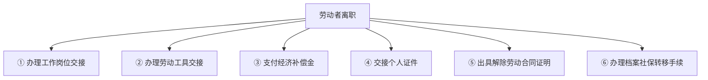
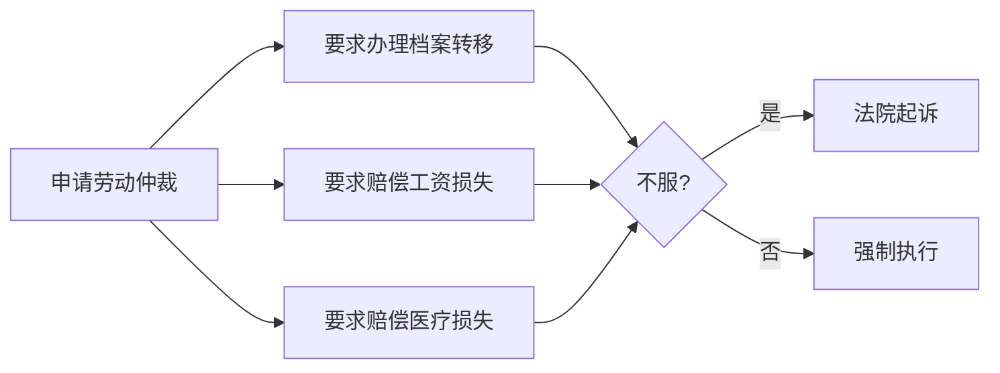

# 第18课：单位拒办理离职证明及社保档案转移手续损失谁承担？

## Learning Objectives

- 了解离职后的四种情形及对应手续
- 明确出具离职证明和办理社保转移是用人单位的法定义务
- 掌握单位拒绝办理手续的法律后果
- 学会遭遇此类问题时的维权方法

---

## 一、思考题回顾

> 张小姐大学毕业后入职不满一年，要求在十一前休5天年假，公司不批准，9月26日后自行休假。公司以旷工为由将其辞退。张小姐能否胜诉？

**答案**：**不能胜诉**。张小姐入职不满一年，不符合"连续工作满12个月"的带薪年假享受条件。此外，擅自休假也违反了公司制度。

---

## 二、引入案例：李某的离职之困

李某2018年6月从A辞职后应聘到B公司，B公司发出聘用通知书（月薪2万元）要求报到时提供离职证明和社保档案转移手续。A公司拒绝开具离职证明，且档案材料不全不配合补全，导致李某无法入职、无法缴纳医疗保险。

**仲裁结果**：A公司应办理档案转移手续，支付李某工资损失（6万元）和医疗损失（2500元）。

---

## 三、离职的四种情形

| 情形 | 说明 |
|------|------|
| ① | 单位违法→员工可立书面提出解除 立即走人，不受批准，可主张经补偿|
| ② | 单位无违法+员工未提前30天申请→员工违法，可承担单位损失|
| ③ | 员工提前30天书面提出→不需批准可走人 |
| ④ | 合同到期或双方一致同意→正常走人 |

---

## 四、离职必须办理的手续

### 离职证明的法定内容

> **必须写明**：合同期限、解除或终止日期、工作岗位、在本单位的工作年限

> **保存要求**：解除或终止的劳动合同文本至少保存**2年**备查

---

## 五、出具离职证明和办理社保转移是法定义务

> 《劳动合同法》规定：用人单位应当在解除或终止劳动合同时出具证明，并在**15日内**为劳动者办理档案和社会保险关系转移手续。

| 义务 | 时限 | 性质 |
|------|------|------|
| 出具离职证明 | 解除/终止时 | 法定义务 |
| 办理档案转移 | 15日内 | 法定义务 |
| 办理社保转移 | 15日内 | 法定义务 |

> [!warning] 常见误区
> **员工未办理工作交接**不能成为单位拒绝出具离职证明的理由。对于不办理交接的劳动者，单位可以拒付经济补偿金，但不能拒绝出具离职证明。

---

## 六、单位拒绝办理的后果

### 造成的损失

职工人事关系和档案长期留在原单位，将导致：
- 新单位无法办理劳动保险
- 无法办理出国政审
- 影响技术职称评定
- 不便于求学深造
- 丧失报考公务员机会

### 法律后果

> 《劳动合同法》规定：用人单位违反规定不向员工出具离职证明的，劳动行政部门**责令改正**；给劳动者造成损失的，**依法承担赔偿责任**。

### 赔偿责任类型

| 赔偿类型 | 说明 |
|---------|------|
| 失业保险待遇损失 | 离职证明是领取失业保险金的前提 |
| 工资损失 | 因无离职证明无法入职新单位的工资损失 |

---

## 七、新单位能否聘用未解除劳动关系的员工？

> 新单位**不能**聘用未解除劳动关系的员工，否则将承担连带责任。

**《劳动合同法》第91条**：用人单位招用与其他用人单位尚未解除或终止劳动合同的劳动者，给其他用人单位造成损失的，应当承担**连带赔偿责任**。

---

## 八、维权指引

---

## 九、思考题回顾

> 张小姐在十一前提出5天年假申请未获批，9月26日后自行休假，公司以旷工为由辞退。张小姐主张违法解除赔偿金，能否胜诉？

**答案**：不能。入职不满一年不满足年假条件，且未经批准擅自休假构成旷工。

---

## 相关课程

- [[0018-labor-arbitration|第17课：劳动仲裁对于解决常见劳动争议有用吗？]]
- [[0020-unlimited-term-contract|第19课：无固定期限劳动合同该如何签订？]]