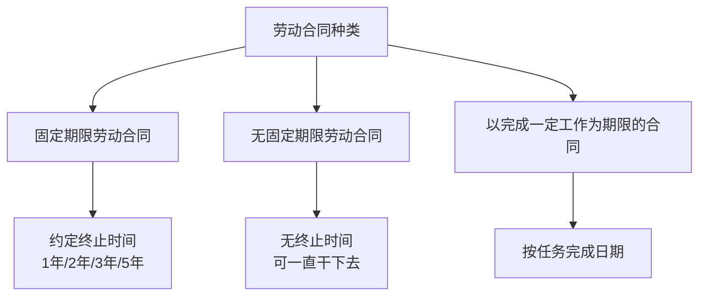
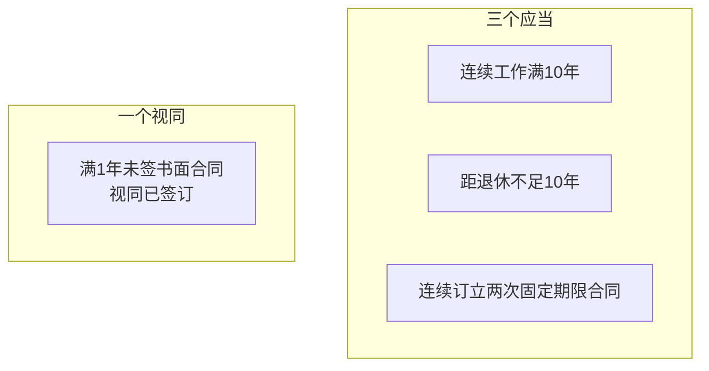

# 第19课："无固定期限劳动合同"该如何签订？

## Learning Objectives

- 理解无固定期限劳动合同的概念和种类划分
- 掌握"三个应当一个视同"的签订条件
- 弄清"连续工作满十年"的具体计算方式
- 了解不签订无固定期限合同的法律责任

---

## 一、思考题回顾

> 2009年1月张先生进入企业，先签三年合同，到期后续签两年合同。2015年1月合同到期，张先生提出签订无固定期限劳动合同，企业不同意。能否得到支持？

**答案**：**应当支持**。根据《劳动合同法》第14条，张先生符合签订无固定期限劳动合同的条件（连续订立两次固定期限劳动合同）。

---

## 二、引入案例：郑女士的"铁饭碗"之争

郑某是某医院勤杂工，与医院签订过**三次**固定期限劳动合同。第三次合同到期时，医院发出不再续签通知书。郑某在签收时注明"此通知为医院单方行为，未经协商一致"，随后申请仲裁。

**结果**：人民法院支持郑某要求，判定医院在10日内与郑某签订无固定期限劳动合同，并补发违法终止合同期间的工资损失。

---

## 三、劳动合同的三种类型

> 无固定期限劳动合同被称为"**铁饭碗**"——只要没有出现法律规定或双方约定的解除条件，双方就可以一直履行合同。

---

## 四、"三个应当一个视同"

### 应当签订无固定期限劳动合同的情形

### 条件一：连续工作满十年

劳动者在用人单位**连续工作满十年**。包含：
- 连续履行劳动合同十年
- 连续形成事实劳动关系十年
- 合同到期后续签累计满十年

### 条件二：距法定退休年龄不足十年

用人单位初次实行劳动合同制度或国有企业改制重新订立劳动合同时，劳动者在该单位距法定退休年龄不足十年的。

### 条件三：连续订立两次固定期限合同

从2008年1月1日起，连续两次签订固定期限劳动合同期满，且劳动者不存在严重违纪、严重失职、被追究刑事责任等情形。

### 视同情形

用人单位自用工之日起满一年未与劳动者签订书面劳动合同的，**视同**已签订无固定期限劳动合同。

---

## 五、关键问题解析

### "连续工作满十年"是否需要扣除医疗期？

> [!warning] 重要提示
> 医疗期**不应扣除**。根据劳动部规定，劳动者依法享有的医疗期应当在计算同一用人单位连续工作时间时予以保留。

但**满十年不等于满十个年头**。例如2000年2月2日入职至2009年12月31日，是10个年头但不足完整10年，不满足条件。

### 能否将正在履行的合同直接变更为无固定期限？

**不能直接变更**。必须同时满足三个条件：
1. 工作年限满十年
2. 在**续订或订立**劳动合同时
3. 劳动者未提出订立固定期限劳动合同

若旧合同仍在履行中，只能等到合同期满续订时提出，除非双方协商一致。

### 第三次是否必须签无固定期限？

> 是的。两次固定期限合同后第三次续签，**主动权在劳动者**。劳动者同意续签的，用人单位必须签无固定期限合同。

---

## 六、不签订的法律责任

| 违法情形 | 法律责任 |
|---------|---------|
| 应当签而不签 | 自应当签订之日起支付**双倍工资** |
| 强制终止或违法解除 | 劳动者可要求继续履行，否则支付**双倍经济补偿金** |
| 满1个月不满1年未签合同 | 每月支付**双倍工资** |

### 一条重要原则

> 无固定期限劳动合同**只能解除，不能终止**。不存在"到期终止"的问题，只有在劳动者违法或违规时才能解除。

---

## 七、思考题回顾

> 2009年1月张先生进入一家企业，企业先与其签订三年期劳动合同，期满后续签两年期合同。2015年1月合同到期，张先生提出签订无固定期限劳动合同，企业不同意。张先生申请仲裁要求续签，能否得到支持？

**答案**：应当支持。符合连续订立两次固定期限劳动合同的条件。

---

## 相关课程

- [[0013-labor-vs-service-contract|第12课：劳动合同还是劳务合同？]]
- [[0019-resignation-procedure|第18课：单位拒办理离职证明及社保档案转移手续怎么办？]]