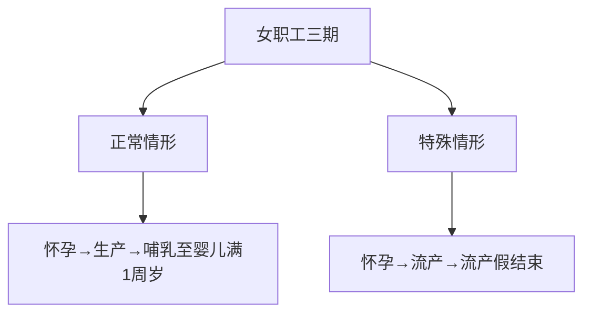
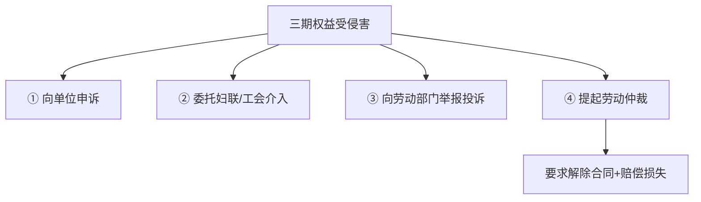

# 第20课：职场女性如何维护自己的合法权益？

## Learning Objectives

- 了解女职工"三期"（孕期、产期、哺乳期）的法定权益
- 掌握各类产假的种类和天数规定
- 理解三期薪资福利待遇的发放规则
- 学会权益受侵害时的救济途径

---

## 一、思考题回顾

> 2009年1月张先生与企业签订3年劳动合同，期满续签2年，2015年1月合同到期时提出签订无固定期限劳动合同，能否得到支持？

**答案**：应当支持。符合《劳动合同法》第14条规定的连续订立两次固定期限劳动合同的条件。

---

## 二、女职工"三期"权益概述

### 什么是"三期"？

- **孕期**：从怀孕开始到分娩
- **产期**：分娩及产后恢复期间
- **哺乳期**：婴儿满一周岁前

### 两种情形

---

## 三、女职工应享受的休假

### ① 产前休息

怀孕七个月（28周）以上的女职工，用人单位不得延长工作时间或安排夜班，应在劳动时间内安排休息时间。

### ② 产前检查假

产前检查算作**劳动时间**，按正常出勤对待，不能按病假、事假或旷工处理。一般11次，每次半天。

### ③ 保胎假

按照**病假**待遇处理，工资按病假计算，非法定带薪休假，无期限限制。

### ④ 流产假

| 情形 | 休假天数 |
|------|---------|
| 怀孕未满4个月流产 | 15天 |
| 怀孕满4个月以上流产 | 42天 |

### ⑤ 产假

| 情形 | 天数 |
|------|------|
| 基本产假 | 不少于98天（产前15天+产后83天） |
| 难产 | 增加15天 |
| 多胞胎（每多一个） | 增加15天 |
| 延长生育假 | 各地不同（30-90天不等） |

> [!tip] 各地延长产假差异
> 北京、上海、江苏、浙江：延长30天
> 广东：延长80天
> 河南、海南：延长3个月
> 甘肃：最长可休180天

### ⑥ 护理假（陪产假）

配偶享受，国家无统一规定：

| 地区 | 天数 |
|------|------|
| 北京、广东、浙江 | 15天 |
| 云南、甘肃 | 30天（最长） |

### ⑦ 哺乳时间

- 婴儿一周岁内，每天安排**1小时**哺乳时间
- 多胞胎的，每多一个增加1小时
- 哺乳时间算作**劳动时间**
- 双胞胎以上每天工作6小时，工资按8小时计算

---

## 四、三期的薪资福利待遇

> 用人单位不得因女性怀孕、生育、哺乳，降低其工资、予以辞退或解除劳动合同。

| 假期类型 | 工资标准 |
|---------|---------|
| 正常出勤 | 正常工资标准 |
| 产前假（上海、江苏） | 本人工资的80% |
| 保胎假 | 按病假工资标准 |
| 产假（参加生育保险） | 由生育津贴支付 |
| 产假（未参加生育保险） | 按合同约定工资由单位支付 |
| 陪产假 | 全额带薪 |
| 哺乳假 | 各地不同（上海80%，广东≥75%） |

### 生育费用

- 参加生育保险的：由生育保险基金**全额支付**检查费、接生费、手术费、住院费、药费
- 未参加的：由所在单位负担

---

## 五、权益受侵害的救济途径

### 真实案例

胡女士怀孕后因感冒需休息3天，丈夫以短信向主管请假未得到回复，公司以旷工为由解除劳动关系。法院认定：公司明知胡女士怀孕，应了解其缺勤原因并给予辩解机会，**解除行为违法**。

---

## 六、特别提醒

> 产假是否包括法定节假日和公休日？

**包括**。根据《劳动保险条例实施细则》规定，产假无论正产还是小产，都包括星期日或法定节假日，连续计算，**不再补假**。

---

## 七、思考题回顾

> 产假是否包括法定节假日和公休日？如果休假期间遇到五一或国庆长假，是否包含在产假中？

**答案**：包括。产假期间连续计算，不另行补假。

---

## 相关课程

- [[0022-workplace-injury|第21课：工伤认定有哪些标准？]]
- [[0014-social-insurance|第13课：公司没交五险一金怎么维权？]]