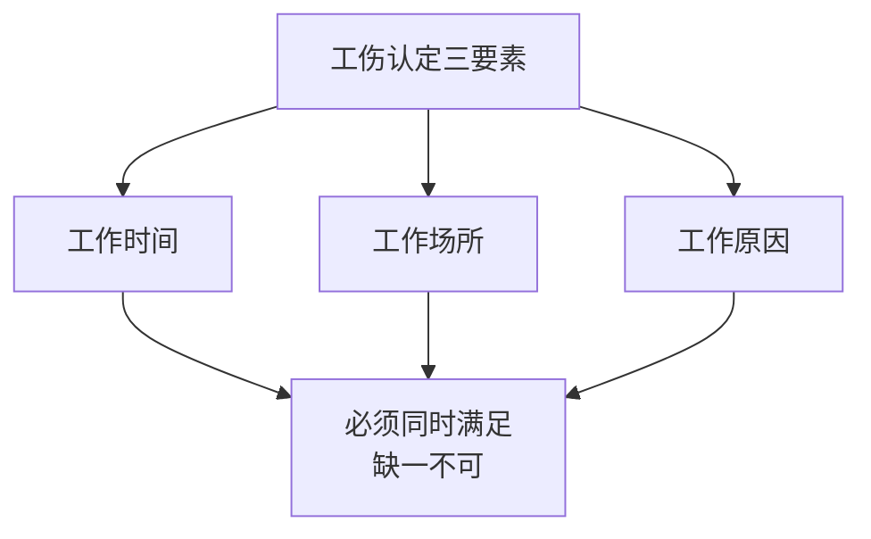
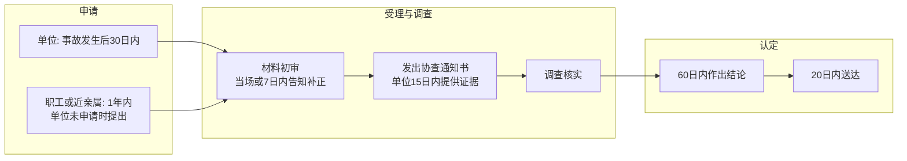
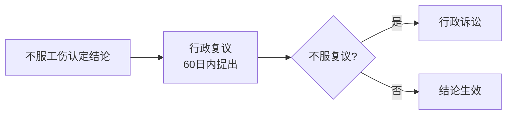
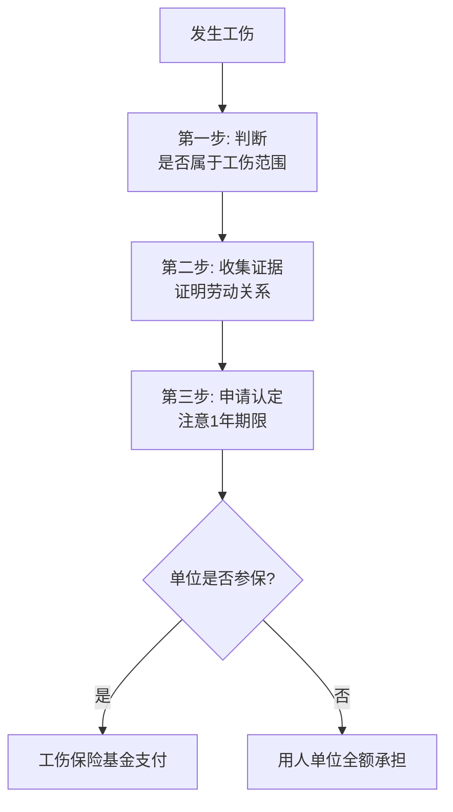

# 第21课：工伤认定有哪些标准？参加公司团建受伤算工伤吗？

## Learning Objectives

- 掌握工伤认定的"三要素"标准
- 理解视同工伤的条件和适用
- 了解工伤认定的申请流程和主体
- 学会判断参加公司活动受伤是否构成工伤

---

## 一、思考题回顾

> 胡女士怀孕后因病需休息，丈夫以短信向主管请假未获回复，公司以旷工为由解除劳动关系。胡女士能否维权？

**答案**：可以。法院认定公司在明知胡女士怀孕的情况下，应了解其缺勤原因并给予辩解机会，**解除行为违法**。

---

## 二、引入案例：公司旅游中突发疾病死亡

李某2017年6月参加公司组织的邮轮赴日本五日游（非强制性），在出游第二天突发疾病，经抢救无效于次日死亡（48小时内）。家属申请工伤认定。

**结果**：**不予认定工伤**。此次活动不带有强制性，内容与工作无关，不符合"工作时间"和"工作岗位"两要素。

---

## 三、工伤认定的"三要素"

### 法定认定工伤的情形（《工伤保险条例》第14条）

| 序号 | 情形 |
|------|------|
| 1 | 工作时间和工作场所内，因工作原因受到事故伤害 |
| 2 | 工作时间前后在工作场所，从事与工作有关的预备性或收尾性工作 |
| 3 | 工作时间和工作场所内，因履行工作职责受到暴力等意外伤害 |
| 4 | 患职业病 |
| 5 | 因工外出期间，因工作原因受到伤害或发生事故下落不明 |
| 6 | 上下班途中，受到非本人主要责任的交通事故或城市轨道交通、客运轮渡、火车事故伤害 |

---

## 四、视同工伤的情形

> 本不符合工伤标准，但法律基于保护劳动者的精神**视为工伤**对待。

**《工伤保险条例》第15条**：

应同时满足三个条件：
1. **工作时间**内
2. **工作岗位**上
3. **突发疾病死亡**或在48小时内经抢救无效死亡

此外还包括：
- 在抢险救灾等维护国家利益、公共利益活动中受伤
- 原在军队服役因战因公负伤致残，已取得革命伤残军人证，到用人单位后旧伤复发

### 不能认定工伤的情形

> **《工伤保险条例》第16条**：
> - 犯罪或违反治安管理导致伤亡
> - 酗酒导致伤亡
> - 自残或自杀

---

## 五、工伤认定申请流程

### 三种认定结果

1. **是工伤**
2. **不是工伤**
3. **视同工伤**

### 申请主体

- **单位**：事故发生后30日内申请（首要义务人）
- **职工或近亲属**：单位未申请时，1年内可自行申请

---

## 六、对认定结论不服怎么办

> [!tip] 重要提醒
> 行政复议是行政诉讼的**前置程序**。

---

## 七、团建旅游受伤的工伤认定

### 核心判断标准

| 情形 | 是否构成工伤 | 原因 |
|------|------------|------|
| 强制性团建（公司要求必须参加） | **是** | 属于工作延伸，符合工作时间和工作岗位要素 |
| 非强制性旅游（自愿参加） | **否** | 与工作无关，非工作原因 |

### 案例：李某参加公司旅游死亡案

- 旅游由公司付费、代办手续
- **但不强制**职工参加
- 活动内容与工作原因无关
- 为纯粹的游玩活动
- 因此认定为**不构成工伤**

---

## 八、维权三步法

### 需收集的证据

- 劳动合同、工作证、上岗证、工资条
- 单位的名称和住址
- 医疗记录、诊断证明
- 目击证人联系方式

---

## 九、思考题回顾

> 周某周末下班后因手机落在办公室，返回取手机时被杂物绊倒导致腿部骨折，能否认定为工伤？

**答案**：**不能**。虽然在工作地点受伤，但：
- 受伤时**非工作时间**
- 受伤原因是取手机（**因私事**），非因工作原因
- 如是被领导叫回办公室加班或取文件，则可认定为工伤

---

## 相关课程

- [[0016-overtime-paid-leave|第15课：加班费获得与带薪年假]]
- [[0023-pension-retirement|第22课：人人要知道的养老退休政策]]