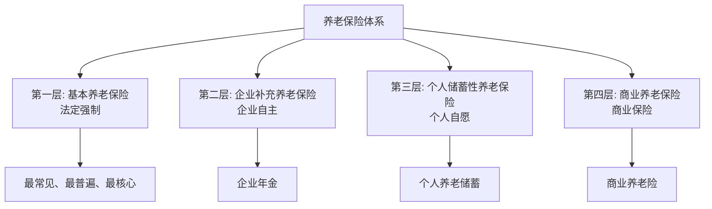
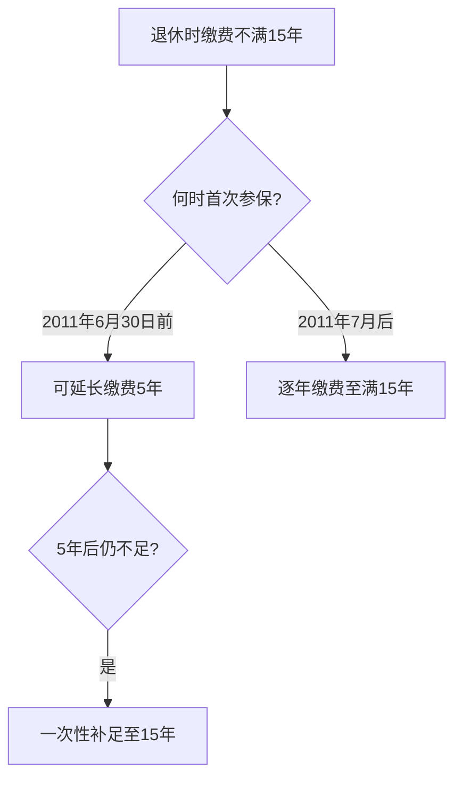

# 第22课：人人要知道的养老退休政策

## Learning Objectives

- 理解我国养老保险的四个层次
- 掌握养老金领取的三个必备条件
- 了解退休年龄的法定标准和认定规则
- 学会处理养老保险缴费年限不足等特殊情况

---

## 一、思考题回顾

> 上班期间回办公室取手机被绊倒骨折，能否认定为工伤？

**答案**：**不能**。虽然在工作地点受伤，但并非工作时间，且因私事（取手机）而非因工作原因受伤。若被领导叫回加班或取文件，则可认定为工伤。

---

## 二、什么是养老保险？

养老保险是国家通过立法强制征集社会保险税（费），形成养老基金，在劳动者退休后支付退休金以保障其基本生活的社会保障制度。

### 我国养老保险的四个层次

> 第一层基本养老保险是**法定强制**的，其他三层由企业和个人自行决定。

---

## 三、基本养老保险的缴费

### 缴费基数

职工本人**上一年度月平均工资**（含计时工资、计件工资、奖金、津贴补贴、加班工资等全部工资总额）

### 上下限规定

- **上限**：当地上一年度职工月平均工资的**300%**
- **下限**：当地上一年度职工月平均工资的**40%**（各地略有不同）

### 缴存比例

| 缴纳主体 | 比例 | 说明 |
|---------|------|------|
| 个人 | **8%** | 全国统一 |
| 单位 | **16%或更低** | 各地不同，如北京16%、广东14% |

---

## 四、领取养老金的条件

> 按月领取养老金须同时满足**三个条件**，缺一不可。

### 条件一：达到法定退休年龄

| 身份 | 退休年龄 |
|------|---------|
| 男职工 | 60周岁 |
| 女工人 | 50周岁 |
| 女干部 | 55周岁 |
| 特殊工种（男） | 55周岁 |
| 特殊工种（女） | 45周岁 |
| 因病或因工致残（男） | 50周岁 |
| 因病或因工致残（女） | 45周岁 |

### 条件二：依法参加养老保险并履行缴费义务

### 条件三：累计缴纳养老保险满15年

---

## 五、缴费年限不足15年怎么办

> 具体政策各地略有不同，建议咨询当地社保部门。

---

## 六、退休年龄的特殊问题

### 出生年月的认定

> 若身份证与档案记载的出生年月不一致，以**本人档案最先记载的出生年月**为准。

### 案例：陈女士退休年龄之争

陈女士在某街道办事处工作，参保身份为"工人"。50周岁时街道办以其达到法定退休年龄终止劳动关系。陈女士认为应作为"干部"按55周岁退休。

**法院判决**：以劳动合同中确定的岗位为准。陈女士的劳动合同中岗位为"工人类"，应按工人50周岁退休。

> [!tip] 重要提醒
> 签订劳动合同时，一定要注意合同中**岗位性质的界定**——是工人还是干部，直接影响退休年龄。

---

## 七、养老保险的其他问题

### 参保人员非因工或因病去世

其遗属可**一次性领取**：
- 个人账户本息
- 丧葬补助金（一般为2个月的在职职工社会平均工资）
- 抚恤金（每缴纳1年支付1个月，最多20个月）

### 灵活就业人员

> 灵活就业者没有单位为其缴纳社保，也可以自己缴纳养老保险。各地有相应的灵活就业人员参保政策，可到当地社保部门咨询办理。

---

## 八、实用建议

> [!tip] 律师建议
> 建议定期在社保局网站打印个人社保缴费记录，清楚了解自己的：
> - 缴纳基数
> - 缴纳数额
> - 缴纳年限

---

## 九、思考题回顾

> 作为灵活就业者，没有具体的单位缴纳社保，能否缴纳养老保险？

**答案**：可以。灵活就业人员可参加基本养老保险，具体政策可咨询当地社保部门。

---

## 相关课程

- [[0014-social-insurance|第13课：公司没交五险一金怎么维权？]]
- [[0015-waive-social-insurance|第14课：自愿放弃社保有什么风险？]]