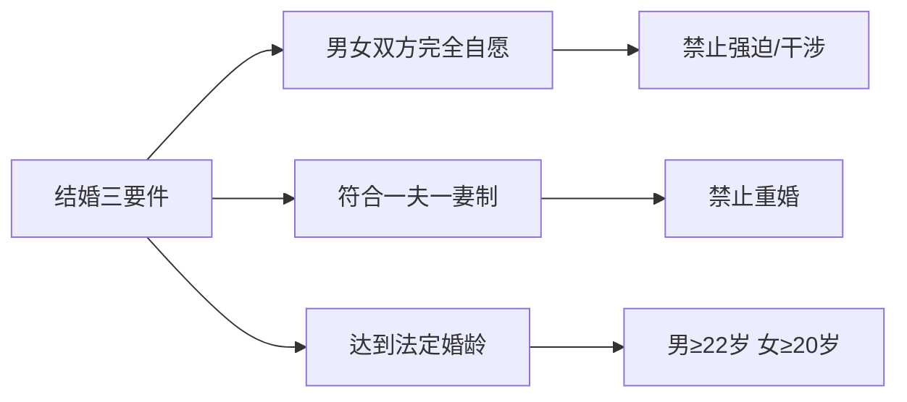
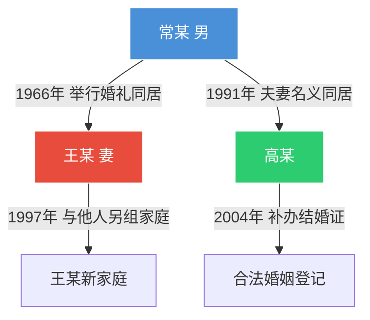

# 第23课：你可能结了个假婚——结婚的法定条件

## Learning Objectives

- 理解有效婚姻必须具备的三个法定要件
- 掌握婚姻登记的法律效力与程序要求
- 区分1994年前后事实婚姻的认定规则
- 识别无效婚姻与可撤销婚姻的核心区别

---

## 一、结婚的三要件

> [!quote] 民国结婚证誓词
> 两性联姻，一堂缔约，两缘永结，匹配同称。看此日桃花灼灼，宜室宜家，卜他年瓜瓞绵绵，尔昌尔炽。谨以白头之约书向红笺，好将红叶之盟载明鸳谱。

有效的婚姻必须同时满足以下三个条件，缺一不可：

### 要件一：男女双方完全自愿

- **婚姻主体**：一男一女（我国不承认同性婚姻）
- **婚姻自由**：禁止强迫、干涉
- **法律后果**：被胁迫的婚姻可向法院申请撤销
- **刑事风险**：以暴力干涉婚姻自由的，处 **2年以下有期徒刑或拘役**；致被害人死亡的，处 **2年以上7年以下有期徒刑**

### 要件二：符合一夫一妻制

- 我国实行 **婚姻自由、一夫一妻、男女平等** 的婚姻制度
- 重婚不仅是无效婚姻，还可能构成刑事犯罪

### 要件三：达到法定婚龄

- 男不得早于 **22周岁**
- 女不得早于 **20周岁**
- 注意：法定婚龄高于成年年龄（18岁），即"你可以参军保家卫国，但不到22岁还不能结婚"

---

## 二、婚姻登记程序

> [!info] 核心规则
> **结婚登记是使婚姻合法有效的唯一程序。** 只办酒席、只同居不领证，法律通通不承认。

- 必须 **双方亲自** 到婚姻登记机关申请
- 符合规定的，发给结婚证
- **不可代办、不可委托**
- 未办理登记的，应当 **补办登记**

---

## 三、事实婚姻的认定

### 时间分水岭：1994年2月1日

| 时间 | 法律效果 |
|------|----------|
| **1994年2月1日前** | 符合结婚实质要件的，按事实婚姻处理 |
| **1994年2月1日后** | 不再承认事实婚姻，一律按非法同居对待 |

### 1994年后的处理方式

- 要求离婚的，必须先 **补办结婚登记**
- 未补办的，按 **解除同居关系** 处理

### 重婚风险

> [!warning] 刑事风险
> 1994年2月1日后，有配偶者与他人以夫妻名义同居，或明知他人有配偶而与之以夫妻名义同居，仍可按 **重婚罪** 定罪处罚。

### 案例：常某重婚案

**裁判要旨**：法院认定常某没有重婚的故意，事实上也未同时保持两个婚姻关系，故不构成重婚罪。

---

## 四、无效婚姻与可撤销婚姻

> [!danger] 法律后果
> 婚姻被宣告无效或被撤销的，该婚姻 **自始没有法律约束力**，视为从未发生过。当事人之间不具有夫妻的权利义务。

### 无效婚姻的三种情形

1. **重婚** —— 已有配偶又与他人结婚
2. **禁止结婚的亲属关系** —— 直系血亲或三代以内旁系血亲
3. **未达法定婚龄** —— 男不满22岁、女不满20岁

### 可撤销婚姻的两种情形

1. **胁迫结婚** —— 受胁迫方可自胁迫终止之日起 **1年内** 请求撤销
2. **隐瞒重大疾病** —— 患病方未在登记前如实告知的，另一方可自知道之日起 **1年内** 请求撤销

### 案例：未达婚龄骗取登记

女方未满20岁，通过欺骗方式办理了结婚登记。十余年后双方感情破裂，女方请求确认婚姻无效。

**法院判决**：无效情形在起诉时已不存在（双方均已达到法定婚龄），不能以此为由确认婚姻无效，婚姻合法有效。

> [!tip] 关键时间点
> 可撤销婚姻的撤销权 **除斥期间为一年**，不适用诉讼时效中止、中断的规定，过期即失权。

---

## 总结

| 维度 | 要点 |
|------|------|
| 结婚三要件 | 自愿 + 一夫一妻 + 法定婚龄 |
| 登记效力 | 不登记 = 非法律意义上的婚姻 |
| 事实婚姻 | 1994年2月1日为分水岭，之后不承认 |
| 无效婚姻 | 重婚、近亲、未达婚龄 |
| 可撤销婚姻 | 胁迫、隐瞒重大疾病（1年内主张） |

---

## 思考题

**男孩的姥姥跟女孩的父亲是亲兄妹，那么男孩跟女孩可以结婚吗？**

> [!note] 提示
> 算清亲属关系代数：男孩为第一代，男孩姥姥为第三代，女孩父亲与男孩姥姥同源，女孩为第四代。以代数多的为准，属于四代旁系血亲，可以结婚。

---

*下一课预告：婚前协议的运用技巧*