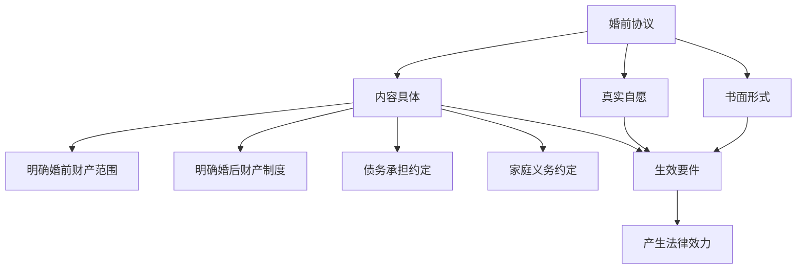

# 第24课：婚前协议的运用技巧

## Learning Objectives

- 理解婚前协议的法律性质与效力
- 掌握婚前协议可以约定和不可约定的内容
- 学会如何签署合法有效的婚前协议
- 了解公证与不公证的实际区别

---

## 一、什么是婚前协议

> [!info] 法律定义
> 婚前协议是男女双方在结婚登记之前，就双方各自婚前婚后所得的财产、所欠的债务、婚内行为等要素所做的，**以结婚为生效要件**的约定。

- 双方自愿签署后，如无法定无效和可撤销情形，即产生 **法律效力**
- 离婚时 **优先适用** 婚前协议中约定的财产分配规则

---

## 二、为什么要签婚前协议

### 现实背景

- 部分地区结婚与离婚比例高达 **50%**
- 离婚风险不言而喻，婚前协议能有效保证 **婚前既得利益**
- 明确婚前婚后财产的 **使用及归属**
- 为将来可能的离婚分割提供 **有利证据**

### 典型案例

> [!example] 默多克与邓文迪
> 因签有婚前协议及补充的婚后协议，邓文迪离婚仅获得两套房产，两个女儿成为870万美元基金受益人，而默多克仍拥有超过 **139亿美元** 的财产。

### 建议签署的人群

1. **资产数量较多的家庭** —— 提前规划，避免巨额财产流失
2. **双方财产差距较大的男女**
3. **涉外或涉港澳台婚姻** —— 避免不同法律体系造成的复杂程序
4. **再婚家庭** —— 明确财产归属，减少家庭纷争
5. **婚前财产与婚后财产界定不明** 的情况

---

## 三、如何签署合法有效的婚前协议

### 要件一：必须采用书面形式

> [!warning] 口头约定无效
> "口说无凭，立字为证"——约定应当采用 **书面形式**。

### 要件二：意思表示真实且不违反法律规定

- 双方 **自愿签署**
- 内容 **合法**，不违反公序良俗
- 不得有隐瞒、欺诈、胁迫
- 不得 **乘人之危**

### 要件三：内容尽可能具体明确

#### 应明确的内容清单

1. **婚前财产的范围**及婚后归属和处置权
2. **婚前共同财产的范围**及婚后的处置权
3. **婚后财产制度**：各自所有/共同所有/部分各自所有部分共同所有
4. **债务承担**约定
5. **家庭生活中的义务**（君子协定，无法律强制力）

---

## 四、公证问题

> [!question] 婚前协议一定要做公证才有效吗？
> **不需要。** 我国法律没有规定财产协议以公证为前提条件。只要双方真实意思表示、内容合法，无论是否公证都有法律效力。

### 公证的意义

- 多一份 **保障**
- 在协议丢失或损毁时，公证处留存的备份是 **有利证据**
- 涉及巨额财产时，建议公证

---

## 五、不动产归属的特殊要求

> [!danger] 不动产需配合产权登记
> 婚前协议约定不动产归属的，必须配合不动产登记，否则赠予方可以撤销赠予。

### 案例：张先生与赵女士

赵女士要求张先生将名下房产的一半产权赠予她，双方签订了婚前协议，但未办理产权变更登记。婚后两个月感情破裂，赵女士起诉要求确认房产共有。

**法院判决**：房产未过户、车辆未交付，赠予方享有 **任意撤销权**，驳回了赵女士的诉讼请求。

> [!tip] 法律依据
> 根据《民法典》第658条，赠予财产的权利转移之前，赠予人可以撤销赠予（具有救灾、扶贫等公益、道德义务性质或经过公证的赠予合同除外）。

---

## 总结

| 要点 | 说明 |
|------|------|
| 形式要求 | 必须书面 |
| 是否必须公证 | **否**，但公证增加保障 |
| 不动产约定 | 必须配合产权变更登记 |
| 效力优先 | 离婚时优先于法定财产分割规则 |
| 建议签署人群 | 资产悬殊、再婚、涉外、财产界限不清 |

> [!quote] 脱口秀大师黄子华
> "婚姻是一个壳，不是我们去保护婚姻，而是婚姻要来保护我们。两个成年人要把所有最坏的事情都说好，将婚姻这个壳做得足够坚固——坚固到即使婚姻不在了，它还能保护我们。"

---

## 思考题

**婚前协议一定要做公证才有效吗？**

> [!note] 答案提示
> 不一定。公证不是生效的前提条件。只要协议是双方真实意思表示、内容合法、不违反公序良俗，书面签署即有效力。公证的意义在于提供额外保障和证据留存。

---

*下一课预告：分手后同居财产怎么分？*