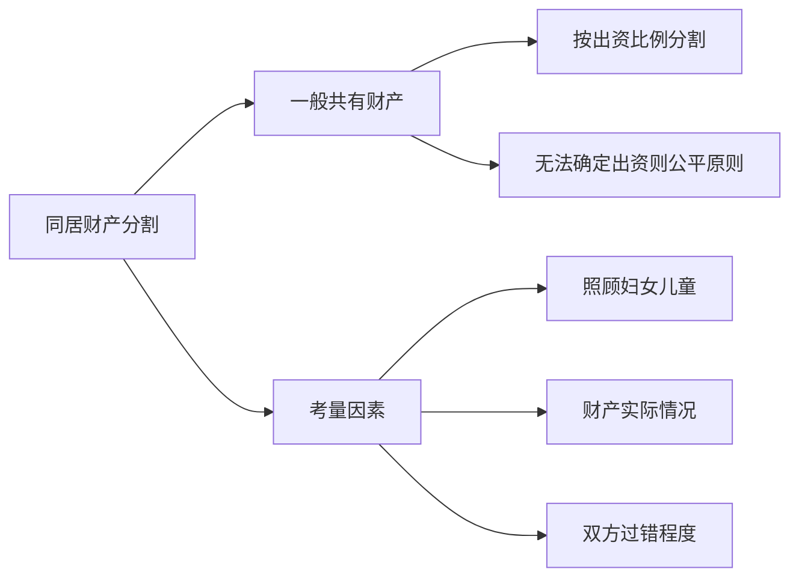

# 第25课：分手后同居财产怎么分？

## Learning Objectives

- 理解同居关系的法律认定标准
- 掌握同居财产分割的基本原则
- 区分同居财产与夫妻共同财产的核心差异
- 学会同居期间共同购置房产的处理方法

---

## 一、同居关系概述

> [!info] 现状
> 不领证直接同居、办酒席同居、试婚同居等现象非常普遍。虽然不合法，但已被社会广泛接受。

### 法律依据

目前适用的是 **1989年最高院**《关于人民法院审理未办结婚登记而以夫妻名义同居生活案件的若干意见》。

---

## 二、同居财产分割的基本原则

> [!important] 核心原则
> 解除同居关系时，同居生活期间双方 **共同所得的收入和购买的财产**，按 **一般共有财产** 处理。

### 分割考量因素

1. 照顾 **妇女儿童** 利益
2. 财产的 **实际情况**
3. 双方的 **过错程度**
4. 妥善分割

---

## 三、同居财产 vs 夫妻共同财产

| 对比维度 | 同居关系 | 夫妻关系 |
|----------|----------|----------|
| 财产性质 | 一般共有财产 | 夫妻共同财产 |
| 分割原则 | 按出资比例/公平原则 | 一般均等分割 |
| 一方死亡 | **不发生继承** | 配偶为第一顺序继承人 |
| 子女身份 | 非婚生子女 | 婚生子女 |
| 继承权 | 无继承权 | 有相互继承权 |

> [!warning] 同居关系不等同于夫妻关系
> 同居期间一方死亡，不发生继承关系；孩子属于非婚生子女（但享有与婚生子女同等的权利）。

---

## 四、共同购置房产的处理

### 案例：深圳房产分割案

双方共同购买深圳市某区公寓，总价123万元：
- 男方付定金4万 + 银行贷款68万
- 女方付首付51万
- 房产登记在男方个人名下
- 分手时房产升值至200万

**法院判决**：
- 按出资比例确定份额：女方51万（**41%**），男方72万（**59%**）
- 房产归男方，男方按现值200万的41%向女方补偿 **82万元**

> [!tip] 出资比例 = 权益比例
> 同居期间共同购房，双方没有约定份额比例的，根据 **实际出资比例** 确定各自份额。

---

## 五、同性同居关系的财产分割

> [!info] 法律态度
> 法律并未对同性同居关系作出禁止性规定，"法无明文禁止即允许"。同性同居行为不违法，产生的后果受法律保护。

### 案例：江某与赵某同性伴侣案

双方共同生活、共同创办培训学校，期间购置一套房产登记在江某名下。赵某主张有出资。

**法院认定**：
- 双方存在 **财产混同**（共同收入、共同开销）
- 赵某对购置房产有贡献
- 按 **公平原则**，双方各自享有 **50%** 份额

---

## 六、实操建议

### 同居期间的自我保护

> [!todo] 行动清单
> 1. 涉及大额财产支出时，签署 **同居期间财产归属协议**
> 2. 保留好付款凭证、转账记录
> 3. 明确约定各自的出资比例
> 4. 房产登记时明确共有形式和份额

### 诉讼指引

- **案由**：同居关系析产纠纷
- 法院受理条件：当事人因同居期间财产分割或子女抚养纠纷提起诉讼的，法院应当受理
- 同居关系的认定：以夫妻名义同居共同生活，可从共同购房、居住使用、准备结婚、共同生育、居住地登记信息等综合判断

---

## 总结

| 要点 | 核心内容 |
|------|----------|
| 财产性质 | 一般共有，非夫妻共同财产 |
| 分割原则 | 出资比例为主，公平原则为辅 |
| 房产处理 | 登记在谁名下谁享有物权，但需补偿对方 |
| 继承权 | 同居伴侣无继承权 |
| 建议 | 大额支出前签协议，保留付款凭证 |

---

## 思考题

**68岁的张大爷和64岁的刘大妈通过广场舞相识，两个老人为了相互照顾住到了一起，一直没有领证。三年后张大爷突发心脏病去世。刘大妈能继承张大爷的遗产吗？张大爷的女儿对刘大妈有没有赡养义务？**

> [!note] 答案提示
> 1. **不能继承**——二人未领证，不是夫妻关系，刘大妈不是法定继承人。但刘大妈尽了主要扶养义务的，可以适当分给遗产。
> 2. **没有赡养义务**——刘大妈与张大爷同居时，张大爷女儿已成年，未形成抚养关系。

---

*下一课预告：彩礼嫁妆归属于谁？*