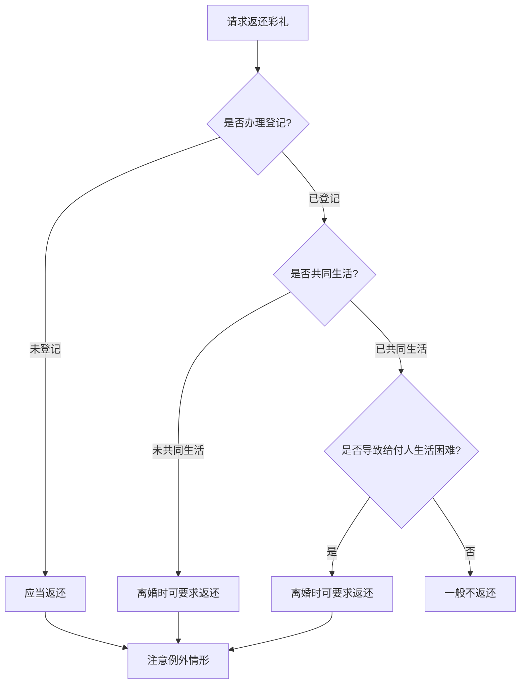

# 第26课：彩礼嫁妆归属于谁？

## Learning Objectives

- 理解彩礼的法律性质与民法典相关规定
- 掌握彩礼退还的三种法定情形
- 了解哪些情况不能要求退还彩礼
- 掌握嫁妆的归属认定规则

---

## 一、彩礼的法律性质

### 什么是彩礼

> [!info] 定义
> 彩礼是男女双方在结婚前，男方给女方的礼金，又称定亲彩礼、聘礼，是古代婚嫁习俗之一。

### 彩礼的三种法律性质

| 情形 | 归属 |
|------|------|
| 赠予女方父母 | 属于女方父母财产，非女方个人财产，也非夫妻共同财产 |
| 登记前赠予女方 | 属于 **女方个人财产**（以结婚为目的的附条件赠予） |
| 登记后赠予 | 属于 **夫妻共同财产**，但需明示是赠予女方个人的除外 |

> [!important] 民法典第1042条
> 禁止包办、买卖婚姻和其他干涉婚姻自由的行为，禁止 **借婚姻索取财物**。按习俗给付彩礼可以接受，但不得借彩礼名义买卖、包办婚姻。

---

## 二、彩礼退还的三种情形

### 法定退还情形

根据《民法典》婚姻家庭编司法解释第5条，以下三种情形法院支持返还彩礼：

1. **双方未办理结婚登记手续**
2. **双方办理了结婚登记手续但确未共同生活**（须以离婚为条件）
3. **婚前给付并导致给付人生活困难**（须以离婚为条件）

### 不能要求退还的情形

以下三种情况即使未登记，也 **不能** 要求返还彩礼：

1. 未办理登记但 **同居生活已满两年**
2. 未办理登记但已 **生育子女**
3. 所收彩礼已用于 **夫妻共同生活**

---

## 三、彩礼纠纷案例分析

### 案例一：订婚未结婚，流产补偿

- 双方订婚，男方给彩礼4万 + 万里挑一1.01万 = 共5.01万
- 女方怀孕后因矛盾终止妊娠
- 婚礼未举行，未办理登记

**法院判决**：女方返还彩礼4万元，1万元作为流产补偿。

### 案例二：恋爱期间转账能否认定为彩礼

- 男方转账给女方5万元
- 男方主张是彩礼，女方主张是还款- 双方无共同结婚的意思表示

**法院判决**：不能认定为彩礼，男方要求返还的请求不予支持。

> [!tip] 彩礼认定的关键
> 是否被认定为彩礼，取决于双方是否有 **以结婚为目的的给付意思表示**，以及是否具备彩礼给付的形式（如订婚仪式、双方家人在场等）。

---

## 四、嫁妆的归属认定

### 一般规则

| 交付时间 | 归属 |
|----------|------|
| **结婚登记前** 陪送 | 认定为女方家人对女方的 **婚前个人赠予**，属于女方个人财产 |
| **结婚登记后** 陪送 | 没有明确表示是对女方个人的，视为对 **夫妻双方的共同赠予** |
| 有特别约定 | 按约定认定 |

### 司法实践倾向

审判实践中，嫁妆一般被视为 **女方的婚前财产**，因为：
- 购买嫁妆的资金大多来源于女方父母
- 符合风俗习惯，当事人容易接受
- 有利于矛盾化解，符合公序良俗

### 案例：嫁妆返还案

男方给彩礼8.8万 → 女方父亲添4万作为嫁妆 → 共12.8万带入男方家 → 男方拿走10万还债 → 离婚

**法院判决**：4万元嫁妆系女方父母在登记前对女方的个人赠予，属于女方 **婚前个人财产**，男方及男方父母共同返还4万元。

---

## 总结

| 类型 | 关键规则 |
|------|----------|
| 彩礼性质 | 附条件的赠予，以结婚为目的 |
| 彩礼退还 | 未登记、已登记未共同生活、给付致贫（后两项需以离婚为条件） |
| 嫁妆归属 | 登记前陪送→女方个人；登记后陪送→通常为夫妻共同财产|
| 嫁妆归属 | 登记前陪送→女方个人；登记后陪送→通常为夫妻共同财产|
| 彩礼纠纷高发省份 | 河南（26%）、安徽（11%）、甘肃（7%） |

---

## 思考题

**男女双方结婚，女方父母婚前陪嫁了一套房子，但只付了首付，房子登记在女方名下，婚后小两口共同还贷。在这种情况下，房子的归属应该怎样认定？**

> [!note] 答案提示
> 婚前女方父母支付首付且登记在女方名下，属于女方的婚前个人财产。但婚后用夫妻共同财产还贷的部分及相应 **增值部分**，属于夫妻共同财产。离婚时，女方得房子，但需补偿男方共同还贷部分及其增值的一半。

---

*下一课预告：房产证上加了名，产权就归你吗？*