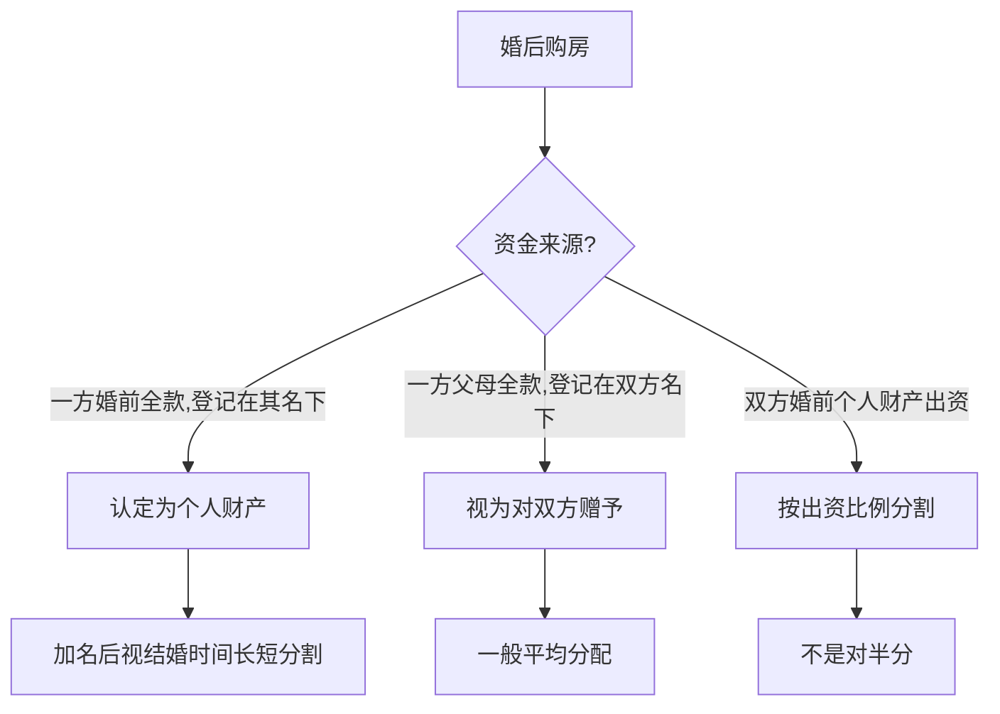
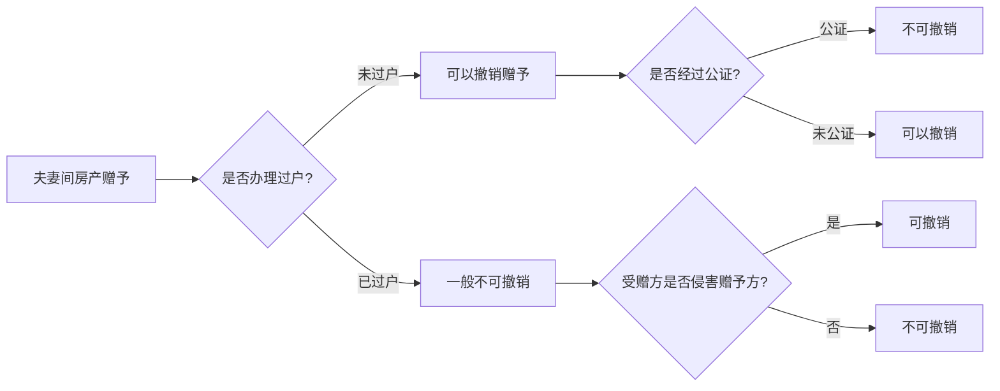

# 第27课：房产证上加了名，产权就归你吗？

## Learning Objectives

- 理解房产证加名的法律性质（赠予行为）
- 区分婚前加名与婚后加名的法律后果差异
- 掌握共同共有与按份共有的核心区别
- 了解赠予房产是否可以撤销的规则

---

## 一、婚前买房加名

### 情形一：婚前购房登记在双方名下，购房款来自一方

- 该房屋属于双方的 **共有财产**
- 登记为**按份共有**（如男方90%、女方10%）→ 按登记比例分配
- 登记为**共同共有** → 按共同共有处理

#### 未结婚就分手
- 一方完全未出资，加名是为了结婚
- 结婚目的未实现 → 上海高院认为未出资方可取得房屋 **10%-20%** 份额
- 其他地区一般不分割

#### 结婚后又离婚
- 加名视为对房屋产权的部分 **赠予**
- 离婚分割时 **不是绝对均分**
- 考量因素：财产贡献大小、结婚时间长短
- 结婚时间越长，越趋于平等

### 情形二：婚前男方出资买房，登记在女方名下

- 原则上视为女方个人财产（不动产登记制度）
- 出资方要回房产需证明：
  - 全款出资事实
  - 登记在对方名下的真实意图
- 无偿赠予 → 返还可能性小
- 以结婚为目的的附条件赠予 → 目的未实现可要求返还

### 情形三：婚前男方贷款买房登记在男方名下，婚后加名

- 婚后夫妻共同还贷部分属于共同财产
- 离婚时房子归男方，男方按比例补偿女方
- **补偿款 = 房屋离婚时价值 × 共同还贷比例 ÷ 2**

> [!tip] 注意两点
> 1. 房屋贷款应 **本息合并计算**，不只计算本金
> 2. 婚后共同还贷 = 以夫妻共同收入还款，即使全职太太无收入，男方单方还款也算共同还贷

---

## 二、婚后买房加名

| 情形 | 处理规则 |
|------|----------|
| 婚后共同财产买房 | 即使只写一人名字，也属于夫妻共同财产 |
| 加名手续 | 带结婚证、房产证、身份证到房产交易中心办理 |
| 银行贷款期间加名 | 需银行同意，通常贷款还清前不能变更 |

### 婚后买房的分割规则

---

## 三、共同共有 vs 按份共有

> [!info] 核心区别
> - **共同共有**：不分份额地共同拥有（离婚分割时不一定是50/50）
> - **按份共有**：按登记份额确定产权（离婚时严格按份额分割）

### 登记建议

> [!warning] 郝律师提醒
> 婚前买房加名时，一定要注意房屋登记为 **按份共有** 还是 **共同共有**，这对离婚时的财产分割有重大影响。

---

## 四、房产加名 = 赠予，能否撤销？

### 撤销规则总结

| 情形 | 能否撤销 |
|------|----------|
| 约定赠予但未办理过户 | **可以撤销**（任意撤销权） |
| 经过公证的赠予协议 | **不可撤销** |
| 已办理加名登记 | 一般不可撤销，除非受赠方侵害赠予方利益 |
| 为逃避法定义务而赠予 | 利害关系人主张权利的，赠予无效 |

> [!tip] 法律依据
> 《民法典》第658条：赠予财产的权利转移之前，赠予人可以撤销赠予（具有救灾、扶贫等公益、道德义务性质或经过公证的赠予合同除外）。

---

## 五、实操建议

### 最保险的方式：签署协议

> [!important] 协议优先
> 在房产证加名的同时，通过协议方式确定每个人的产权份额，以及离婚财产分割时的比例。只有这样，房屋产权才能得到充分保障。

### 核心原则

1. **谈钱不伤感情**，友好协商决定登记方式
2. 婚前加名注意区分按份共有与共同共有
3. 婚后加名需要确认是否属于夫妻共同财产
4. 大额出资建议保留相关凭证

---

## 总结

| 维度 | 要点 |
|------|------|
| 婚前加名 | 视为赠予，离婚时不一定均分，考量出资和结婚时间 |
| 婚后加名 | 夫妻共同财产，但按出资来源可能影响分割比例 |
| 共有形式 | 按份共有→按份额；共同共有→不一定对半 |
| 赠予撤销 | 未过户可撤销，公证后不可撤销 |
| 最佳方案 | 加名同时签署书面协议约定份额 |

---

## 思考题

**婚前买房，双方都出资了，房子登记在两个人的名下，并没有做按份共有的登记，还没有结婚就分手了。这种情况下房子应该怎么分？**

> [!note] 答案提示
> 双方没有领结婚证，不属于夫妻共同财产。只能按 **同居关系的公平原则**，按照双方 **实际出资比例** 来分割。

---

*下一课预告：法律如何界定家暴？发生家暴怎么保护自己？*