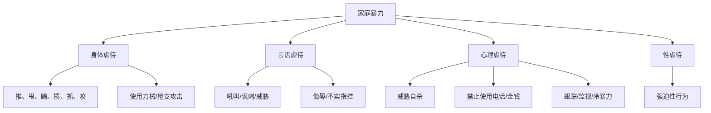
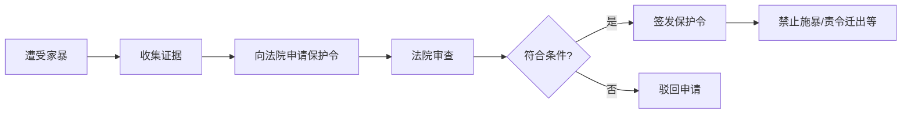

# 第28课：法律如何界定家暴？发生家暴怎么保护自己？

## Learning Objectives

- 理解家庭暴力的法律定义与四种表现形式
- 掌握人身安全保护令的申请条件和流程
- 学会遭遇家暴时如何有效收集证据
- 了解告诫书制度的法律作用

---

## 一、家庭暴力的法律界定

> [!info] 法律定义
> 根据《反家庭暴力法》第2条：家庭暴力是指家庭成员之间以 **殴打、捆绑、残害、限制人身自由** 以及 **经常性谩骂、恐吓** 等方式实施的身体、精神等侵害行为。

### 家暴的四种表现形式

### 冷暴力 vs 暴力

- **冷暴力**：言语和精神上的虐待，甚至不说话、冷漠对待
- **人身暴力**：殴打、捆绑、残害、限制人身自由

> [!important] 零容忍
> 家庭暴力只有 **零次和无数次的** 区别。民法典明确将禁止家庭暴力列入法典，赋予受害者请求损害赔偿的权利。

---

## 二、反家庭暴力法

### 法律背景

- **2016年3月1日** 起实施
- 共6章38条：总则、家庭暴力的预防、处置、人身安全保护令、法律责任、附则
- 当事人因遭受家暴或面临家暴现实危险的，可向法院申请 **人身安全保护令**

---

## 三、人身安全保护令

### 申请条件

- 当事人 **正在遭受** 家庭暴力
- 或面临家庭暴力的 **现实危险**

### 申请流程

### 保护令内容

- 禁止被申请人实施家庭暴力
- 禁止被申请人骚扰、跟踪、接触
- 责令被申请人迁出住所
- 保护申请人人身安全的其他措施

---

## 四、证据收集——维权的关键

### 家暴举证难的原因

- 家暴发生在家庭私密空间，具有 **隐蔽性**
- 往往是 **突发的**，无准备
- 受害者九成以上为女性

### 证据收集行动清单

> [!todo] 遭遇家暴应立刻行动
> 1. **报案** —— 第一时间向公安机关、居委会、村委会、妇联、司法局等寻求帮助
> 2. **伤情鉴定和治疗** —— 及时就医，获取诊断证明、病例资料；必要时做伤情鉴定（构成轻伤可追究刑事责任）
> 3. **保留物证** —— 撕破的衣物、施暴凶器
> 4. **保存电子证据** —— 施暴者的书面保证、微信聊天记录、受伤照片、现场录音录像
> 5. **寻找证人** —— 目睹人员、参与调解或治疗的人员可作为证人

### 证据类型一览

| 证据类型 | 具体内容 |
|----------|----------|
| 公权力记录 | 报警记录、出警记录、告诫书 |
| 医疗记录 | 诊断证明、病例资料、伤情鉴定 |
| 调解记录 | 居委会/村委会调解笔录 |
| 物证 | 破损衣物、施暴工具 |
| 电子证据 | 聊天记录、录音录像、受伤照片 |
| 人证 | 目击者、调解参与人 |
| 施暴者自认 | 保证书、悔过书、微信承认 |

### 案例：二审改判精神损害赔偿

女方起诉离婚并提供：
- 受伤照片 + 诊断证明
- 报警记录 + 110接警单
- 病历资料

男方否认家暴，称女方受伤为外出旅行自己造成。

**法院认定**：根据女方提供的证据，结合受伤部位在头颈、伤情为软组织挫伤等事实，以 **高度盖然性** 标准认定家暴成立，判男方支付 **精神损害赔偿金43,750元**。

> [!tip] 高度盖然性标准
> 在家暴案件中，法官可以根据生活经验法则，结合在案证据进行综合判断，不必要求"铁证如山"，只要事实具有 **高度的可能性** 即可认定。

---

## 五、告诫书制度

- 公安机关出警后，对家暴情节较轻的，可出具 **告诫书**
- 告诫书包含：施暴者身份信息、家暴事实陈述、禁止再次实施家暴等内容
- 告诫书可作为法院认定家暴事实的 **重要证据**

---

## 六、社会现状与展望

- 九成以上家暴受害者为女性，施暴者几乎全是男性
- 反家暴法实施解决了"无法可依"问题
- 但家暴的社会干预模式仍需健全
- 全社会应重视家庭文明建设，加大反家暴力度

---

## 总结

| 要点 | 内容 |
|------|------|
| 家暴定义 | 身体暴力 + 精神暴力 + 性暴力 + 冷暴力 |
| 法律依据 | 《反家庭暴力法》（2016年3月1日实施） |
| 保护令 | 遭受或面临家暴危险可申请 |
| 证据重要性 | 家暴隐蔽性强，证据是维权的关键 |
| 举证标准 | 高度盖然性，不要求绝对确凿 |

---

## 思考题

**打小孩算家庭暴力吗？**

> [!note] 答案提示
> 视程度而定。打死、打残、打成重伤的不仅是家暴，还可能追究刑事责任。经常性谩骂、拳打脚踢、扇耳光导致人身伤害或精神恐惧的，构成家庭暴力。提倡启发式教育，反对拳打脚踢。

---

*下一课预告：对方出轨了，能让ta净身出户吗？*