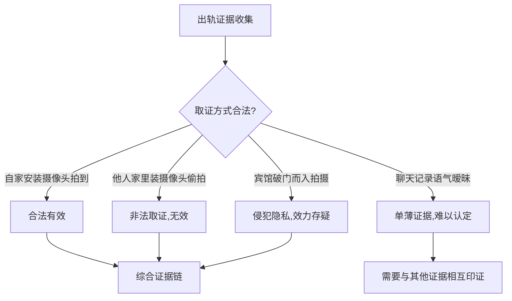
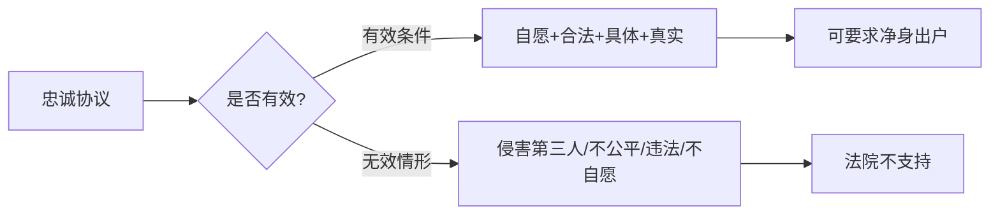

# 第29课：对方出轨了，能让ta净身出户吗？

## Learning Objectives

- 理解"净身出户"不是法律术语及其与出轨的法律关系
- 掌握出轨有效证据的收集方法与合法性判断
- 了解离婚损害赔偿的适用条件
- 认识忠诚协议的法律效力与限制

---

## 一、出轨与"净身出户"

> [!info] 核心观点
> **"净身出户"不是法律术语**，是民间口头表达。民法典没有"净身出户"这个概念。

### 民法典的规定

出轨导致离婚的，无过错方有权要求 **离婚损害赔偿**。但"净身出户"（让过错方完全不分财产）并非法定后果。

### 谁可以实现净身出户的效果

> [!important] 关键条件
> 夫妻可在婚前或婚后以书面形式约定财产归属，并约定在一方有过错（如出轨）的情况下，过错方主动放弃财产。只要该约定不违反法律规定，出轨事实成立时，可实现对方净身出户。

---

## 二、有效证据类型

### 证据合法性判断

### 有效证据清单

> [!tip] 单一证据难以认定
> 出轨证据必须是 **综合的、连贯的、相互印证的**，单一证据往往难以被法院采信。

| 证据类型 | 说明 |
|----------|------|
| 通信记录 | 微信、短信等暧昧聊天内容 |
| 开房记录 | 酒店住宿记录 |
| 转账记录 | 多笔转账、消费记录 |
| 照片/视频 | 注意取证合法性 |
| **保证书/悔过书** | 对方亲笔书写，非常有力的证据 |
| 私生子出生证明 | 直接证据 |
| 以夫妻名义同居的证据 | 邻居证言、小区登记等 |

### 经典证据案例

双方长期以夫妻名义对外生活，在某小区购房同居，门口挂着"五好家庭"牌匾（有关部门误发）——这个牌匾本身成了非常有效的证据。

---

## 三、离婚损害赔偿

### 适用情形

根据《民法典》，因以下情形导致离婚的，无过错方有权请求损害赔偿：
1. **重婚**
2. **有配偶者与他人同居**（长期）
3. **出轨**（偶发但导致离婚）

### 赔偿金额的影响因素

- 过错程度
- 财产来源与状况
- 结婚时间长短
- 当事人未来生活需要

---

## 四、忠诚协议的效力

### 有效的情形

> [!example] 案例：出轨责任协议书
> 双方签署协议约定："任何一方在外有婚外情而引起离婚，家庭所有财产归另一方所有（含车、房、现金、存款、流动资金），子女也归另一方所有。"
>
> 婚后第七年，女方起诉离婚要求按协议让男方净身出户。
>
> **法院判决**：协议有效。双方具备完全民事行为能力，意思表示真实，内容不违法、不违公序良俗，约定具体可操作。判决男方净身出户。

### 有效条件

1. 双方具备 **完全民事行为能力**
2. **真实意思表示**，无欺诈、胁迫
3. 内容 **不违反法律强制性规定**
4. 不违反 **公序良俗**
5. 约定 **具体、详细、可操作**

### 无效的情形

| 无效情形 | 示例 |
|----------|------|
| 以协议离婚为生效条件 | "如协议离婚则净身出户"——选择诉讼离婚则协议无效 |
| 内容不合法/不真实 | "男方不得与前女友有任何联系，否则打10万欠条" |
| 不公平不公正 | 只约束男方，不约束女方 |
| 表述不真实 | 吵架后哄妻而签，无具体财产清单 |
| 非自愿签订 | 受威胁、强迫签订 |
| 损害第三人利益 | 净身出户导致无力支付前婚子女抚养费 |

---

## 五、实操建议

> [!todo] 行动清单
> 1. **不要冲动取证** — 违法取证的证据无效还可能反被告
> 2. **发现苗头就保存证据** — 保证书是最好的证据，让对方亲笔写
> 3. **综合收集** — 将通信记录、转账记录、照片等形成证据链
> 4. **注意除斥期间** — 离婚损害赔偿请求应在离婚时一并提出
> 5. **谨慎签忠诚协议** — 可以约定财产归属，但不要动不动就签"净身出户"协议

> [!warning] 重要提醒
> 如果过错方需要承担前婚子女抚养费、老人赡养费等法定义务，"净身出户"可能因损害第三人利益而无法获得法院支持。如有此情况，务必在法庭上出示相关证据。

---

## 总结

| 要点 | 核心内容 |
|------|----------|
| 净身出户 | 非法定术语，需通过协议约定实现 |
| 损害赔偿 | 出轨导致离婚，无过错方可主张 |
| 证据要求 | 综合连贯、相互印证的证据链 |
| 忠诚协议 | 有效时可按约定让过错方净身出户 |
| 无效情形 | 侵害第三人、不公平、不自愿、不合法 |

---

## 思考题

**婚姻存续期间，出轨的一方背着妻子赠与小三的财产有效吗？**

> [!note] 提示
> 夫妻对共同财产有平等处理权。未经配偶同意，擅自将夫妻共同财产赠与他人的行为，因违反公序良俗且侵害配偶权益，一般认定为 **无效**。配偶可以要求小三返还受赠财产。

---

*下一课预告：哪些情况下婚姻是无效的？哪些婚姻可以撤销？*