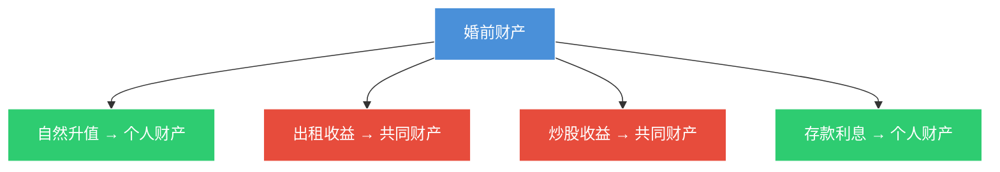

# 第30课：离婚了，如何保护我应得的财产和权益？

## Learning Objectives

- 掌握离婚财产分割的三大原则（照顾子女、女方、无过错方）
- 区分夫妻共同财产与一方个人财产的范围
- 了解子女抚养权的判定标准与变更条件
- 掌握抚养费的计算标准与支付期限

---

## 一、起诉离婚的流程与时间

> [!warning] 心理准备
> 诉讼离婚是一个**比较漫长的过程**，通常需要一年多时间才能实现离婚目的。

### 第一次起诉大概率不判离

- 只要**对方不同意离婚**，且不存在婚外情、重婚等过错情形
- 法院一般以"感情未破裂"为由**不判离**
- 需等判决生效 **6个月后** 再次起诉

### 民法典新规：第二次判离条件

> [!info] 民法典新变化
> 第二次起诉时，如果**分居满一年**，法院**必须判离**。

---

## 二、离婚财产分割原则

### 三大原则

1. **照顾女方**
2. **照顾子女**
3. **照顾无过错方**

### 夫妻共同财产的范围

| 类别 | 具体内容 |
|------|----------|
| **工资奖金** | 婚姻存续期间的劳动收入 |
| **生产经营收益** | 婚后经营所得 |
| **知识产权收益** | 婚后出版的版税、专利收益等 |
| **继承/赠与所得** | 除非明确只归一方 |
| **住房公积金** | 婚姻存续期间部分 |
| **养老保险金** | 婚姻存续期间部分 |
| **破产安置费** | 婚姻存续期间部分 |
| **婚后购房** | 即使登记在一方名下，也是共同财产 |

### 婚前财产在婚后的收益归属



### 一方个人财产（不可分割）

1. **婚前财产**
2. **因伤害获得的医疗补助费、残疾人生活补助费**
3. **遗嘱/赠与合同明确只归一方的财产**
4. **个人生活用品**（化妆品、首饰等）
5. **军人的伤亡保险金、伤亡补助费、医疗补助费**
6. **婚前财产购买的房屋**（属于出资人个人财产）

### 父母出资购房的归属

| 出资时间 | 推定规则 |
|----------|----------|
| **婚前**父母出资 | 视为对**自己子女**的赠与 |
| **婚前**明确赠与双方 | 属于双方 |
| **婚后**父母出资 | 视为对**双方**的赠与 |
| 婚后明确只赠与自己子女 | 属于一方个人财产 |

---

## 三、给小三的财产可以追回

> [!danger] 擅自处分无效
> 夫妻一方擅自将共同财产**无偿赠与婚外第三者**，损害了另一方的财产权益，该**赠与行为无效**，财产可以追回。

---

## 四、子女抚养权的判定

### 核心原则

> [!quote] 法院的裁判标准
> **以孩子利益最大化为标准**，以**不改变孩子的生活方式**、对孩子的成长有利为原则。

### 按年龄段的判定规则

```mermaid
graph TD
    A[子女抚养权判定] --> B[2周岁以下]
    A --> C[2-8周岁]
    A --> D[8周岁以上]
    
    B --> B1[原则上归母亲抚养]
    B --> B2[例外:母亲患重病/有不良嗜好时可归父亲]
    
    C --> C1[按双方条件综合判定]
    C --> C2[优先考虑:已做绝育手术的一方]
    C --> C3[优先考虑:长期抚养孩子的一方]
    C --> C4[优先考虑:无其他子女的一方]
    
    D --> D1[尊重孩子本人意愿]
    
    style A fill:#4a90d9,stroke:#fff,color:#fff
    style B fill:#2ecc71,stroke:#fff,color:#fff
    style C fill:#f39c12,stroke:#fff,color:#fff
    style D fill:#e74c3c,stroke:#fff,color:#fff```

### 抚养权的变更条件

- 抚养方生活发生变化，不适于继续抚养
- 抚养方**不尽抚养义务**或**虐待子女**
- **8周岁以上**子女自己要求变更

### 抚养费标准

| 项目 | 标准 |
|------|------|
| **一个子女** | 工资收入的 **20%~30%** |
| **两个子女** | 最高不超过工资的 **50%** |
| **支付期限** | 原则上至 **18周岁** |
| **18岁后** | 父母自愿，法律不强制 |

---

## 五、思考题

**夫妻离婚后，孩子只能跟一方吗？可以轮流抚养吗？**

> [!note] 提示
> 根据法律规定，在有利于保护子女利益的前提下，父母双方**协议轮流抚养子女的，人民法院是准许的**。具体做法可以是每人一周、每月、每季度或每年轮换一次。父母与子女的关系不因父母离婚而消除。

---

*下一课预告：哪些情况下不能办离婚？*