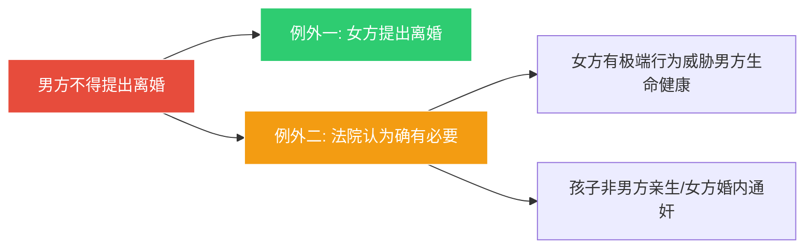

# 第31课：哪些情况下不能办离婚？

## Learning Objectives

- 掌握四种法定不能离婚的情形
- 理解对军婚的特殊保护规定
- 了解离婚冷静期的法律逻辑
- 识别夫妻感情破裂的六种认定标准

---

## 一、女方怀孕期、分娩后及终止妊娠后

> [!danger] 民法典第1082条
> **女方在怀孕期间、分娩后一年内或终止妊娠后六个月内，男方不得提出离婚。**

### 立法目的

保护女方在特殊时期的身体健康，同时保障胎儿/婴儿的照顾需求。

### 两种例外情形

### 案例一：女方产后暴力

女方生产后对男方拳打脚踢，不给孩子喂奶，不准父亲和奶奶碰婴儿。法院以"确有必要"为由受理男方离婚请求并判离。

### 案例二：孩子非男方亲生

女方与他人通奸怀孕，男方申请离婚。法院以"确有必要"为由受理并判离。

---

## 二、现役军人的配偶要求离婚

### 民法典第1081条

> [!quote] 军婚保护原则
> **现役军人的配偶要求离婚，应当征得军人同意。** 军人不同意则不能离婚，但军人一方有重大过错的除外。

### 什么是现役军人？

包括在**中国人民解放军**和**中国人民武装警察部队**服役的：
- 军官、武警警官
- 文职干部、士兵
- 军队学员

> [!warning] 注意
> 不包括预备役军人、国防生、退役/复员/转业军人、军队非现役文职人员。

### 军人重大过错的三种情形

1. **重婚**或与他人同居
2. **家暴**或虐待、遗弃家庭成员
3. **赌博、吸毒**等恶习屡教不改

### 刑事风险

> [!danger] 破坏军婚罪
> 明知是现役军人的配偶而与之**同居或结婚**，处 **3年以下有期徒刑或拘役**。

---

## 三、判决不准离婚后的起诉限制

### 六个月冷静期

> [!info] 司法规则
> 判决不准离婚、调解和好、原告撤诉或驳回起诉后，**没有新情况、新理由的，原告在六个月内再起诉，法院不予受理。**

- 这是法律给予双方的**冷静期**
- 但**另一方起诉**不受此限制

---

## 四、夫妻感情未破裂

### 法院判离的核心标准

> [!quote] 唯一标准
> 法院判决离婚的**唯一标准**是——**夫妻感情确已破裂**。

### 感情破裂的六种认定情形

| 序号 | 情形 |
|:----:|------|
| 1 | 重婚或有配偶者与他人同居 |
| 2 | 实施家庭暴力或虐待、遗弃家庭成员 |
| 3 | 赌博、吸毒等恶习屡教不改 |
| 4 | **因感情不和分居满两年** |
| 5 | 一方被宣告失踪 |
| 6 | 一方被依法判刑或违法犯罪行为严重伤害夫妻感情 |

### 网红判决书：双方都同意离婚，法官仍不准离

> [!quote] 法官寄语
> 本案中原被告虽然结婚时间不足一年，但结婚前经过了长时间的恋爱，双方互相了解，婚前感情基础较好。日常生活中虽有矛盾发生，也属于夫妻相处中的正常现象，未达到夫妻感情破裂的程度。

**案件要点**：
- 双方恋爱两年后结婚，育有一女
- 矛盾因生孩子后男方沉迷游戏、缺乏家庭责任感引发
- 双方虽同意离婚，但法官认为**感情未真正破裂**
- 判决：**不准离婚**

---

## 五、思考题

**小红的丈夫是现役军人，小红与丈夫分居满两年，小红向法院申请离婚，能得到法院的支持吗？**

> [!note] 提示
> 因为小红是军婚，如果小红的丈夫不同意离婚，小红向法院提起离婚请求是**得不到支持的**。但如果丈夫有法律规定的重大过错（重婚、家暴、赌博吸毒等），则可以得到支持。分居满两年虽是感情破裂情形之一，但军婚受特别保护，仍需军人同意或存在重大过错。

---

*下一课预告：想收养子女要符合什么样的条件？*