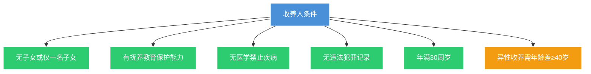

# 第32课：想收养子女要符合什么样的条件？

## Learning Objectives

- 掌握收养人应具备的五个法定条件
- 了解民法典关于收养的五项重大变化
- 理解收养登记的必要性和法律效力
- 掌握收养关系成立后的权利义务关系

---

## 一、收养人的条件

### 民法典第1098条：五项条件

> [!info] 收养人条件
> 1. **无子女或者只有一名子女**
> 2. 有**抚养、教育和保护被收养人**的能力
> 3. 未患有医学上认为**不能收养子女的疾病**
> 4. **无不利于被收养人健康成长的违法犯罪记录**
> 5. **年满30周岁**

### 无配偶者收养异性子女的特殊要求

> [!warning] 年龄差要求
> 无配偶者收养异性子女的，收养人与被收养人的年龄应当**相差40周岁以上**。

### 案例：老李收养花花

- 老李49岁，中学教师，身体健康，无不良嗜好和犯罪记录
- 花花8岁，因交通事故父母双亡成为孤儿
- 两人年龄相差41岁（>40岁）
- 花花已满8周岁，本人同意
- **结论：收养合法有效**

---

## 二、民法典收养新规——五大变化

### 变化一：放宽收养条件与数量

| 原规定 | 新规定 |
|--------|--------|
| 无子女才能收养 | 无子女可收养**2名**，有一名子女可再收养**1名** |
| 仅能收养1名 | 数量上限放宽 |

### 变化二：扩大被收养人范围

- **原规定**：不满14周岁的未成年人
- **新规定**：**14~18周岁的未成年人**也可以被收养
- 民法典第1093条三类：丧失父母的孤儿、查找不到生父母的未成年人、生父母有特殊困难无力抚养的子女

### 变化三：征求被收养人意见的年龄下调

> [!info] 从10周岁降为8周岁
> 民法典第1104条规定：收养**8周岁以上**未成年人的，应当**征得被收养人同意**。

### 变化四：扩大40岁年龄差适用范围

新增规定：**单身女性收养男孩**或**单身男孩收养女孩**，都需满足40周岁年龄差。

### 变化五：增加无违法犯罪记录要求

新增"无不利于被收养人健康成长的违法犯罪记录"条件。

---

## 三、收养手续

### 必须办理登记

> [!danger] 核心规则
> 收养关系**自登记之日起成立**。没有办理登记的，**不适用**法律关于父母子女关系的规定。

### 收养登记材料清单

| 类别 | 材料 |
|------|------|
| 身份证明 | 收养人身份证、户口本、结婚证 |
| 被收养人证明 | 出生证明、户口本 |
| 能力证明 | 单位/村居委会出具的抚养教育能力证明 |
| 计生证明 | 街道/乡镇出具的收养人子女情况说明 |
| 健康证明 | 收养人双方健康体检报告 |
| 亲属证明 | 收养三代以内旁系血亲的，需公安机关证明或公证 |

### 案例：收养12年未登记被判无效

- 梁先生夫妇2008年领养汪某，与生父签订领养协议
- 12年后汪某生母起诉，称当年不知情
- **法院判决**：未办理收养登记，收养关系不成立，收养行为无效
- 出于公平，生母补偿梁先生**8万元**（抚养费、教育费、医疗费等）

---

## 四、收养的法律效力

### 民法典第1111条

> [!quote] 法律后果
> 自收养关系成立之日起：
> - ❤️ 养父母与养子女的关系 = **父母子女关系**
> - ❤️ 养子女与养父母近亲属 = 近亲属关系
> - ❌ 养子女与生父母的权利义务关系**消除**

这意味着：
- 养父母对养子女有**养育义务**
- 养子女对养父母有**赡养义务**
- 双方可**相互继承遗产**

---

## 五、思考题

**张先生今年40岁，单身没有孩子，有收养孩子的经济能力。张先生的堂姐去世，留下了一个女儿今年7岁。年龄相差不满40岁，张先生可以收养堂姐的女儿吗？**

> [!note] 提示
> 可以。根据民法典第1099条，收养**三代以内旁系同辈血亲的子女**，可不受无配偶者收养异性子女需相差40周岁以上的限制。张先生与堂姐的女儿属于三代以内旁系血亲，年龄差不满40岁也可以收养。

---

*下一课预告：子女对父母的赡养义务如何体现？*