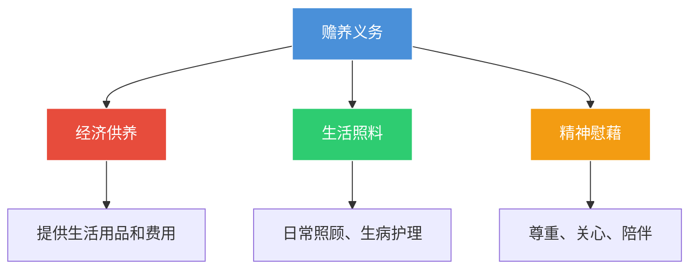

# 第33课：子女对父母的赡养义务如何体现？

## Learning Objectives

- 理解赡养义务的三重内涵（经济供养、生活照料、精神慰藉）
- 掌握子女赡养义务的法定性与无条件性
- 了解孙辈对祖辈的赡养条件
- 识别哪些情形下可以免除赡养义务

---

## 一、什么是赡养？

### 法律依据

- **宪法**：成年子女有赡养扶助父母的义务
- **民法典第26条**：成年子女对父母负有**赡养、扶助和保护**的义务

### 赡养的三重内涵

### 谁有赡养义务？

> [!info] 范围
> - 婚生子女对父母
> - **非婚生子女**对生父母
> - **养子女**对养父母
> - **继子女**对履行了抚养教育义务的继父母

### 案例：七旬父亲要求女儿探望

- 陈某1952年结婚，婚后生育两子三女
- 妻子与两个儿子均已去世，陈某与小女儿生活
- 体弱多病，要求女儿照顾被拒
- **法院判决**：
  - 长女和次女每月探望陈某**不少于一次**
  - 三个女儿共同负担医疗费
  - 不能因父母有退休收入就将父母置之不顾

---

## 二、孙辈对祖辈的赡养义务

### 民法典规定

> [!info] 有条件的赡养
> 有负担能力的**孙子女、外孙子女**，对于**子女已经死亡**的祖父母、外祖父母，有赡养义务。

**条件**：
1. 孙辈有负担能力
2. 祖辈的子女已死亡

---

## 三、能否以父母未抚养为由免除赡养义务？

### 一般情况：不能免除

> [!warning] 法定无条件义务
> 子女对父母的赡养义务是**法定的、无附加条件的**。不能以父母未履行抚养义务为由拒绝赡养。

**情形分析**：

| 父母未抚养的原因 | 结论 |
|------------------|------|
| 经济能力不足等客观原因 | **不免除**赡养义务 |
| 因犯罪被监禁 | **不免除**赡养义务 |
| **故意杀害、虐待、遗弃**子女 | **可以免除**赡养义务 |

### 例外：情节严重的可以免除

如果父母具有抚养能力但**拒不履行抚养义务**，或对子女实行**虐待、遗弃、故意杀害**，情节严重——受严重伤害的子女可以不再承担赡养义务。

> [!note]
> 如果子女不计前嫌，**自愿赡养**伤害过自己的父母，法律不予干涉。

---

## 四、父母离婚后，子女还有赡养义务吗？

### 民法典第1069条

> [!quote] 不因婚姻关系变化而终止
> **子女对父母的赡养义务，不因父母的婚姻关系变化而终止。**

### 案例：父亲20多年未联系，能否主张赡养？

- 老张与黄女士1981年结婚，育有一子小张
- 1995年分居，孩子随母亲生活，与父亲感情疏远
- 1998年离婚后，小张与老张再无联系
- 20多年后，老张主张赡养

**法院结论**：**有义务**。赡养义务不因父母离婚、再婚而终止。

> [!tip] 诉讼时效
> 请求支付赡养费的权利**不受诉讼时效限制**（超过20年也可以主张），因为赡养是持续性义务。

---

## 五、放弃继承权能否免除赡养义务？

> [!danger] 不能！
> **赡养义务是法定义务**，不能以放弃继承权为由免除。

### 案例：儿子放弃继承仍被判支付赡养费

- 张某兄妹四人，父亲76岁患病不能自理
- 张某忙于经商，提出放弃继承财产，不承担赡养义务
- 父亲将张某告上法庭
- **法院判决**：赡养老人是子女应尽的法定义务，以放弃继承权拒绝赡养**不对**
- 判令张某每月支付赡养费**300元**

> [!info] 法律逻辑
> 赡养义务是**长期性、持续性**义务，不同于一般民事债权债务的一次性给付。即使父母曾经同意免除赡养义务，后续需要时仍可重新主张。

---

## 六、不赡养老人的法律后果

| 情节 | 后果 |
|------|------|
| **较轻** | 治安处罚 |
| **严重** | 追究刑事责任 |
| **民事救济** | 申请人民调解或向法院起诉 |

---

## 七、思考题

**儿媳妇对公婆，或者女婿对岳父母，有没有法定的赡养义务？**

> [!note] 提示
> 媳妇对公婆、女婿对岳父母**没有法定的赡养义务**。但民法典第1129条规定：**丧偶的儿媳对公婆、丧偶的女婿对岳父母，尽了主要赡养义务的，可以作为第一顺序继承人**。尽主要赡养义务表现为：经济上提供主要来源、生活上提供主要帮助（包括生病护理）、具有长期性而非偶尔看望。

---

*下一课预告：找工作遇到传销洗脑公司，怎么办？*