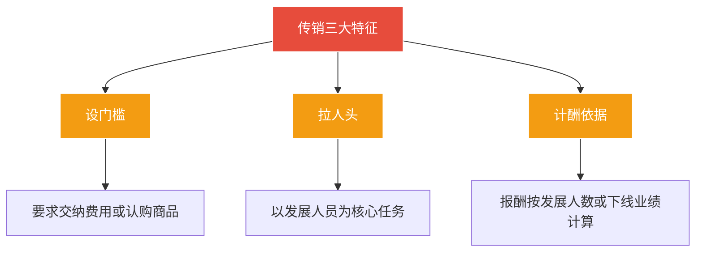

# 第35课：找工作遇到传销洗脑公司，怎么办？

## Learning Objectives

- 掌握传销组织的三大核心特征
- 学会求职前对公司的背景调查方法
- 掌握误入传销后的六种自救策略
- 了解传销罪的构成要件与量刑标准

---

## 一、什么是传销？

### 法律定义

> [!quote] 传销的实质
> 传销是组织者发展人员，通过被发展人员**直接或间接发展的人员数量**或**业绩**为计算和给付报酬，或要求被发展人员以**交纳费用**为条件取得加入资格，从而获得财富的**违法行为**。

### 传销三大特征

### 求职时的判断清单

| 问题 | 危险信号 |
|------|----------|
| 加入要交费吗？ | 要求交费或认购商品取得加入资格 |
| 工作内容是？ | 主要任务是发展人员加入 |
| 报酬怎么算？ | 按发展人员数量或下线业绩计算 |
| 公司查得到吗？ | 企业信用系统查不到注册信息 |

---

## 二、求职前背景调查

### 推荐查询网站

> [!tip] 四大查询工具

| 网站 | 用途 |
|------|------|
| **国家企业信用信息公示系统** | 查询注册登记、许可审批、行政处罚、经营异常等 |
| **企信宝/企查查/天眼查** | 查询公司基本信息 |
| **商务部直销行业管理网站** | 查询有资格从事直销的企业 |
| **中国裁判文书网** | 查询公司/管理人员涉及的诉讼情况 |

### 案例：网友识破骗局

- 网友在网上找到一份"北清人教育基地"的兼职
- 对方发来的四份文件，公司名称格式不一致
- 网友到企业信用网查询，**发现没有这个公司**
- 及时避免了上当受骗

> [!warning] 注意
> 查到某企业有直销经营许可证，**不意味着完全可靠**，只说明有直销资质。

---

## 三、误入传销后的自救策略

### 六种自救方法

> [!danger] 保护生命安全是第一位的

| 序号 | 策略 | 具体做法 |
|:----:|------|----------|
| 1 | **保管财务** | 尽量保管好身份证、银行卡、手机，不入对方手中 |
| 2 | **表面配合** | 记住楼栋号、门牌号、标志性建筑等位置信息 |
| 3 | **假装生病** | 装病要求外出就医，寻找逃脱机会 |
| 4 | **求救纸条** | 趁不备抛出求救纸条 |
| 5 | **暗示危险** | 与家人通信时说与事实不符的事，提前约定暗号 |
| 6 | **趁外出逃跑** | 利用上街考察时机挣脱，提前规划逃跑路线 |

### 逃脱后立即报警

> [!info] 逃脱后立刻到安全区域拨打 **110** 报警。

### 案例：小李机智脱险

- 同学小周邀小李去武汉"做生意"
- 到武汉后被要求交3800元"份子钱"再拉人入会
- 小李想起大学法制课讲过的传销手段，意识到被骗
- 尝试逃跑失败，手机被没收，被严加看管
- 小李**假装配合**取得信任，手机被归还
- 在洗手间向同学发出求救信息，请同学报警
- 在商场故意拖延时间，警察根据定位成功解救

---

## 四、传销罪的认定

### 刑事立案标准

> [!info] 立案条件
> 传销组织内部参与传销活动人员在**30人以上**且层级在**三级以上**的，对组织者、领导者应**立案追诉**。

### 量刑标准

| 情节 | 刑罚 |
|------|------|
| 一般违法 | 行政处罚（工商部门） |
| 情节严重 | **5年以下有期徒刑或拘役**，并处罚金 |
| 情节特别严重 | **5年以上有期徒刑**，并处罚金 |

### 传销与直销的区别

> [!warning] 注意区分
> 直销活动中出现夸大宣传、误导行为，由直销监管部门予以**行政处罚**，不能认定为传销罪。

---

## 五、总结

| 维度 | 要点 |
|------|------|
| 事前预防 | 查询企业信用、核实公司资质、放弃一夜暴富心理 |
| 事中自救 | 保护证件、表面配合、假装生病、趁外出求救 |
| 事后追责 | 及时报警、保存证据 |
| 刑事标准 | 30人以上+三级以上=传销罪 |

---

## 六、思考题

**传销组织什么情况下可以构成传销罪？**

> [!note] 提示
> 传销组织内部参与人员在**30人以上**且层级在**三级以上**的，对组织者、领导者应当立案追诉。需结合传销涉案金额、发展人员数量、使用手段、造成影响等多方面因素综合衡量。

---

*下一课预告：常见的碰瓷伎俩都有哪些？该如何反击？*