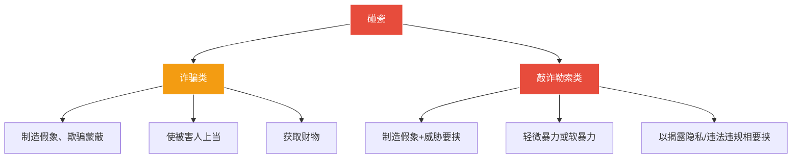

# 第36课：常见的碰瓷伎俩都有哪些？该如何反击？

## Learning Objectives

- 了解碰瓷的两大法律定性（诈骗类 vs 敲诈勒索类）
- 掌握四种常见碰瓷手法
- 学习遭遇碰瓷后的五个应对步骤
- 了解碰瓷是否构成犯罪的判断标准

---

## 一、什么是碰瓷？

### 历史由来

> [!quote] 典故
> 清朝末年没落的八旗子弟，手捧名贵**赝品瓷器**行走在闹市街巷，故意与行驶的马车碰撞，将瓷器摔碎后按"名贵瓷器"价格向车主索赔。

### 法律定性：两类碰瓷

### 案例一：特大车险诈骗案

- 刘某购买事故豪车，雇佣司机故意制造撞车事故
- 故意扩大事故损失，多报修理费用
- 勾结保险公司工作人员，为送修车辆在其他保险公司投保
- **涉案**：刑拘27人，涉及20余家保险公司，2000余笔理赔，金额近**700万元**

### 案例二：酒驾碰瓷敲诈

- 马某酒驾被奔驰SUV追尾，对方索赔10万元
- 马某心虚，但围观二手车商发现奔驰保险杠用铁丝绑住
- 报警后查明：5人团伙，专人放活、跟车、开车
- 以**敲诈勒索罪**追究刑事责任

---

## 二、四种常见碰瓷手法

### 手法一：追尾索赔

- 红色轿车以慢速通过路口，后车想超车时突然刹车
- 制造追尾事故后索要高额赔偿

### 手法二：弹射异物制造碰擦

- 高速上，白车跟随目标车辆
- 趁目标变道时用弹弓弹射橄榄核
- 目标误以为碰擦下车查看，白车趁机制造痕迹

### 手法三：连人带椅摔倒

- 轮椅碰瓷者故意连人带椅摔倒
- 以"私了"方式快速解决

### 手法四：冒充警察式碰瓷

- 双人作案，一人与事主发生事故后主动"报警"
- 电话设为公放，"警察"建议私了
- 实际联系人备注名为"110"，对方是同伙假扮

---

## 三、遭遇碰瓷怎么办？

### 五个应对步骤

> [!info] 核心原则：保护现场，第一时间报警

| 步骤 | 做法 |
|:----:|------|
| 1 | **保护现场**，拍照录像固定证据 |
| 2 | **找机会报警**，等待警察处理 |
| 3 | 不要轻易私了，不私下转账 |
| 4 | 坚持走正规程序，走保险或报警 |
| 5 | 安装**行车记录仪**留存证据 |

### 五条预防建议

1. **开车前多观察** —— 绕车一周，查看障碍物、车牌、车门
2. **发现异常别草率处理** —— 先拍照留证，缓慢移动
3. **注意可疑人员** —— 远离故意靠近机动车道、迎着车走的人
4. **安装行车记录仪** —— 目前最好的留存证据方法
5. **自己别违法** —— 遵守交规是最佳防护（碰瓷者专挑违法时机下手）

### 案例：机智车主反制碰瓷

- 车主开车碰倒骑共享单车的罗某
- 罗某说手机摔坏，索赔8000元
- 车主发现不对劲但不动声色，表面答应去医院
- 实际将车**直接开到派出所门前**
- 民警从罗某身上搜出两部手机：一部完好自用，一部已损坏专门碰瓷
- 罗某因**敲诈勒索**被拘留

---

## 四、碰瓷的法律责任

> [!question] 碰瓷都会构成刑事犯罪吗？

**不一定。** 碰瓷行为的法律后果取决于情节轻重：

| 情节 | 法律后果 |
|------|----------|
| 情节轻微 | **治安处罚**（警告、罚款、行政拘留） |
| 构成犯罪 | 按**诈骗罪**或**敲诈勒索罪**追究刑事责任 |

- 实施碰瓷尚不构成犯罪但违反治安管理的，依法给予**治安管理处罚**

---

## 五、总结

| 维度 | 要点 |
|------|------|
| 碰瓷类型 | 诈骗类（骗钱）、敲诈勒索类（威胁要钱） |
| 常见手法 | 追尾、弹射异物、假装摔倒、假警察 |
| 应对策略 | 不私了、不转账、不慌张、立即报警 |
| 预防措施 | 行车记录仪、合规驾驶、多观察 |
| 法律责任 | 治安处罚到刑事犯罪，视情节定 |

---

## 六、思考题

**碰瓷的行为都会构成刑事犯罪吗？**

> [!note] 提示
> 不一定。情节较轻微的，公安部门会进行治安处罚（警告、罚款、行政拘留）。《关于依法办理碰瓷违法犯罪案件的指导意见》明确：实施碰瓷尚不构成犯罪，但构成违反治安管理行为的，依法给予**治安管理处罚**。

---

*下一课预告：正当防卫的十大界定标准*