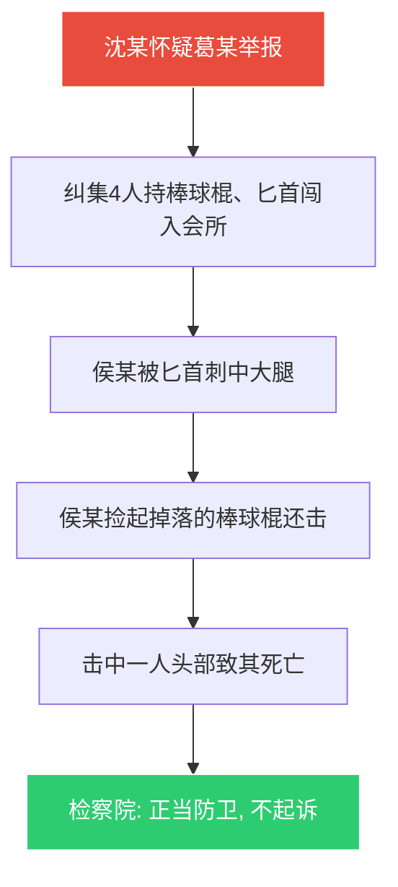

# 第37课：正当防卫的十大界定标准

## Learning Objectives

- 掌握正当防卫的**十大认定标准**
- 区分正当防卫与防卫过当、互殴的界限
- 理解特殊防卫（无限防卫）的适用条件
- 了解防卫过当的刑罚裁量规则

---

## 一、正当防卫的法律定义

### 刑法规定

> [!quote] 正当防卫
> 对**正在进行**的不法侵害行为的人，采取的**制止不法侵害**的行为，对不法侵害人造成损害的，属于正当防卫，**不负刑事责任**。

### 2020年新规背景

> [!info] 背景
> 长期以来，正当防卫在司法实践中容易被认定为防卫过当、故意伤害甚至打架斗殴。2020年9月，最高人民法院、最高人民检察院、公安部联合发布《关于依法适用正当防卫制度的指导意见》，确立了"**十个准确**"标准。

---

## 二、十大认定标准

### 标准一：准确把握起因条件

> [!tip] 不法侵害的范围
> - 既包括生命、健康权利，也包括**人身自由、公私财产**等权利
> - 既包括犯罪行为，也包括**违法行为**
> - 既包括对本人，也包括对**国家、公共利益或他人**的不法侵害
> - **非法限制人身自由、非法侵入住宅**等，可以实行防卫

#### 案例：强拆伤人案

- 房地产公司委托拆迁人员深夜翻墙入室
- 房主妻子被摁住、捂嘴架出院子
- 房主持农用分苗刀乱挥捅伤三名强拆人员（两人重伤二级）
- **检察院认定**：非法侵入住宅在前，防卫在后，**正当防卫成立，不构成犯罪**

### 标准二：准确把握时间条件

> [!warning] 必须是"正在进行时"
> 正当防卫必须针对**已经开始、尚未结束**的不法侵害。

| 情形 | 是否构成正当防卫 |
|------|:----------------:|
| 歹徒正在施暴时还击 | ✅ 是 |
| 施暴结束后追上去报复 | ❌ 否 |

### 标准三：准确把握对象条件

> [!info] 对象范围
> 防卫对象包括**直接实施不法侵害的人**，以及现场的**组织者、教唆者**等共同实施不法侵害的人。

#### 案例：文某反杀案

- 刘某、欧某酒后持匕首殴打文某
- 文某夺过刘某匕首向欧某挥刺，致刘某死亡
- **检察机关**：以正当防卫为由，**不起诉**文某

### 标准四：准确把握意图条件

> [!warning] 防卫挑拨不构成正当防卫
> **故意以语言、行为挑逗对方侵害自己，再予以反击的"防卫挑拨"**，不认定为正当防卫。

### 标准五：准确界分防卫行为与互相斗殴

> [!danger] 纠正"各打五十大板"
> 实践中不能只要是双方动手就各按犯罪处理，必须准确认定是**正当防卫**还是**相互斗殴**。

#### 案例：乙某被围殴反击案

- 甲因乙在女友网络空间留言而纠集三人围殴乙
- 乙掏出折叠水果刀（8.5cm，非管制刀具）乱挥乱刺
- 三人重伤二级，乙轻伤二级
- **检察机关**：乙的行为属于正当防卫，**不构成犯罪**

### 标准六：准确界分滥用防卫权

> [!warning] 两种情况不认定防卫
> 1. 对**显著轻微**的不法侵害，直接使用足以致人重伤或死亡的方式制止
> 2. 行为人有过错引发侵害，在可用其他手段避免时仍故意使用重伤害方式还击

#### 案例：砖头砸偷狗贼案

- 于某发现有人偷狗，捡起石头砸向偷狗贼
- 石块砸中头部致重伤二级
- **法院认定**：防卫行为**明显超过必要限度**，构成**防卫过当**
- **判决**：过失重伤罪，拘役4个月，缓刑6个月

### 标准七：准确把握防卫过当的认定条件

> [!info] 两个条件缺一不可
> 认定防卫过当必须同时具备：
> 1. **明显超过必要限度**
> 2. **造成重大损害**（重伤或死亡）

#### 案例：足疗店刺死闯入者案

- 凌晨2点，醉酒男子强行拧开已上锁的足疗店门锁
- 入室后殴打店主，店主持折叠刀刺死该男子
- **法院认定**：防卫行为，但男子未使用凶器，尚不严重危及人身安全
- 店主使用刀具防卫属于**防卫过当**
- **判决**：故意伤害罪，有期徒刑2年，缓刑3年

### 标准八：准确把握防卫过当的刑罚裁量

> [!quote] 减免规则
> 防卫过当应当负刑事责任，但应当**减轻或者免除处罚**。需综合考量：
> - 不法侵害人的过错程度
> - 不法侵害的严重程度
> - 防卫人的恐慌、紧张心理状态

### 标准九：准确把握特殊防卫（无限防卫）

> [!danger] 特殊防卫
> 对正在进行的**杀人、抢劫、强奸、绑架**以及其他严重危及人身安全的暴力犯罪，可以实行**特殊防卫**。造成侵害人死亡的，不属于防卫过当，**不负刑事责任**。

#### 案例：会所员工反杀案

### 标准十：准确把握一般防卫与特殊防卫的关系

> [!info] 兜底规则
> 不符合特殊防卫的起因条件，但致不法侵害人伤亡的，如果**没有明显超过必要限度**，也应当认定为正当防卫，不负刑事责任。

---

## 三、总结

| 标准 | 核心要点 |
|:----:|----------|
| 起因条件 | 不法侵害的范围包括人身、财产、自由、住宅等 |
| 时间条件 | 必须是"正在进行时" |
| 对象条件 | 侵害人及现场共犯 |
| 意图条件 | 不能是防卫挑拨 |
| 互殴区分 | 一方先动手 + 手段过激 = 对方可能构成正当防卫 |
| 滥用限制 | 显著轻微侵害不得用重伤害手段 |
| 过当认定 | 明显超过必要限度 + 造成重大损害 |
| 过当量刑 | 应当减轻或免除处罚 |
| 特殊防卫 | 杀人/抢劫/强奸/绑架等严重暴力犯罪可无限防卫 |
| 兜底规则 | 未超限度的防卫致伤也属正当防卫 |

> [!warning] 律师提醒
> 法律虽然赋予公民正当防卫权，但**任何权利都不能滥用**。具备条件的应当**优先报警**，尽可能理性平和解决争端，避免滥用武力。

---

## 四、思考题

**学生阿俊在课余时间为赚取生活费兼职做家教，在去家教的途中与一名同行的中年男子无意撞倒，两人因此发生争执并升级为互殴，导致男子左腿骨裂轻伤二级。阿俊被指控故意伤害，你认为阿俊属于正当防卫吗？**

> [!note] 提示
> 法院审理后认为阿俊的行为构成**正当防卫**，且没有明显超过必要限度，依法不负刑事责任。依据《指导意见》第9条：因琐事争执，**有过错一方先动手且手段明显过激**，还击一方的行为一般应当认定为防卫行为。中年男子先动手且手段过激，符合上述规定。

---

*下一课预告：老年人遭遇保健品传销式骗局，该怎么办？*