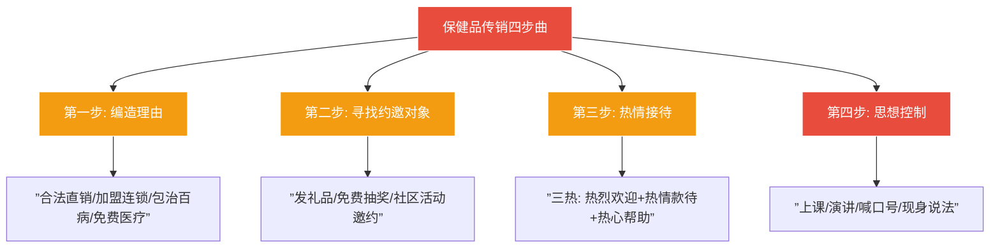
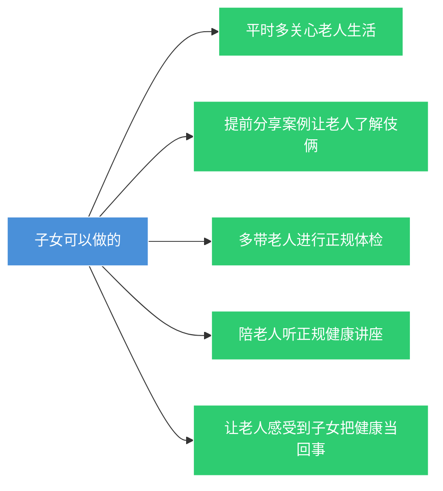

# 第38课：老年人遭遇保健品传销式骗局，该怎么办？

## Learning Objectives

- 掌握保健品传销的四个经典运作步骤
- 学会识别合法保健品与非法产品的区别
- 了解家人被骗后的维权路径
- 理解精神关爱对预防老人被骗的重要性

---

## 一、保健品传销的经典四步

### 案例：王某保健品传销案

> [!quote] 案例简介
> 王某凭借"三寸不烂之舌"，短短半年吸引300多人入会，最终以**组织领导传销活动罪**被判有期徒刑1年3个月，罚金2万元。

### 运作四步曲

### 惯用话术

> [!warning] 注意这些关键词
> - "合法直销"
> - "加盟连锁"
> - "包治百病"
> - "免费医疗"
> - "不好不给钱"
> - "买3000元产品享50%利润空间"

---

## 二、如何识别正规保健品？

### 核心识别方法

> [!info] 保健品不是药品
> 保健品**不能替代药品**，没有治疗作用。

#### 四步识别法

| 步骤 | 做法 |
|:----:|------|
| 1 | **认准蓝帽子标志** —— 产品外包装上有蓝色草帽样标志 |
| 2 | **查询批准文号** —— 登录国家食药监局网站数据查询栏目 |
| 3 | **仔细阅读说明书** —— 看清成分、保健功能、适宜/不适宜人群 |
| 4 | **保留购物凭证** —— 索取并保存发票、小票 |

> [!danger] 每个保健食品批准文号只能对应一个产品

---

## 三、家人被骗后怎么办？

### 维权路径

> [!tip] 发现被骗后的三步走

1. **拨打12345** 向食品安全监管部门举报
2. **保留证据** —— 产品、包装、收据、宣传材料等
3. **及时报案** —— 涉及刑事犯罪的（掺杂掺假、以假充真、以次充好），应报警处理

---

## 四、骗局的新花样

### 新型套路：养老O2O模式

> [!warning] 警惕升级版骗局

| 骗局手法 | 具体表现 |
|----------|----------|
| **社区养老中心** | 打着"国家居家养老"旗号，提供保健品的养生器件 |
| **免费体检问诊** | 查出"病"后忽悠去网上商城买高价保健品 |
| **幸福助理"关怀"** | 对孤寡老人嘘寒问暖，目标是有点积蓄或子女不在身边的老人 |
| **小恩小惠** | 免费发牙膏、听课领鸡蛋、领大米 |
| **医疗旅游体检** | 免费出游后推销"长寿村秘密"保健品 |

### 典型目标群体

- 身边有点积蓄的**孤寡老人**
- **子女不在身边**、需要关怀的老人

---

## 五、预防建议

### 给老人的建议

> [!info] 防骗三原则
> 1. 具备足够的安全知识
> 2. 遇事及时与家人沟通交流
> 3. 一旦损失钱财，及时报案，不要因面子选择沉默

### 给子女的建议

> [!quote] 核心提醒
> **多给父母一些精神上的关爱。** 一些老年人宁愿相信保健品营销人员，也不相信子女，这说明子女**介入太晚、关心不够**。

#### 具体做法

---

## 六、总结

| 维度 | 要点 |
|------|------|
| 骗局模式 | 编理由 → 找对象 → 热情接待 → 思想控制 |
| 识别方法 | 认准蓝帽子、查批准号、看清说明书 |
| 维权路径 | 12345举报 → 保留证据 → 报案 |
| 新兴骗局 | 养老O2O、免费体检、医疗旅游 |
| 根源预防 | 子女多关心、多陪伴、多沟通 |

---

## 七、思考题

**70岁的王阿姨退休在家，在健康咨询活动中认识了销售员小张。小张多次见到王阿姨一人在家，孩子都在国外，就经常拿着礼品去看望。当得知阿姨心脑血管有毛病以后，就高价兜售了保健品，包装上写着"本品可预防心脑血管疾病"。请问小张销售的产品是否合法？**

> [!note] 提示
> 不合法。保健食品的标签、说明书**不得涉及疾病预防、治疗功能**。该产品包装上写"可预防心脑血管疾病"，属于违法宣传。正确的保健食品标签应当声明"**本品不能代替药物**"，且内容应当真实合法，不得含有虚假内容或涉及疾病预防、治疗功能。

---

*下一课预告：民法典物业新规，业主与物业纠纷有法可依*