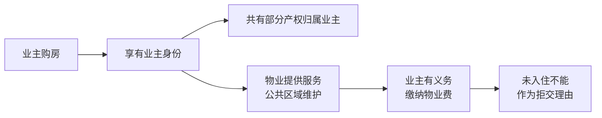
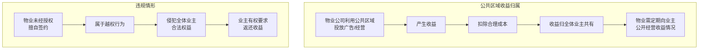
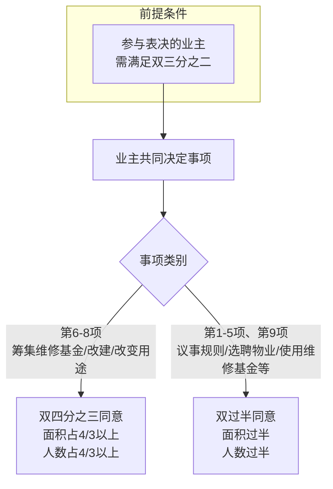

# 第39课：民法典物业新规，业主和物业纠纷有法可依

## Learning Objectives

- 理解物业服务合同的法律约束力及业主缴纳物业费的义务
- 掌握物业公司催缴物业费的合法方式与禁止行为
- 明确小区公共区域广告收益的归属权
- 了解业主大会和业主委员会的决策权限与程序
- 熟悉民法典第278条规定的业主共同决定事项

---

## 一、热身思考题：保健品销售的合法性

> 王阿姨独自在家，孩子们都在国外。小张经常拿礼品去看望她，得知阿姨有心脑血管毛病后，高价兜售保健品，包装上写着"本品可预防心脑血管疾病"。

**问题：小张销售的产品是否合法？**

**答案：不合法。**

根据《食品安全法》第78条，保健食品的标签说明书**不得涉及疾病预防、治疗功能**，内容应当真实，并声明"本品不能代替药物"。《广告法》第18条也明确禁止保健食品广告涉及疾病预防、治疗功能。

---

## 二、案例一：未入住也要交物业费吗？

### 案情回顾

李先生有一套回迁房，三年前交付但未办理入住。今年办理入住时，物业要求他**补缴前三年的物业费**，否则**拒绝供水供电**。李先生认为未享受服务，拒绝全额缴纳。

### 法律分析

#### 业主缴纳物业费的义务

根据 **《民法典》第944条**：

> 业主应当按照约定向物业服务人支付物业费。物业服务人已经按照约定和有关规定提供服务的，业主不得以未接受或者无需接受相关物业服务为由拒绝支付物业费。

物业服务范围是**小区公共区域及设施设备**，产权归全体业主共有。即使业主未入住，公共区域的维护费用也在发生，因此**仍需缴纳物业费**。

#### 物业催缴的合法方式

**《民法典》第944条**明确规定：

> [!warning] 禁止断水断电催缴
> 物业服务人不得采取停止供电、供水、供热、供燃气等方式催交物业费。

水电供应合同是业主与自来水公司、供电公司之间订立的，物业公司无权干涉。合法的催缴方式是：
1. 催告业主在合理期限内支付
2. 合理期限届满仍不支付的，**提起诉讼或申请仲裁**

---

## 三、案例二：小区电梯广告费归谁？

### 案情回顾

王先生发现小区电梯内有各种广告，询问物业公司广告费用去向，物业推诿不答。王先生起诉要求物业公开公共区域经营收益。

### 法律分析

**《民法典》第282条**：

> 建设单位、物业服务企业或者其他管理人等利用业主的共有部分产生的收入，在扣除合理成本之后，属于业主共有。

**《民法典》第943条**：

> 物业服务人应当定期将服务的事项、负责人员、质量要求、收费项目、收费标准、履行情况，以及维修资金使用情况、业主共有部分的经营与收益情况等，以合理方式向业主公开。

#### 小区公共区域的范围

包括但不限于：
- 大堂
- **电梯内外侧**
- 小区外墙
- 楼道
- 道路

这些区域都属于**业主共有产权**，其管理权和收益权归业主所有。

---

## 四、如何避免物业纠纷？成立靠谱的业委会

### 业主委员会的法律地位

业委会作出的决定对**全体业主**具有法律约束力。无论是聘请物业公司，还是对公共区域进行修缮，都需要业主大会把关。

### 业主共同决定的事项（民法典第278条）

> [!tip] 记住规律：凡是涉及**人**和**钱**的事项，都需要全体业主共同决定。

具体包括以下**9项**事项：

| 编号 | 事项内容 |
|:---:|---------|
| 1 | 制定和修改业主大会议事规则 |
| 2 | 制定和修改管理规约 |
| 3 | 选举或更换业主委员会成员 |
| 4 | 选聘或解聘物业服务企业 |
| 5 | **使用**建筑物及其附属设施的维修基金 |
| 6 | **筹集**建筑物及其附属设施的维修基金 |
| 7 | 改建、重建建筑物及其附属设施 |
| 8 | 改变共有部分用途或利用共有部分从事经营活动 |
| 9 | 有关共有和共同管理权利的其他事项 |

### 表决比例要求

> [!info] 业主共同决定事项需满足：
> - **专有部分面积占比三分之二以上**的业主参与表决
> - **人数占比三分之二以上**的业主参与表决

**重大事项（第6-8项）**：需经参与表决专有部分面积**四分之三以上**的业主同意，或人数**四分之三以上**同意。

**一般事项（第1-5项、第9项）**：需经参与表决专有部分面积**过半数**的业主同意，或人数**过半数**同意。

### 解聘物业公司的程序

**《民法典》第946条**：

> 业主依照法定程序共同决定解聘物业服务人的，可以解除物业服务合同。决定解聘的，应当提前**60日**书面通知物业服务人。

---

## 五、业主权利救济

如果业主大会或业委会作出的决定**侵害了业主的合法权益**，受侵害的业主可以：

> [!important] 请求人民法院予以撤销

---

## 总结

| 核心要点 | 法律依据 |
|---------|---------|
| 未入住仍需缴纳物业费 | 《民法典》第939条、第944条 |
| 物业不得断水断电催缴 | 《民法典》第944条 |
| 公共区域收益归全体业主 | 《民法典》第282条 |
| 物业需定期公开经营收益 | 《民法典》第943条 |
| 业主共同决定9类事项 | 《民法典》第278条 |
| 提前60日通知可解聘物业 | 《民法典》第946条 |

---

## 思考题

> 小王所在小区楼房的外墙皮脱落了，业主大会准备使用维修基金招聘施工队进行维修。**请问是否需要全体业主的共同决定？**

（提示：参考民法典第278条第5款——使用建筑物及其附属设施的维修基金由业主共同决定。）