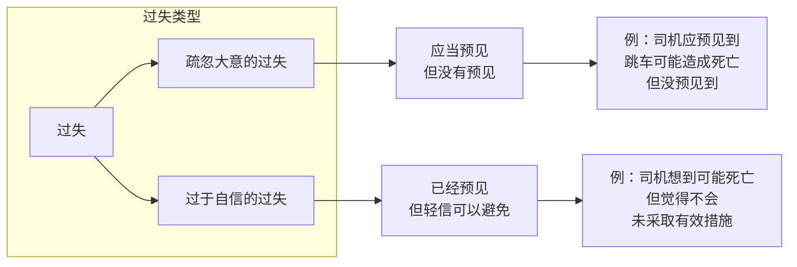
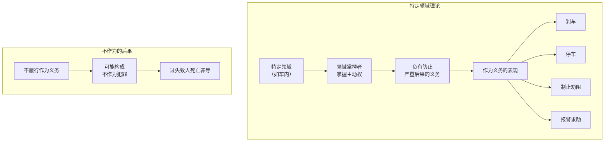

# 第40课：网约车乘客、网约车司机都要注意防范的法律风险

## Learning Objectives

- 了解网约车平台在乘运事故中的责任认定规则
- 掌握乘客乘坐网约车的安全防范措施
- 理解司机在特定领域内的救助义务
- 区分疏忽大意的过失与过于自信的过失
- 了解网约车司机应增强的法律意识

---

## 一、回顾上期思考题

> 小区楼房外墙皮脱落，使用维修基金维修是否需要全体业主共同决定？

**答案：需要。** 根据《民法典》第278条第5款，使用建筑物及其附属设施的维修基金由业主共同决定。

---

## 二、案例一：空姐网约车遇害案

### 案情回顾

2018年5月6日晚，空姐李某在郑州搭乘顺风车赶往市内后遇害。作案人员是一名滴滴司机，存在**人证不统资料作假、多次违规**等情形。

### 平台责任分析

| 情形 | 责任认定 |
|------|---------|
| 平台尽到审核和安全保障义务 | 平台**不承担责任** |
| 平台未尽到审查义务（如本案） | 平台存在过错，需要承担**补充责任** |

> [!important] 补充责任
> 补充责任是指**主要责任人承担在先，次要责任人承担补充责任在后**。即先由司机个人承担刑事责任，平台在其过错范围内承担补充赔偿责任。

### 乘客安全防范措施

```mermaid
flowchart TD
    A[乘客乘车安全注意事项] --> B[上车前]
    A --> C[乘车中]
    A --> D[遇险时]

    B --> B1[确认人车是否一致]
    B1 -->B2[不一致时拒绝乘坐<br>并平台投诉]
    B2 --> B3[查看副驾驶资质执照]
    B3 --> B4　[执照模糊过期<br>要◆求下车]
    
    C --> C1[观察行车路线<br>是否与规划一致]
    C1 --> C2[减少交谈<br>避免透露个人信息]
    C2 --> C3[添加手机紧急联系人]
    
    D1[第一时间要求停车下车]
    D1 --> D2[拨打电告诉亲人或报警]
    D2 --> D3[生命第一原则下<br>可采取拖延和欺骗手段]
```

---

## 三、案例二：货拉拉女生跳车案

### 案情回顾

2021年2月6日晚，23岁湖南女孩通过货拉拉平台搬家，跟车途中从货车车窗处跳下，2月10日因头部伤抢救无效死亡。

**关键事实**：
1. 司机周某多次催促女孩快搬，告知超时将额外收费
2. 司机为节省时间提前抢接下一单，**多次偏航**
3. 女孩四次提出偏航要求停车，司机未理睬
4. 女孩将身体探出车窗后，司机**未采取语言制止，也未紧急刹车**
5. 仅轻点刹车、减速、打开双闪

### 责任分析

#### 平台责任

> 货拉拉作为网络货运平台，允许货运人跟车服务，实质业务成了提供客运服务合同。平台有义务对乘运全程进行录音等技术监控，保障用户安全。

本案中司机多次偏航，平台未及时纠正，也未提供录音证据，**存在过错**，需要承担法律责任。

#### 司机刑事责任——过失致人死亡罪

> [!warning] 什么是过失致人死亡罪？

过失致人死亡有两种类型：



### 司机的作为义务

车内形成一个**类似密闭的空间**，属于司机的**特定领域**。在此领域内：
- 司机掌握主动权
- 负有**防止严重后果发生的作为义务**
- 作为方式包括：**刹车、停车、制止**

本案中司机未采取有效措施，涉嫌**不作为的过失致人死亡罪**。

---

## 四、网约车司机法律风险防范建议

| 建议 | 具体内容 |
|------|---------|
| **礼貌沟通** | 乘客上车时礼貌沟通，避免不必要的私人交谈 |
| **安装行车记录仪** | 应对复杂道路状况，事故时提供证据 |
| **合理绕行** | 存在修路封闭、严重拥堵时可合理绕行，但**应当与乘客解释** |
| **有权拒载** | 乘客提出不符合安全规则要求、携带管制器具/爆炸/有毒物品、损害车辆、行为异常时，可拒载或终止载客 |

---

## 五、"特定领域"与"作为义务"的法理



---

## 总结

| 角色 | 关键要点 |
|------|---------|
| **乘客** | 确认人车一致、观察路线、减少交谈、生命第一可采取拖延欺骗手段 |
| **司机** | 安装记录仪、礼貌沟通、合理解释偏航、履行作为义务 |
| **平台** | 尽到审核义务、录音监控、及时纠正偏航、保障交易安全 || **法律原理** | 补充责任的认定、特定领域内的作为义务、过失类型的区分 |

---

## 思考题

> 小周通过平台搭乘出租车，在行驶途中擅自解开安全带并把身子探出窗外。司机提醒并减速慢行后，小周仍然拒不改，最终不慎跌落车外身亡。**请问司机是否需要承担刑事责任？**

（提示：司机已履行提醒和减速义务，乘客自身违规行为导致伤亡。）