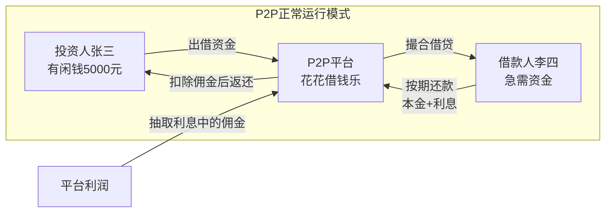
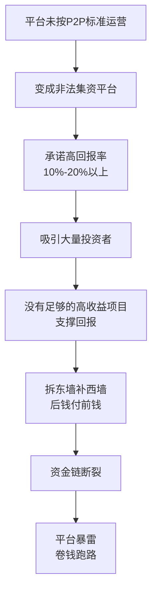
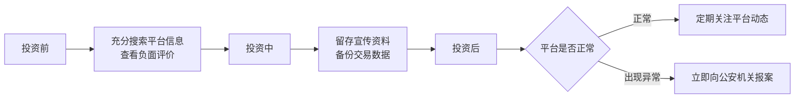

# 第41课：P2P产品暴雷跑路了怎么办？如何识别预防投资风险

## Learning Objectives

- 理解P2P网贷平台的正常运行模式与暴雷原因
- 区分非法吸收公众存款罪与集资诈骗罪
- 掌握P2P投资风险识别与防范的具体方法
- 了解暴雷后的正确应对措施

---

## 一、回顾上期思考题

> 小周在出租车中擅自将身体探出窗外，司机提醒并减速后小周仍不改正，最终跌落身亡。司机是否需要承担刑事责任？

**答案：不需要。**

司机已经多次提醒并减速慢行，**尽到了自身的责任**。小周的行为违反了《道路交通安全法实施条例》第77条（机动车行驶中不得将身体任何部分伸出车外），属于**交通违法行为**，伤亡完全由自身违规造成，司机无需承担刑事责任。

---

## 二、P2P网贷平台的正常运作模式

### 基本概念

P2P网络借贷是指个人或法人通过**独立的第三方网络平台**相互借贷。平台作为中介机构，借款人在平台发布借款标，投标人进行竞标向借款人放贷。

**三方共赢**：
- **投资人**：获得高于银行同期的利息
- **借款人**：缓解资金短缺
- **平台**：赚取中间费用

---

## 三、P2P平台暴雷的根本原因

> [!danger] 庞氏骗局
> 大量P2P平台没有按照标准充当中间人角色，而是变成了**非法集资平台**，采用"拆东墙补西墙"的方式，用后进来的客户的钱支付早期客户的收益。当平台资金难以支撑时，只有**卷钱跑路**一条出路。

### 暴雷原因链

---

## 四、暴雷平台涉及的罪名

### 罪名一：非法吸收公众存款罪

**《刑法》第176条**

> 未经中国人民银行批准，向社会不特定对象吸收资金，出具凭证，承诺在一定期限内还本付息的行为。

**四个特征**：

| 特征 | 说明 |
|------|------|
| 未经依法批准 | 没有经过有关部门批准吸收资金 |
| 公开宣传 | 通过公开方式向社会宣传 |
| 向社会公众吸收资金 | 对象是**不特定的人** |
| 高额回报引诱 | 通过高回报率吸引投资者 |

### 罪名二：集资诈骗罪

**《刑法》第192条**

> 以非法占有为目的，使用诈骗方法非法集资，数额较大的行为。

**本质特征**：平台成立之初的目的就是**诈骗**。

```mermaid
graph TD
    subgraph 集资诈骗的表现
        A[虚构投资项目] --> B[高回报诱骗投资者]
        B --> C[收到的投资款]
        C --> D[未用于宣传的项目]
        C --> E[少量用于投资项目]
        C --> F[大部分用于个人挥霍/赌博]
    end
    
    subgraph 暴雷时的特征
        G[法定代表人/实际控制人]
        G --> H[携带集资款逃匿]
        G --> I[抽逃转移资金]
        G --> J[隐匿销毁账目]
        G --> K[搞假破产假倒闭]
    end
```

### 两大罪名的核心区别

| 区别点 | 非法吸收公众存款罪 | 集资诈骗罪 |
|-------|-------------------|-----------|
| **行为方式** | 非法向社会吸收存款或变相吸收存款 | 使用**诈骗方法**非法集资 |
| **主观目的** | 是否获利不影响罪名成立 | **以非法占有为目的**，从开始就没想过还钱 |
| **本质** | 违规吸收资金 | 骗取资金 |

---

## 五、投资者风险防范措施

> [!tip] 四步防范法

### 第一步：选择安全平台

投资前在互联网上**充分搜索**投资平台的相关信息。一旦发现大量涉及该平台的**负面举报投诉**，应避而远之。

### 第二步：留存实物证据

- 理财咨询阶段：索取平台宣传手册
- 投资阶段：**及时备份交易电子数据**

### 第三步：抵御高息诱惑

- 对宣称**10%-20%以上收益**的平台保持警惕
- **不要贸然投入全部身家**
- **不要将资金过于集中**在某个平台
- 牢记：鸡蛋不能放在一个篮子里

### 第四步：暴雷后及时报案

> [!important] 发现暴雷风险后，应当**立即向公安机关报案**，由公安机关牵头帮助追回投入的钱款。绝对不能存有侥幸心理，不能助长犯罪分子气焰，一直期待中不去报案是错误的。

---

## 六、总结

| 知识点 | 核心内容 |
|-------|---------|
| P2P本质 | 第三方中介平台撮合借贷 |
| 暴雷原因 | 平台变非法集资，庞氏骗局崩盘 |
| 非法吸收公众存款罪 | 未经批准、公开宣传、向不特定对象吸资、高回报引诱 |
| 集资诈骗罪 | 以非法占有为目的，从一开始就骗 |
| 投资者防范 | 选平台、留证据、抵诱惑、快报案 |

---

## 思考题

> **你认为集资诈骗罪和非法吸收公众存款罪的区别是什么？**

（提示：从行为方式和主观目的两个维度分析——前者使用诈骗方法且以非法占有为目的，后者重在违规吸收资金。）