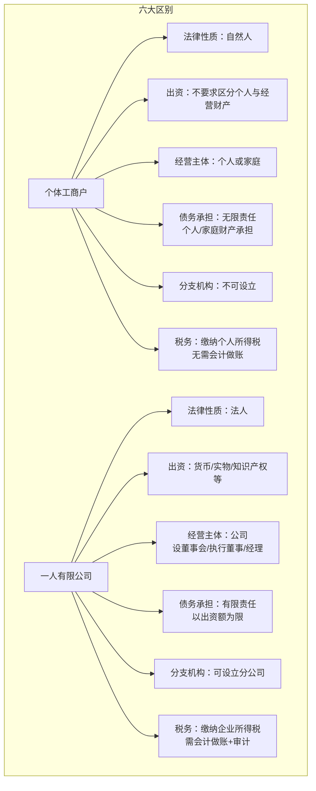
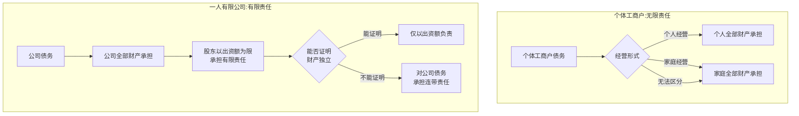

# 第42课：想开店创业，是注册个体工商户还是一人有限公司？

## Learning Objectives

- 理解个体工商户与一人有限公司的法律定义和本质区别
- 掌握无限连带责任与有限责任的核心差异
- 了解两种形式的税务处理方式不同
- 学会根据自身情况选择合适的创业主体形式

---

## 一、热身案例：个体工商户起诉为何被驳回？

### 案情回顾

甲某是"建材经销处"的个体工商户经营者。乙某多次从甲处购买建材但拖欠货款。甲以**自己个人名义**起诉乙某要求清偿货款。法院**驳回了甲的起诉**。

### 原因分析

根据**最高人民法院关于适用《民事诉讼法》的解释第59条**：

> 在诉讼中，个体工商户以营业执照上登记的**经营者**为当事人。有字号的，以营业执照上登记的**字号**为当事人，但应同时注明该字号经营者的基本信息。

本案中，供货单上明确写的是"建材经销处"，营业执照也显示字号为"建材经销处"。甲应当以**字号（建材经销处）** 为当事人起诉，而非以个人名义。

> [!warning] 个体工商户维权提示
> 个体工商户在起诉时，一定要明确**维权主体**。有字号的应以字号为当事人，这样才能实现正确维权。

---

## 二、个体工商户 vs 一人有限公司：概念对比

### 个体工商户

> 生产资料属于私人所有，主要以个人劳动为基础，劳动所得归个体劳动者自己支配的经营方式。个体工商户**不具备法人资格**。

组织形式：
- 个人经营
- 家庭经营
- 个人合伙经营

### 一人有限责任公司

> 只有一个自然人股东或者一个法人股东的有限责任公司。公司全部股权或出资全部归属于一个股东。**具备法人资格**。

---

## 三、六大核心区别

### 区别一：法律关系不同

| 形式 | 法律性质 |
|------|---------|
| 个体工商户 | **自然人**，不具备法人资格 |
| 一人有限公司 | **法人**，属于法人企业 |

### 区别二：出资方式不同

| 形式 | 出资要求 |
|------|---------|
| 个体工商户 | 不要求区分经营者财产与经营财产，**无需登记出资方式** |
| 一人有限公司 | 股东可以货币、实物、知识产权、土地使用权等出资 |

### 区别三：经营管理主体不同

| 形式 | 管理方式 |
|------|---------|
| 个体工商户 | 个人或家庭经营，家庭经营时需备案家庭成员姓名 |
| 一人有限公司 | 可设董事会、执行董事、经理等机构，**所有权与经营权分离** |

### 区别四：债务承担方式不同（核心区别）

> [!important] 这是最重要的区别！

**个体工商户——无限责任**：

> 《民法典》规定：个体工商户的债务，个人经营的以个人财产承担；家庭经营的以家庭财产承担；无法区分的以家庭财产承担。

**一人有限公司——有限责任**：

> 公司以其全部财产对公司债务承担责任，股东**仅以认缴的出资额为限**承担责任。

但一人有限公司有**财产独立证明责任倒置**：

> 股东**不能证明**公司财产独立于自己财产的，应当对公司债务承担**连带责任**。

### 区别五：分支机构设立不同

| 形式 | 分支机构 |
|------|---------|
| 个体工商户 | **不能设立**分支机构，规模通常较小 |
| 一人有限公司 | **可以设立**分公司，分公司民事责任由总公司承担 |

### 区别六：税收管理不同

| 形式 | 税务处理 |
|------|---------|
| 个体工商户 | 缴纳**个人所得税**，一般不需要会计做账，手续简单灵活 |
| 一人有限公司 | 缴纳**企业所得税**，需每年编制财务会计报告并经会计师事务所审计 |

---

## 四、如何选择？

### 个体工商户的优势

- 成本低
- **不需要缴纳企业所得税**
- 手续简便，经营灵活
- 不需要会计做账

### 个体工商户的劣势

- **无限责任**，涉及个人全部财产乃至家庭全部财产

### 一人有限公司的优势

- **有限责任**，不涉及个人财产

### 一人有限公司的劣势

- 需要**每月做账和报税**
- 经营成本较高

> [!tip] 选择建议
> - 如果是**小本经营、风险较低**的生意，个体工商户手续简便、成本低
> - 如果是**投资较大、风险较高**的生意，一人有限公司的有限责任可以隔离个人财产风险
> - 关键在于根据自身实际情况选择**最适合的形式**

---

## 五、总结

| 对比维度 | 个体工商户 | 一人有限公司 |
|---------|-----------|-------------|
| 法人资格 | 无 | 有 |
| 责任形式 | **无限连带责任** | **有限责任** |
| 涉及财产 | 个人/家庭全部财产 | 仅以出资额为限 |
| 税务 | 个人所得税 | 企业所得税+分红个税 |
| 会计要求 | 无需做账 | 需做账+审计 |
| 分支机构 | 不能设立 | 可以设立 |

---

## 思考题

> **你认为个体工商户和一人有限公司各有什么优点和缺点？**

（提示：从责任承担、税务负担、经营成本、发展规模等角度综合考虑。）