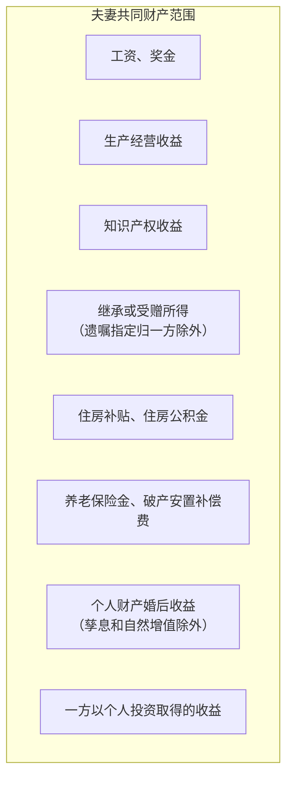
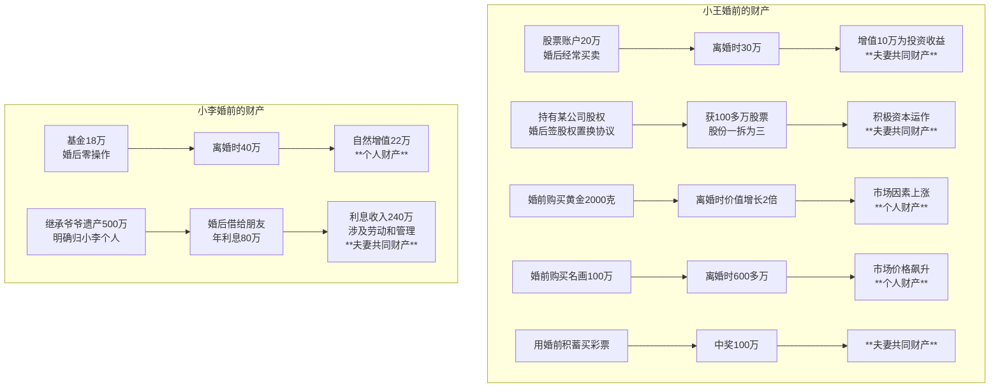
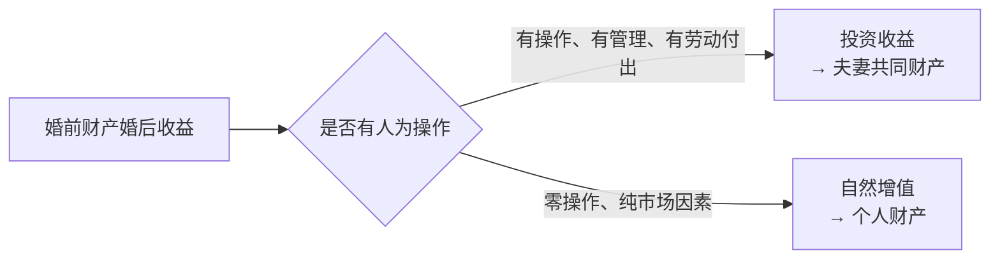

# 第43课：婚后夫妻共同财产和个人财产，都有哪些？怎么区分？

## Learning Objectives

- 掌握婚前财产与婚后财产的划分时间标准
- 明确哪些属于夫妻一方个人财产
- 明确哪些属于夫妻共同财产
- 理解**投资收益**与**自然增值**的核心区别及其对财产归属的影响

---

## 一、回顾上期思考题

> 个体工商户和一人有限公司各有什么优缺点？

**答案要点**：

| 形式 | 优点 | 缺点 |
|------|------|------|
| 个体工商户 | 成本低、不缴企业所得税、手续简便、灵活、无需做账 | **无限责任**，涉及个人和家庭全部财产 |
| 一人有限公司 | **有限责任**，不涉及个人财产 | 需每月做账报税，经营成本较高 |

---

## 二、婚前财产与婚后财产的时间界限

> [!important] 以**结婚证登记日期**为界限
> - 登记日期以前 = **婚前财产**
> - 登记日期以后 = **婚后财产**
> 
> 不以是否举办婚礼为准。

**基本规则**：婚前财产依法受法律保护，**不随婚姻持续时间长短而自动变为夫妻共同财产**。

---

## 三、哪些属于夫妻一方个人财产？

根据《民法典》规定，以下属于**夫妻一方个人财产**：

| 类别 | 具体内容 |
|------|---------|
| **婚前财产** | 工资、奖金、生产经营收益、知识产权收益、继承或受赠所得等 |
| **人身损害赔偿** | 一方因身体受到伤害获得的医疗费、残疾人生活补助费等 |
| **遗嘱或赠与指定** | 遗嘱或赠与合同中确定**只归夫或妻一方**的财产 |
| **专用生活用品** | 一方专用的戒指、项链、假牙等个人生活用品 |

> 注意：如果父母留下遗产未做明确约定，继承的财产为**夫妻共同财产**；但遗嘱中明确"只归妻子一方"或"只归丈夫一方"的，则属于**个人财产**。

---

## 四、哪些属于夫妻共同财产？

根据《民法典》规定，婚姻关系存续期间所得的以下财产属于**夫妻共同财产**：

---

## 五、核心难点：投资收益 vs 自然增值

> [!warning] 关键区分点
> 婚前财产在婚后产生的收益，是**投资收益**还是**自然增值**，决定了它属于**夫妻共同财产**还是**个人财产**。

| 类型 | 定义 | 归属 |
|------|------|------|
| **投资收益** | 投入货币或实物以经营某项事业，**有人为操作和管理** | **夫妻共同财产** |
| **自然增值** | 不需要人为操作，自然增加的价值量，**排除人为因素** | **个人财产** |

### 案例分析：小王和小李的离婚财产分割

### 具体分析

| 财产项目 | 分析逻辑 | 结论 |
|---------|---------|------|
| 小王婚前股票（婚后频繁操作） | 婚后不断买进卖出，付出人力劳动，属于**主动增值** | 增值部分 **共同财产** |
| 小李婚前基金（婚后零操作） | 未进行任何操作，账面收益属于**被动增值/自然增值** | 收益部分 **个人财产** |
| 小王婚前黄金、名画 | 市场价值上涨，不以人的意志为转移 | 增值部分 **个人财产** |
| 小王婚前股权婚后资本运作 | 经历了资本运作和股权收购，包含人为因素 | 增值部分 **共同财产** |
| 小李继承遗产500万 | 爷爷明确归小李个人所有 | 本金 **个人财产** |
| 小李利息收入240万 | 签署借款协议、进行财产投资管理，包含劳动付出 | 利息 **共同财产**（注：可能需扣除500万固定存款收益后分割） |
| 小王婚后彩票中奖100万 | 婚姻存续期间所得 | **共同财产** |

### 判断公式

---

## 六、总结

| 知识点 | 核心规则 |
|-------|---------|
| 时间界限 | 以结婚证登记日期为界 |
| 个人财产 | 婚前财产、人身损害赔偿、遗嘱指定归一方、专用生活用品 |
| 共同财产 | 婚后工资奖金、生产经营收益、知识产权收益、继承受赠（无特别约定）等 |
| 婚前财产婚后收益 | **投资收益→共同，自然增值→个人** |
| 关键区分 | 有无**人为操作和管理** |

---

## 思考题

> 小王和小李婚姻存续期间，丈夫小王向同学小张借了100万元。小张找妻子小李要钱，小李不同意，称两人是**AA制（约定财产制）**，小王的债务属于个人债务。**小李的主张能得到法官的支持吗？**

（提示：需要考虑第三人是否知道夫妻之间的财产约定。）