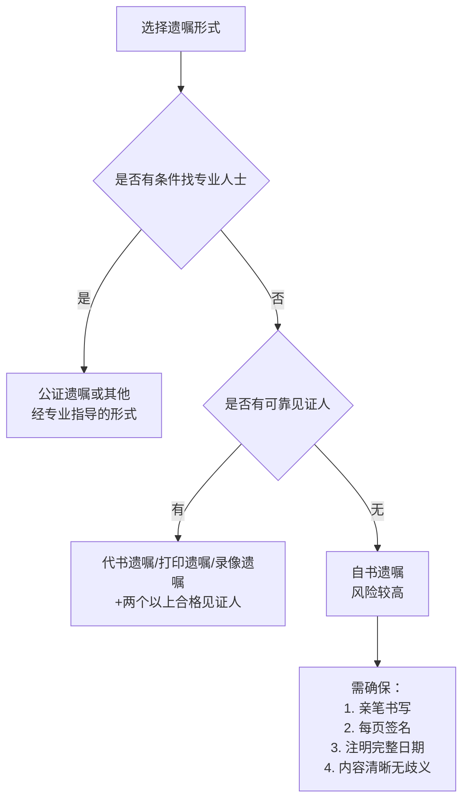

# 第45课：民法典遗嘱新规，别让无效遗嘱成为永远的遗憾

## Learning Objectives

- 掌握民法典规定的**七种遗嘱形式**及其有效要件
- 理解公证遗嘱效力优先规则已被**删除**
- 了解多份遗嘱冲突时以**最后一份**为准
- 掌握设立遗嘱的实操注意事项，避免遗嘱无效

---

## 一、回顾上期思考题

> 夫妻共同经营超市，丈夫向王老板借10万购进日用补货，王老板想认定该笔债务为夫妻共同债务，应保留什么证据？

**答案**：王老板应证明该债务用于**共同生产经营**。可以：
1. 要求丈夫将**进货清单及相关票据**复印一份留存
2. 拿着借款找妻子确认，或告知妻子该借款用于超市补货

---

## 二、法定继承与遗嘱继承

| 继承类型 | 定义 |
|---------|------|
| **法定继承** | 按照法律规定的继承人范围、继承顺序对遗产进行分配 |
| **遗嘱继承** | 按照被继承人生前所立遗嘱中指定的继承人继承遗产 |

自然人设立遗嘱属于典型的**单方法律行为**——只需要自己的真实意思表示即可生效，**不需要他人同意**。

---

## 三、民法典规定的七种遗嘱形式

```mermaid
graph TD
    subgraph 七种遗嘱形式
        A[自书遗嘱]
        B[代书遗嘱]
        C[打印遗嘱]
        D[录音遗嘱]
        E[口头遗嘱]
        F[公证遗嘱]
        G[录像遗嘱]
    end
    
    A --> A1[亲笔书写+签名+年月日]
    B ->> B1[两个以上见证人<br>一人代书+签名+年月日]
    C --> C1[两个以上见证人<br>每页签名+年月日]
    D --> D1[.....]
    E --> E1[两个以上见证人<br>仅限危急情况<br>危急消除后无效]
    F --> F1[通过公证处办理<br>**不再具有优先效力**]
    G --> G1[两个以上见证人<br>记录姓名/肖像+年月日]```

### 1. 自书遗嘱

> **《民法典》规定**：自书遗嘱由遗嘱人**亲笔书写**，签名，注明**年、月、日**。

> [!warning] 注意
> - 不管几页，**每一页**都要签名
> - 最后一定要注明**年、月、日**

### 2. 代书遗嘱

> 由别人代为书写，需要**两个以上见证人**在场见证，由其中一人代书，遗嘱人、代书人、其他见证人签名，注明**年、月、日**。

### 3. 打印遗嘱

> 应当有**两个以上见证人**在场见证。遗嘱人和见证人应当在遗嘱**每一页**签名，注明年、月、日。

> [!warning] 打印遗嘱特别要求
> 不要以为从网上找个模板打印出来签字即可！**每一页都要签名**，且需两个以上见证人。

### ���4. 录像遗嘱

> 应当有**两个以上见证人**在场见证。遗嘱人和见证人应当在录音录像中记录其**姓名或者肖像**以及**年、月、日**。

### 5. 口头遗嘱

> 遗嘱人在**危急情况下**可以立口头遗嘱。应当有两个以上见证人在场见证。危急情况消除后，遗嘱人能够以书面或者录音录像形式立遗嘱的，所立的口头遗嘱**无效**。

### 6. 公证遗嘱

> 由遗嘱人经过公证处办理的遗嘱。

> [!important] 重大变化：公证遗嘱效力优先规则被删除
> **过去**：有多份遗嘱时，公证遗嘱**优先于**其他形式。
> **现在（民法典）**：立有数份遗嘱，内容相抵触的，以**最后一份遗嘱为准**。

---

## 四、案例分析

### 案例一：王老汉的两份遗嘱

王老汉有两个儿子。大儿子拿出一份**公证遗嘱**，说房子归大哥。小儿子拿出一份老人临终前**自书的遗嘱**，说房子归弟弟。

```mermaid
flowchart LR
    A[王老汉的遗嘱] --> B[第一份：公证遗嘱<br>房子归大哥]
    A --> C[第二份：自书遗嘱<br>房子归小儿子]
    
    B --> D{哪份有效?}
    C --> D
    
    D -->|民法典新规| E[以最后一份为准]
    E --> F[房子归小儿子]
```

**结论**：公证遗嘱不再有优先效力，**以最后订立的遗嘱为准**，房子归小儿子。

### 案例二：田女士父亲的录音遗嘱

田女士父亲去世，与父亲生活十多年但未领证的继母拿出一份**录音遗嘱**，说田先生将部分遗产留给她。法庭**支持了田女士的诉请，认定录音遗嘱无效**。

**原因**：录音遗嘱（实为口头遗嘱形式）需要满足两个条件：
1. **危急情况下**
2. **两个以上见证人在场**

本案不满足"危急情况"条件，故无效。

---

## 五、见证人资格要求

### 不能做见证人的人

| 类别 | 说明 |
|------|------|
| **无行为能力人、限制行为能力人** | 自身没有见证能力 |
| **继承人、受遗赠人** | 与遗产有利害关系 |
| **与继承人有利害关系的人** | 如继承人的合伙人、债务人、债权人等 |

### 见证人的能力要求

- 视力、听力正常
- 识字（能做代书遗嘱见证）
- 与遗嘱人语言相通
- 意识清醒（非醉酒、药物等状态）

---

## 六、自书遗嘱的实操风险

> [!danger] 遗嘱被确认无效的比例超过**60%**（最高人民法院统计）

### 常见无效原因

| 风险点 | 正确做法 |
|-------|---------|
| 无法证明为本人所写 | 最好有专业人指导 |
| 无法证明立遗嘱时精神清醒 | 可做精神评估鉴定 |
| 保管不善，丢失或被篡改 | 妥善保管或交由他人保管 |
| 语言不规范 | 不写"我走后"，应写"死亡后" |
| 遗漏形式要件 | 打印遗嘱每页签名需两个见证人 |

### 建议

> 找**专业人士**指导立遗嘱，避免因形式要件不合规导致遗嘱无效。

---

## 七、遗嘱形式选择建议



---

## 八、总结

| 知识点 | 关键内容 |
|-------|---------|
| 七种遗嘱形式 | 自书、代书、打印、录音、口头、公证、录像 |
| 公证遗嘱优先规则 | **已删除**，以最后一份为准 |
| 打印遗嘱要求 | 每页签名+两个见证人 |
| 口头遗嘱条件 | 仅限危急情况，消除后无效 |
| 见证人资格 | 有见证能力+无利害关系 |
| 遗嘱无效率 | 超60%，建议专业人士指导 |

> 有人选择不婚，无人能够不老。遗产每个人都有，或多或少。找个可以托付的人，提前做个传承规划——**做肯定比不做要好，但如何做得好，还是要请专业部门和专业人员帮忙。**

---

## 思考题

> 张老年事已高，希望通过立遗嘱的方式处分自己故去后的遗产。因为腿脚不便，便希望在家中通过**手机视频录像**的方式立遗嘱。你觉得他应当如何操作？

（提示：参考录像遗嘱的有效要件——两个以上见证人、记录姓名肖像、注明时间地点等。）