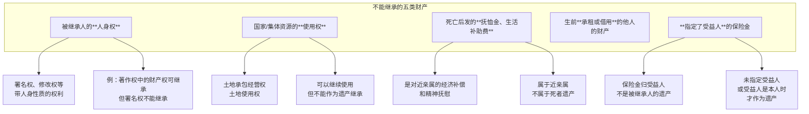
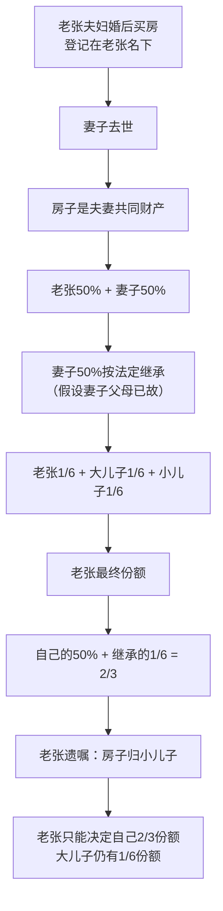
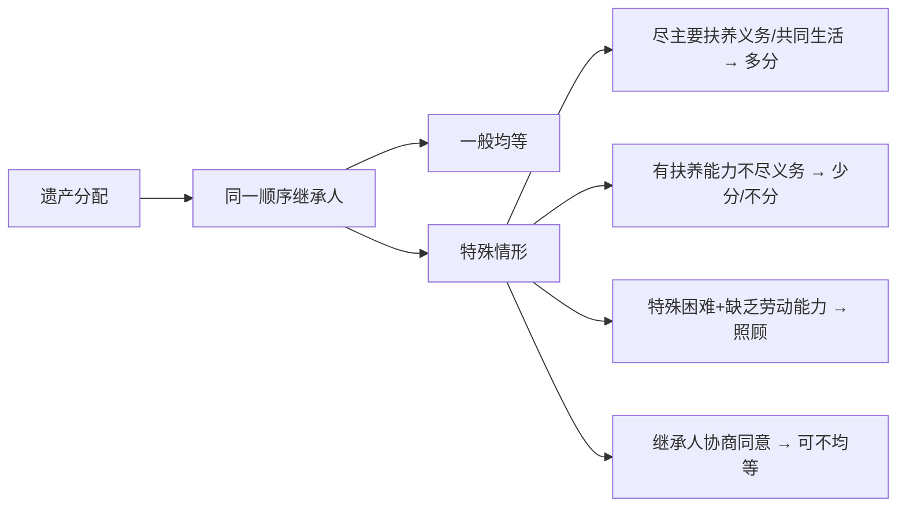

# 第46课：哪些财产可作为遗产？哪些财产无法被继承？

## Learning Objectives

- 明确可作为遗产的财产范围
- 掌握不能继承的财产类型
- 理解遗产分配的原则（均等、照顾、多分、少分）
- 了解遗产债务的清偿规则

---

## 一、回顾上期思考题

> 张老年事已高，腿脚不便，希望在家中通过手机视频录像立遗嘱。应当如何操作？

**答案**：

1. 老张**亲自叙述**遗嘱全部内容
2. 请**两个以上见证人**在场见证（具备见证能力，与遗产无关）
3. 录制开始时，老张和见证人分别对着镜头说明**姓名、性别、年龄、籍贯、职业、工作单位、家庭住址**等个人信息
4. 老张对着镜头说明制作遗嘱的**具体地点、年、月、日、时**
5. 录制完毕后**封存**录像，封面上由老张和见证人**签名**，注明**年、月、日**
6. 老张去世后继承开始时，由见证人、继承人到场，**检验封皮完好情况**，然后宣读遗嘱

---

## 二、遗产的定义

> **《民法典》**：遗产是公民死亡时留下的**个人合法财产**。

- 死亡前 → **财产**
- 死亡后 → **遗产**
- 前提：**必须是合法的**

---

## 三、可以作为遗产的财产

### 一般财产类型

| 类别 | 具体内容 |
|------|---------|
| 公民的收入 | 工资、奖金、经营收益等 |
| 房屋、储蓄和生活用品 | 房产、存款、日常用品 |
| 树木、林木、牲畜和家禽 | 农业相关资产 |
| 文物、图书资料 | 收藏品、书籍 |
| 法律允许的生产资料 | 生产工具、设备等 |
| 著作权、专利权中的财产权利 | 版权收入、专利许可费 |
| 其他合法财产 | 包括**虚拟财产** |

### 虚拟财产

> 随着网络发展，网上虚拟财产也受法律保护。如网络账号、数字资产等，属于遗产范围。

---

## 四、不能继承的财产



### 详细说明

#### 1. 人身权不能继承

> 例：老张生前写畅销书，每年有可观版税收入。老张去世后，儿子小张可以继续享有**版税收入（财产权）**，但老张的**署名权、修改权**等带人身性质的权利，小张**不能继承**。

#### 2. 国家/集体资源使用权不能继承

> 如土地承包经营权、土地使用权等。可以按规定**继续使用**，但不能作为遗产继承。

#### 3. 死亡抚恤金、生活补助费不能继承

> 这部分财产是在被继承人**死亡后**获得的，是对死者近亲属的**经济补偿和精神抚慰**，属于近亲属所有，不属于死者遗产。

#### 4. 生前承租或借用他人的财产

> 被继承人生前租来的房子、借来的物品，所有权不属于被继承人，不能作为遗产。

#### 5. 指定了受益人的保险金

> 被保险人死亡后，保险金应当归**受益人**，不是被保险人的遗产。

**例外**：如果没有指定受益人，或者指定受益人就是本人，则保险金作为遗产。

---

## 五、典型案例分析

### 案例：老张夫妇的房产继承



**结论**：老张的遗嘱只能决定**2/3产权**的归属，大儿子仍能分到**1/6**的房产。

> **关键规则**：夫妻共同财产中，一方去世后，属于其的份额先发生继承，剩余份额才由生存方通过遗嘱处分。

---

## 六、遗产分配原则

| 原则 | 说明 |
|------|------|
| **均等分配** | 同一顺序继承人份额一般均等 |
| **照顾原则** | 对生活有特殊困难又缺乏劳动能力的继承人，应当**照顾** |
| **多分原则** | 尽了主要扶养义务或与被继承人共同生活的，可以**多分** |
| **少分/不分原则** | 有扶养能力和条件但**不尽扶养义务**的，应当**少分或不分** |
| **协商不均等** | 继承人协商同意的，可以不均等 |

### 案例应用：王大爷的三个儿子

| 继承人 | 情况 | 分配原则 |
|---------|------|---------|
| 大儿子 | 主要养老，与王大爷共同生活 | **可以多分** |
| 二儿子 | 富裕但拒绝扶养老人 | **应当不分或少分** |
| 小儿子 | 智障人士（残疾人） | **应当给予照顾**，多留财产 |



---

## 七、遗产债务清偿

### 遗产债务的种类

| 类型 | 说明 |
|------|------|
| 税款 | 被继承人生前应缴未缴的税费 |
| 合同之债 | 因合同所欠的债务 |
| 侵权赔偿 | 因侵权行为应承担的损害赔偿 |
| 不当得利返还 | 因不当得利应返还的债务 |
| 无因管理费用 | 因无因管理应承担的费用 |
| 其他个人债务 | 其他合法债务 |

### 清偿规则

> **限定继承原则**：继承人以**遗产实际价值为限**清偿债务，超过部分继承人自愿偿还的除外。

```mermaid
flowchart TD
    A[被继承人死亡] --> B[留有遗产和债务]
    B --> C{继承人是否放弃继承}
    C -->|放弃继承| D[不负清偿责任]
    C -->|接受继承| E[以遗产实际价值为限<br>清偿债务]
    
    E --> F{遗产价值 vs 债务金额}
    F -->|遗产100万<br>债务200万| G[只清偿100万<br>剩余债务不需还]
    F -->|遗产200万<br>债务100万| H[清偿100万后<br>余100万继承]
    
    G --> I[继承人自愿偿还<br>超出部分<br>法律不禁止]```

### 关键规则

> **继承人放弃继承的，对被继承人依法应当缴纳的税款和债务可以不负清偿责任。**

---

## 八、总结

| 知识点 | 核心内容 |
|-------|---------|
| 遗产定义 | 死亡时留下的个人合法财产 |
| 可继承财产 | 收入、房产、储蓄、知识产权财产权、虚拟财产等 |
| **不能继承** | 人身权、国家资源使用权、抚恤金、承租借用财产、指定受益人保险金 |
| 分配原则 | 均等→照顾→多分→少分/不分→协商不均等 |
| 债务清偿 | **限定继承**，以遗产实际价值为限 |

---

## 思考题

*（本节无新思考题，课程内容结束。）*