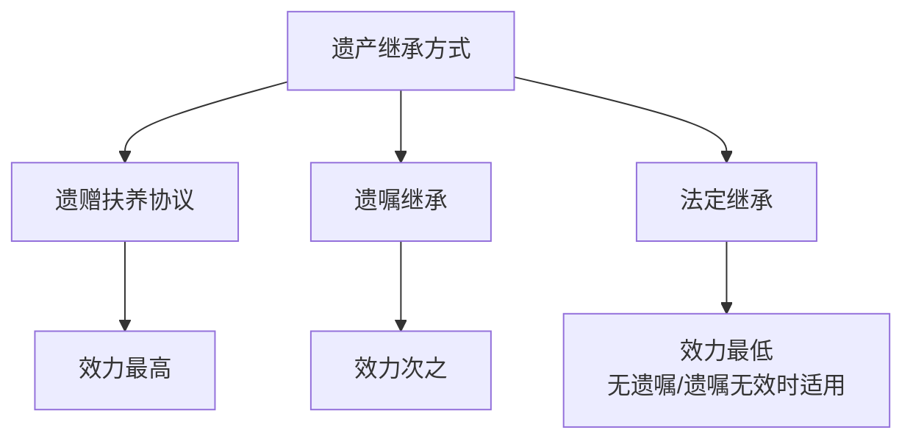
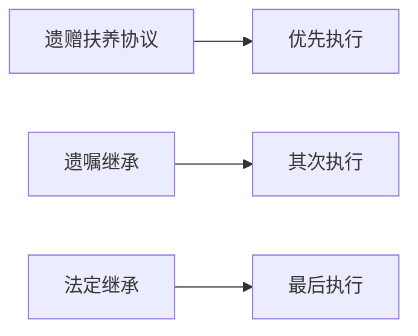

# 第47课：遗产继承顺序，把财产留给你想留的人

## Learning Objectives

- 掌握《民法典》三种继承方式的优先级关系
- 理解法定继承第一顺序和第二顺序的继承人范围
- 区分代位继承与转继承的法律要件
- 了解遗赠抚养协议的效力优先规则

---

## 一、《民法典》规定的三种继承方式

《民法典》规定了三种继承方式，按优先级排列如下：

### 1.1 遗赠与遗赠扶养协议

**遗赠**：将遗产赠给继承人以外的人。

**遗赠扶养协议**：被继承人与扶养人签订协议，由扶养人承担生养死葬义务，遗产归扶养人所有。

> [!example] 遗赠扶养协议案例
> 王老80岁，终身未婚无子女，与村委会签订遗赠扶养协议，约定由村委会负责其生活与后事，王老的遗产（两间瓦房、十棵树、三只鸡、一只鹅、菜园蔬菜及现金等）归村委会继承。

> [!tip] 关键在于：扶养人**先尽义务、后享权利**；被继承人**先享权利、后尽义务**。

### 1.2 遗嘱继承

被继承人生前立遗嘱，将个人合法遗产由法定继承人中的一人或多人继承。

> [!warning] 遗嘱必须符合《民法典》规定的形式要件，否则可能无效。详见第48课（有效遗嘱）。

### 1.3 法定继承

在没有遗嘱或遗嘱无效的情况下，依据法律规定的继承人范围、顺序和分配原则继承遗产。

---

## 二、法定继承顺序

> [!law] 《民法典》第1127条
> 遗产按照下列顺序继承：
> - **第一顺序**：配偶、子女、父母
> - **第二顺序**：兄弟姐妹、祖父母、外祖父母
>
> 继承开始后，由第一顺序继承人继承，第二顺序继承人不继承。没有第一顺序继承人继承的，由第二顺序继承人继承。

### 2.1 继承人范围详解

| 称谓 | 涵盖范围 |
|------|----------|
| **子女** | 婚生子女、非婚生子女、养子女、有扶养关系的继子女 |
| **父母** | 生父母、养父母、有扶养关系的继父母 |
| **兄弟姐妹** | 同父母兄弟姐妹、同父异母/同母异父兄弟姐妹、养兄弟姐妹、有扶养关系的继兄弟姐妹 |

### 2.2 特殊规定：丧偶儿媳/女婿

> [!law] 丧偶儿媳对公婆、丧偶女婿对岳父母**尽了主要赡养义务**的，可以作为**第一顺序继承人**。

### 2.3 案例分析

#### 案例一：多子女家庭

刘老汉25岁与乔婆婆结婚，生刘一、刘二。刘老汉45岁时乔婆婆去世，孙婆婆带11岁儿子小孙与刘老汉再婚（小孙与刘老汉形成扶养关系）。刘老汉90岁去世，无遗嘱，父母已故，有兄长"大刘"。

- **继承人**：配偶孙婆婆 + 子女刘一、刘二、小孙（继子女，有扶养关系）
- **结果**：四人**均等继承**，第二顺序的兄长大刘无权继承

> [!tip] 如果小孙结婚时已满20岁（成年人），则与刘老汉未形成扶养关系，**无继承权**。

#### 案例二：无子女情况

刘老汉与老伴无子女，老伴去世，父母早亡，仅有一个哥哥大刘。

- **结果**：第一顺序无人，由第二顺序的**大刘作为唯一继承人**。

---

## 三、代位继承

> [!law] 《民法典》第1128条
> 被继承人的子女**先于**被继承人死亡的，由被继承人子女的**直系晚辈血亲**代位继承。
> 被继承人的兄弟姐妹**先于**被继承人死亡的，由其**子女**代位继承。

### 3.1 代位继承示意图

### 3.2 代位继承的要点

- 代位继承人只能继承被代位人**有权继承的份额**
- 新增：兄弟姐妹的子女也可以代位继承（《民法典》新增，避免财产归公）

> [!example] 代位继承案例
> 老赵儿子小赵因工伤死亡，留下女儿。老赵悲痛后去世，无遗嘱。小赵的继承份额由其**女儿代位继承**。

---

## 四、转继承

> [!law] 继承开始后，继承人于遗产分割前死亡，其应继承的份额**转给其继承人**（遗嘱另有安排的除外）。

### 4.1 转继承与代位继承的区别

| 区别点 | 代位继承 | 转继承 |
|--------|----------|--------|
| **死亡时间** | 继承人**先于**被继承人死亡 | 继承人**在继承开始后、遗产分割前**死亡 |
| **适用场景** | 子女替代已故父母的位置 | 继承人在处理遗产过程中死亡 |

> [!example] 转继承案例
> 老赵去世，遗产一套房子给独子小赵。小赵未放弃继承，但在处理遗产途中遇车祸去世。小赵应继承的房产转由**小赵的继承人**（配偶、女儿等）继承。

---

## 五、三种继承方式的冲突规则

当遗赠扶养协议、遗嘱和法定继承并存时：

债务清偿顺序：**法定继承**→清偿税费和债务→不足部分由**遗嘱继承人和受遗赠人**按比例清偿。

---

## 六、课后思考题

> [!question] 思考题
> 宋某妻子早逝，留下一子一女。2001年，儿子甲意外死亡，留下妻子孙某与儿子小甲。两年后宋某身患重病，一直由女儿乙赡养。弥留之际神志不清，由女儿乙代书立下遗嘱继承其房产。
>
> **问题**：这份遗嘱有效吗？遗产应该如何继承？

> [!done]- 思考题答案
> 遗嘱**无效**，因为：
> 1. 立遗嘱时宋某已神志不清，属于**限制民事行为能力人**，无法确认真实意思表示
> 2. 代书遗嘱由**利害关系人**（女儿）书写，形式不符合法律规定
>
> 应按**法定继承**处理：
> - 继承人：子女甲、乙（甲先于宋某死亡，由小甲代位继承）
> - 女儿乙尽主要赡养义务，可适当**多分**
> - 丧偶儿媳孙某仅在对公婆尽主要义务的前提下才能分得遗产

---

> [!summary] 本课小结
> - 《民法典》规定三种继承方式：**遗赠扶养协议**（效力最高）→ **遗嘱继承** → **法定继承**
> - 法定继承第一顺序：**配偶、子女、父母**；第二顺序：**兄弟姐妹、祖父母、外祖父母**
> - **代位继承**：子女先亡→孙辈代替；**转继承**：继承人遗产分割前死亡→转给其继承人
> - 丧偶儿媳/女婿尽主要赡养义务的，可作为第一顺序继承人