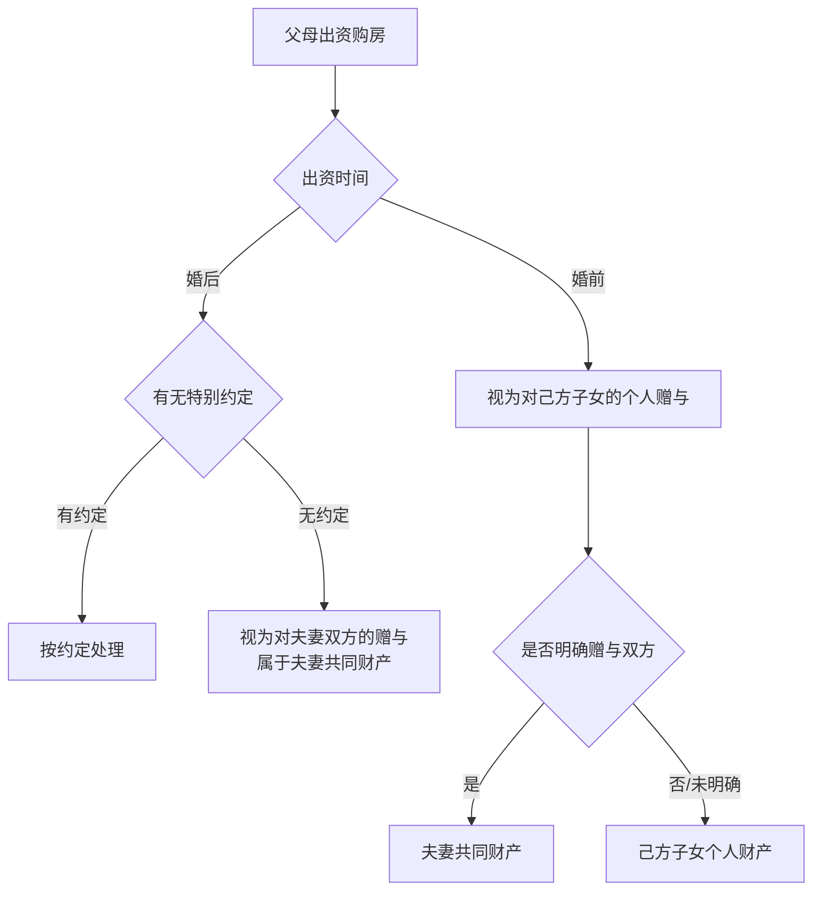

# 第48课：父母想为子女买房，首付前务必注意！

## Learning Objectives

- 掌握婚前与婚后父母出资购房的产权归属规则
- 理解"赠与"与"借贷"的性质认定标准
- 学会通过书面协议、公证等方式规避风险
- 了解不同登记情形下的离婚房产分割规则

---

## 一、核心法律依据

> [!law] 《最高人民法院关于适用〈民法典〉婚姻家庭编的解释（一）》第29条
> **婚前**：父母为双方购置房屋出资的，该出资应当认定为对**自己子女个人的赠与**，但父母明确表示赠与双方的除外。
> **婚后**：父母为双方购置房屋出资的，依照**约定**处理；没有约定或约定不明确的，按《民法典》第1062条第一款第四项处理（即视为**夫妻共同财产**）。

---

## 二、婚前出资 vs 婚后出资

### 2.1 婚前出资四情形

#### 情形一：父母出全款，登记在己方子女名下

> [!example]
> 小张父母婚前全款购房，登记在小张名下。
> **结果**：属于小张**婚前个人财产**，离婚时不予分割。

#### 情形二：父母出首付，登记在己方子女名下，婚后共同还贷

> [!example]
> 小张父母出首付，登记在小张名下，婚后小张和小李共同还贷。
> **结果**：
> - 房产归**登记方小张**所有
> - **婚后共同还贷部分 + 相应增值部分**属于夫妻共同财产，需对另一方补偿
> - 即使婚后由小张的工资还贷，也属于共同还贷（婚后工资属于夫妻共同财产）

> [!warning] 注意
> 如果遇到房价暴涨，个人存款可能不足以补偿对方，需要**变卖房产**或**借款**来实现补偿。

#### 情形三：父母出首付，登记在双方或对方名下

> [!example]
> 无特别约定时，认定为对**小两口双方的赠与**，属于**夫妻共同财产**。

### 2.2 婚后出资情形

#### 情形四：婚后父母出全款，登记在己方子女名下

| 情况 | 结果 |
|------|------|
| 有约定（如约定归个人） | 按约定处理 |
| 无约定或约定不明 | 推定为对**夫妻双方的赠与**，属于共同财产 |

---

## 三、郝律师的实操建议

### 建议一：尽量婚前全款购房

如果有购房计划，尽量在**婚前全款买房**并登记在自己子女名下，这样属于子女的**个人财产**，离婚时纠纷少。

### 建议二：明确出资性质和对象

无论是全款还是部分出资，都应当对资金性质做出明确的**意思表示**：

- 约定是**赠与**还是**借款**
- 明确赠与的**对象**（仅赠与自己子女还是赠与夫妻双方）

### 建议三：召开家庭会议 + 书面协议

> [!tip] 推荐做法
> 1. 大额出资前召开**家庭会议**，开诚布公
> 2. 形成**书面协议**，要求所有利益相关人（尤其是儿媳/女婿）签字
> 3. 如对方不愿意签字，可去**公证机关**办理公证，明确出资只赠与自己的子女一方

### 建议四：银行转账 + 备注留存

> [!danger] 资金流转方式
> - 尽量通过**银行转账**支付
> - 转账时**添加备注**（如"仅赠与我儿子XXX购房款"）
> - **避免现金支付**，现金无法留下有效证据

---

## 四、课后思考题

> [!question] 思考题
> 小张和小李结婚后，小张的父母出全资购房，房子登记在小李名下，并且表示**这是送给儿媳小李个人的礼物**。离婚时，房子的产权归谁？

> [!done]- 思考题答案
> 产权归**小李个人所有**。
>
> **分析**：婚后父母出资购房，原则上视为夫妻共同财产。但本案中，小张父母明确表示"送给儿媳小李个人"，这属于**特别约定**，具有优先效力。因此该房产属于小李的**个人财产**。

---

> [!summary] 本课小结
> - **婚前出资**：一般认定为对**己方子女的个人赠与**（明确赠与双方的除外）
> - **婚后出资**：无特别约定时视为**夫妻共同财产**
> - 登记在单方还是双方名下，结论不同
> - 明确出资性质的**四种方法**：书面协议、家庭会议、公证、转账备注
> - 大额出资**避免现金支付**，注重证据留存