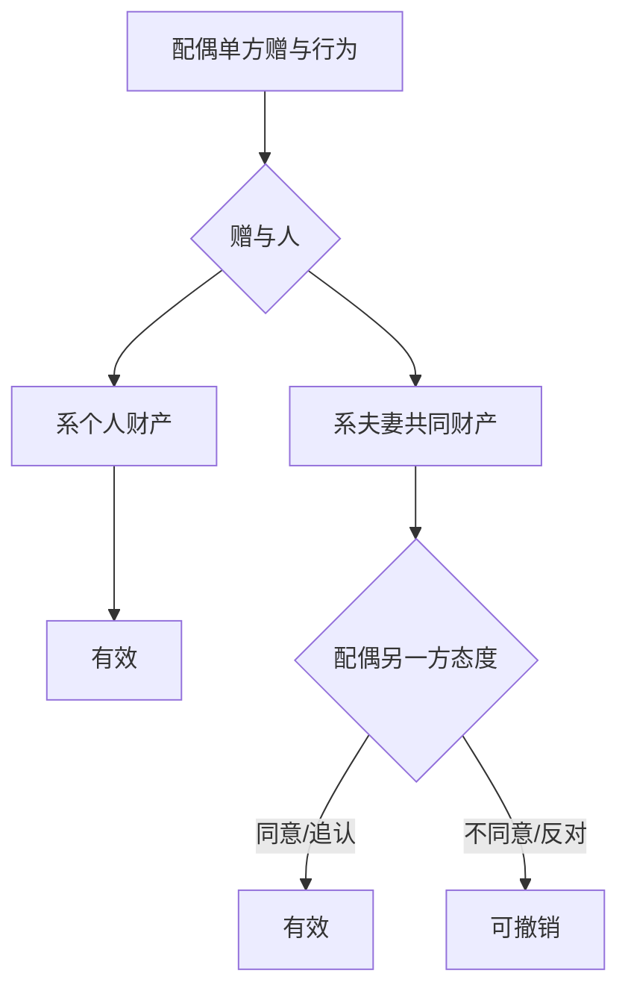
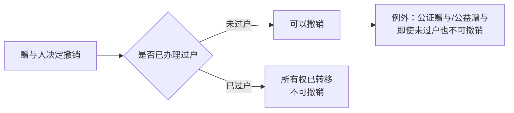

# 第49课：离婚时对方转移财产，将其赠与自己亲属，我能要回来吗？

## Learning Objectives

- 区分个人财产与夫妻共同财产的处分权差异
- 掌握单方赠与夫妻共同财产的法律效力（待定状态）
- 理解赠与撤销权的行使条件和时间节点
- 了解婚前全款房与婚后共同财产在赠与上的区别

---

## 一、核心原则：先区分财产性质

### 1.1 个人财产 → 单方赠与有效

如果赠与物属于一方的**个人财产**，赠与人拥有完整的处分权，**无需配偶同意**，配偶也不能撤销。

> [!law] 以下属于个人财产：
> - 婚前财产
> - **遗嘱或赠与合同中确定只归一方的**财产
> - **因人身损害获得的赔偿或补偿**
> - 婚后约定为个人所有的财产

> [!example] 案例一：奶奶遗嘱赠与的字画
> 小张奶奶病逝，遗嘱将两幅宋名字画赠与小张个人所有。小张私自将一幅赠与自己父亲。离婚时小李要求撤销赠与并分割。
>
> **结果**：小李请求无法得到支持。字画属于小张**个人财产**，小张有权自由处分。

> [!example] 案例二：车祸赔偿金
> 小张车祸致残，获赔50万赔偿金，后赠与母亲10万。离婚时小李要求撤销。
>
> **结果**：小李请求无法得到支持。**人身损害赔偿金**属于个人财产，小张拥有完整处分权。

### 1.2 夫妻共同财产 → 单方赠与效力"待定"

夫妻对共同财产**不分份额地共同共有**，处分需要双方同意。一方单方赠与的，在另一方确认前效力**待定**：

| 配偶态度 | 法律后果 |
|----------|----------|
| 知情后**同意或追认** | 赠与有效 |
| 知情后**表示反对** | 赠与无效，应返还财产 |

---

## 二、婚前全款房的特殊规则

> [!example] 案例：小张将婚前全款房赠与姐姐
> 小张婚前全款购房作为婚房与小李居住。离婚前与姐姐签订赠与协议将房子赠与姐姐。
>
> **结果**：赠与**有效**。房子是小张的婚前个人财产，小李仅有使用权，没有所有权。

### 2.1 赠与撤销规则

> [!law] 《民法典》第658条
> 赠与人在赠与财产的**权利转移之前**可以撤销赠与。
>
> 但下列赠与**不可撤销**：
> - 经过**公证**的赠与合同
> - 具有**救灾、扶贫、助残等公益、道德义务**性质的赠与合同

### 2.2 承诺赠与未过户的后果

> [!warning] 甜言蜜语不等于法律赠与
> 小张承诺将婚前房赠与小李，但未办理过户登记。离婚时小李要求分割。
>
> **结果**：小李的诉求难以得到支持。根据《民法典》第658条，**赠与人在财产转移前可随时撤销赠与**。房子仍属于小张个人财产。

---

## 三、婚后小额财产赠与 → 家事代理权

> [!example] 案例：按摩椅赠与
> 小张未告知小李，将家中高档按摩椅赠与父亲。小李下班后：
> - **追认**（"孝敬老人应该的"）→ 赠与有效
> - **反对**（"怎么不跟我商量"）→ 有权撤销该项赠与

> [!tip] 家事代理权
> 夫妻一方在日常家事范围内有代理权，但对于**大件财产**的处分，必须征得对方同意。

---

## 四、课后思考题

> [!question] 思考题
> 小张是军人，与小李结婚后仍在部队服役。在一次执行任务中受伤退役，得到**十万元医疗生活补助费**。后来小张将其全部赠与母亲。离婚时，小李能否主张撤销这笔赠与？

> [!done]- 思考题答案
> **不能撤销**。
>
> 根据《民法典》规定，**军人的伤亡保险金、伤残补助费、医药生活补助费**属于**个人财产**。小张完全有权对个人财产进行处置，无需征得小李同意，小李无权主张撤销或分割。

---

> [!summary] 本课小结
> - **个人财产**：单方赠与**有效**，配偶无权干涉
> - **夫妻共同财产**：单方赠与效力**待定**，配偶可撤销
> - 赠与在**权利转移（过户）前**可撤销，但**公证赠与**和**公益赠与**除外
> - "承诺赠与"不等于"完成赠与"，未过户前赠与人可随时反悔
> - 家事代理权只适用于日常生活小件，大件处分需双方同意