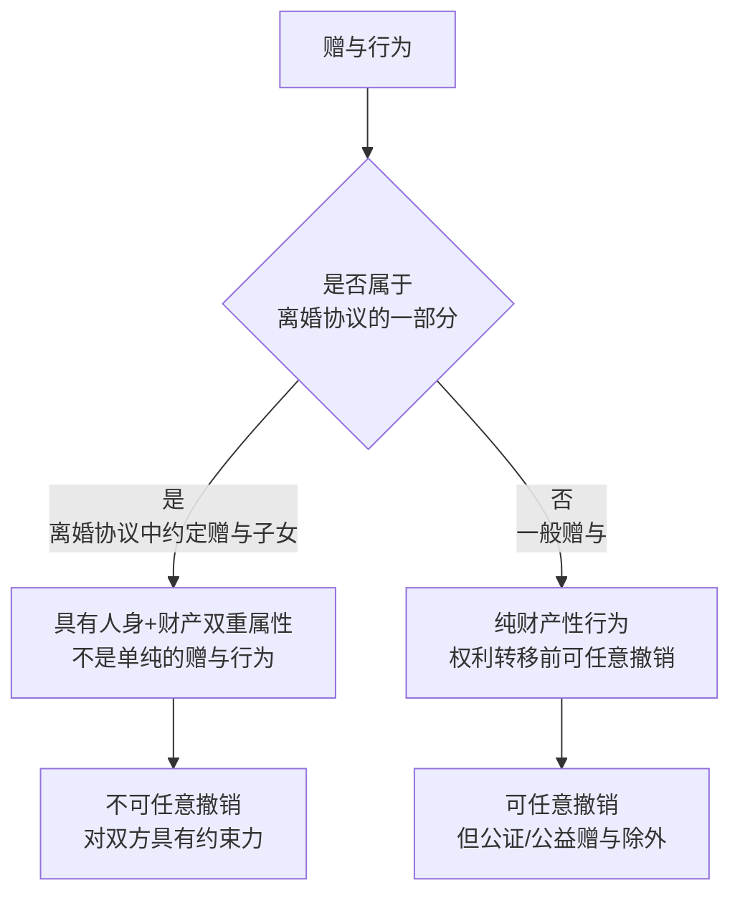

# 第50课：夫妻约定将房产赠与子女后，一方反悔可以撤销吗？

## Learning Objectives

- 理解离婚协议中的赠与与一般赠与的本质区别
- 掌握任意撤销权的限制条件
- 学会通过公证、法院调解书等方式确保赠与不可撤销
- 了解"重大误解"情形下可以撤销赠与的特例

---

## 一、离婚协议中的赠与 vs 一般赠与

### 1.1 核心区别

### 1.2 为什么离婚协议中的赠与不能任意撤销？

> [!law] 离婚协议的特殊性
> 离婚协议是夫妻双方就**婚姻关系解除、子女抚养、财产分割**等问题达成的**一揽子合意**，具有**人身和财产双重属性**。

- 赠与行为与**解除婚姻关系**密不可分
- 一方同意赠与，往往是以对方接受其他条款（如放弃部分权益）为条件
- 若允许反悔，将违背**诚实信用原则**

### 1.3 典型案例分析

> [!example] 案例一：父亲再婚反悔
> 妻子李某与丈夫王某经法院调解离婚。为保护未成年儿子小王，双方协议：共有房屋在付清贷款后归儿子所有。离婚后王某继续还贷，后准备再婚，主张撤销赠与要求分割房屋。
>
> **结果**：王某的请求**得不到法院支持**。
> - 离婚协议具有人身和财产双重属性，不适用任意撤销权
> - 双方意思表示真实有效，对双方均有约束力
> - 赠与子女也是履行抚养义务的方式

---

## 二、特殊例外：重大误解可以撤销

### 2.1 非亲生子女情形

> [!example] 案例二：非亲生子女
> 夫妻2016年结婚，2017年生子，2020年离婚。离婚时协议将房子登记在儿子名下（已过户）。后经鉴定，儿子与父亲**没有血缘关系**。父亲起诉请求撤销离婚协议中的房产处理决定。
>
> **结果**：**可以得到法院支持**。
> - 父亲在误以为儿子是亲生的情形下做出赠与，构成**重大误解**
> - 根据《民法典》第147条，基于重大误解实施的民事法律行为，行为人可在知道之日起**90日内**请求撤销
> - 无论是否已完成产权变更，均可申请撤销

> [!law] 《民法典》第147条
> 基于**重大误解**实施的民事法律行为，行为人有权请求人民法院或者仲裁机构予以撤销。

### 2.2 继父/继女关系情形

> [!example] 案例三：继父赠与非亲生女儿
> 父亲单身与带2岁女儿的母亲结婚，视女儿为己出。十年后离婚，协议将房产赠与女儿（未过户）。后父亲反悔请求撤销。
>
> **结果**：**不可撤销**。
> - 父亲在赠与房产时**不存在亲缘关系误解**
> - 是**真实意思表示**
> - 离婚协议中的赠与条款具有法律效力

---

## 三、郝律师的建议：如何确保赠与有效

### 建议一：对离婚协议进行公证

经过公证的赠与合同具有**强制执行效力**，能够更好地督促对方履行义务。

### 建议二：通过法院制作调解书

> [!tip] 协议离婚可以去法院
> 除了去婚姻登记机关办理协议离婚，也可以去法院，经法院审查确认后制作**民事调解书**。
> - 调解书生效后，与判决书具有同等**强制执行力**
> - 双方必须遵守

### 建议三：尽快办理产权变更手续

> [!warning] 产权过户是关键
> 一旦产权发生转移，**无论是谁都难以撤销**。条件允许时，达成赠与协议后应尽快办理过户。
>
> 例外：婚姻存续期间，父母一致同意赠与子女但未过户，后因子女出现问题，**父母一致同意撤销**的，可以撤销。

---

## 四、课后思考题

> [!question] 思考题
> 老张和妻子结婚数年育有一子，感情不好但为了孩子一直未离婚。儿子成家立业后两人离婚，开始各自的黄昏恋。离婚后分给老张的房子，老张直接赠与儿子并办理了过户手续。后来老张年老病重，儿子拒绝照顾和赡养。老张能否要回赠给儿子的房子？

> [!done]- 思考题答案
> **可以要回**。
>
> 根据《民法典》规定，受赠人有下列情形之一的，赠与人可以撤销赠与：
> 1. 严重侵害赠与人或赠与人近亲属的**合法权益**
> 2. 对赠与人有**扶养义务而不履行**
> 3. 不履行赠与合同约定的义务
>
> 本案中，儿子小张对父亲老张有**法定赡养义务**却不履行，老张可以主张**法定撤销权**要回房子。

---

> [!summary] 本课小结
> - 离婚协议中的赠与不同于一般赠与，具有**人身+财产双重属性**，**不可任意撤销**
> - **重大误解**（如非亲生子女）是例外，可在知悉后**90日内**申请撤销
> - 确保赠与不可撤销的**三种方式**：**公证**、**法院调解书**、**及时过户**
> - 如果受赠人不履行扶养义务，赠与人可行使**法定撤销权**