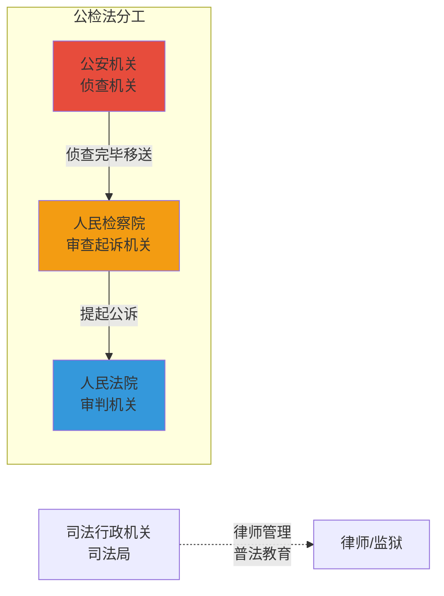
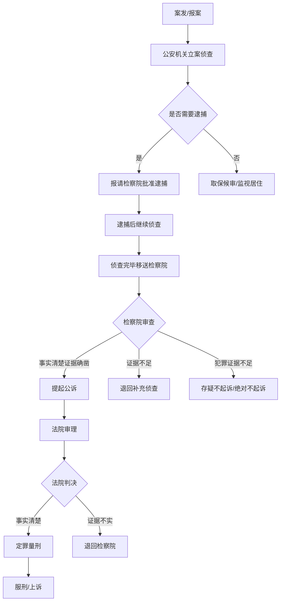

# 第51课：法院、检察院、公安都是负责什么的？

## Learning Objectives

- 理解公检法三机关的职能分工与协作关系
- 掌握公安机关的侦查权与逮捕权的区别
- 了解检察院的法律监督职能和不起诉类型
- 认识法院的体系结构和两审终审制度

---

## 一、公检法概览——"出了问题该找谁？"



### 1.1 公安机关（公安局/派出所）

公安机关是**政府职能部门**，兼具行政和司法双重属性：

| 职能类型 | 具体职责 |
|----------|----------|
| 
| **行政管理** | 治安管理、交通消防、户口身份证、出入境等 |
| **刑事侦查** | 立案、侦查、收集证据、抓捕犯罪嫌疑人 |

> [!tip] 什么时候找公安？
> - 被盗窃、诈骗、人身安全受到威胁
> - 发生交通事故
> - 发现违法犯罪行为需要报警
> - 日常生活中遇到任何紧急情况都可以拨打110

### 1.2 人民检察院

检察院是国家的**法律监督机关**，行使监督权：

- 对公安机关的侦查活动进行**监督**
- 对人民法院的审判活动进行**监督**
- 代表国家**提起公诉**
- **批准逮捕**（公安只有拘留权，没有逮捕权）

> [!law] 独立行使检察权
> 人民检察院依照法律规定独立行使检察权，不受任何行政机关、社会团体和个人的干涉。

### 1.3 人民法院

法院是国家的**审判机关**，独立行使审判权。

**法院体系：**

```mermaid
flowchart TD
    A[最高人民法院] --> B[高级人民法院]
   省/自治区/直辖市]
    B --> C[中级人民法院]
    C --> D[基层人民法院]
    D --> E[人民法庭<br/>派出机构   非专属审级]]
```

**专门法院**：军事法院、海事法院、铁路运输法院、知识产权法院、金融法院、互联网法院等。

> [!law] 两审终审制
> 一审在基层法院→二审在**中级法院**
> 一审在**中级**法院→二审在**高级**法院
> 一审在**高级**法院→二审在**最高**法院

---

## 二、通过刑事案件看公检法如何协同工作

### 2.1 完整流程



### 2.2 检察院的三条出路

| 结果 | 含义 |
|------|------|
| **提起公诉** | 事实清楚，证据确凿 |
| **退回补充侦查** | 事实不清，证据不足 |
| **存疑不起诉** | 有犯罪嫌疑但证据链不完整（可再查） |
| **绝对不起诉** | 认为不构成犯罪 |

### 2.3 法院的三条出路

1. **定罪判决**：认可公安和检察院的工作，事实清楚证据确凿
2. **退回检察院补充侦查**
3. **无罪判决**：检察院再次移送仍证据不足

### 2.4 典型案例流程

> [!example] 张晓明涉嫌过失杀人案
> 1. 公安局**立案**、侦查
> 2. 检察院**签发逮捕令**，公安局逮捕张晓明
> 3. 检察院**提起公诉**
> 4. 法院**开庭审理**（律师辩护）
> 5. 一审判决：有期徒刑**5年**张晓明**服判未上诉**
> 6. 检察院认为判决太轻**提起抗诉**
> 7. 二审改判：有期徒刑**10年**

> [!warning] 上诉不加刑原则
> 刑事案子上诉**不加刑**。张晓明如果自己上诉，二审不能因"态度不好"加重刑罚。
>
> 但**检察院抗诉**不受此限制——本案因检察院抗诉，二审改判了10年。

---

## 三、自诉案件与职务犯罪

| 案件类型 | 侦查/起诉机关 |
|----------|---------------|
| **一般刑事案件** | 公安立案侦查 → 检察院公诉 |
| **自诉案件** | 直接到**法院**起诉，不需要公安立案 |
| **职务犯罪**（贪污受贿、渎职等）| **检察院**自己立案侦查 |

---

## 四、课后思考题

> [!question] 思考题
> 张三接到电话说妻子李四在深圳被逮捕，急需一笔钱就能放人。张三慌乱中汇款后才发现被骗了。张三应该向哪个部门报案？

> [!done]- 思考题答案
> 应当向辖区内的**派出所或公安局**报案。本案涉及**网络诈骗犯罪**，由公安机关进行**侦查**。报案时应详细叙述被骗经过、时间地点、犯罪嫌疑人特征、手段、被骗数额、汇款账号等，并提供相关证据。

---

> [!summary] 本课小结
> - **公安机关**：侦查立案，收集证据，有拘留权无逮捕权
> - **人民检察院**：审查起诉、批准逮捕、法律监督
> - **人民法院**：独立审判，两审终审制
> - 三机关**互相独立、互相配合、互相监督**
>