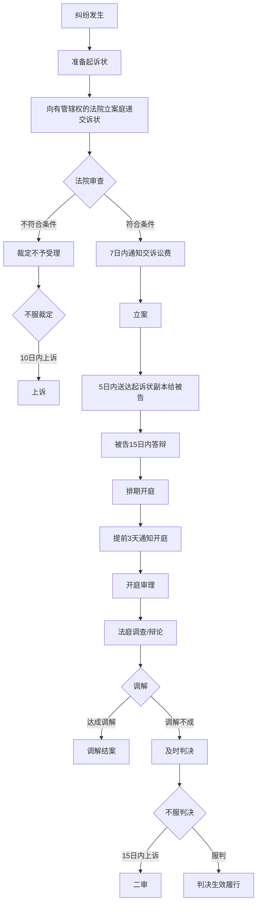

# 第52课：如果遇到刑事、民事诉讼，法律流程是怎样的？

## Learning Objectives

- 掌握刑事诉讼的三个阶段及各阶段负责机关
- 理解"黄金37天"的含义和法律意义
- 区分刑事拘留与行政拘留
- 了解民事诉讼的基本流程和关键时间节点

---

## 一、刑事诉讼流程

刑事案件一般分为**侦查**、**审查起诉**和**审判**三个阶段，分别由公安机关、检察院和法院负责。

```mermaid
flowchart TD
    subgraph 侦查阶段【公安】
        A[报案/发现犯罪] --> B[立案]
        B --> C[传唤/调查]
        C --> D{刑事拘留}
        D -->|是| E[进看守所<br/>24小时内通知家属<br/>律师可会见]
        D -->|否| F[取保候审/监视居住]
    E --> G{报请批捕}
    end

    subgraph 审查起诉阶段【检察院】
        G --> H[检察院7天审查]
        H -->|批准逮捕| I[继续侦查<br/>最多2个月]
        H -->|不批准| J[释放/取保候审]
    I --> K[移送检察院起诉]
        K --> L{审查决定}
        L -->|提起公诉| M[移送法院]
        L -->|退回补侦| I
        L -->|不起诉| N[释放]
    end

    subgraph 审判阶段【法院】
        M --> O[法院受理开庭]
        O --> P[合议庭合议]
        P --> Q[择日宣判]
        Q --> R{上诉}
        R -->|10日内上诉| S[二审程序]
        R -->|不上诉| T[判决生效执行]
    end
```

### 1.1 侦查阶段（公安机关）

#### 刑事拘留 vs 行政拘留

| 类型 | 目的 | 最长期限 | 适用对象 |
|------|------|----------|----------|
| **刑事拘留** | 侦查犯罪 | 14天（一般）<br/>30天（重大嫌疑） | 犯罪嫌疑人 |
| **行政拘留** | 处罚教育违法行为 | ️ 3-15天 | 违法行为人 |

#### 律师会见权

- 刑事拘留后**24小时内**通知家属
- 家属可聘请**律师**了解案情
- 看守所收到会见请求后**48小时内**安排会见
- 例外：危害国家安全犯罪、恐怖活动犯罪，律师会见需经侦查机关许可

### 1.2 黄金37天

> [!law] 黄金37天 = 30天（拘留期限）+ 7天（检察院批捕审查期）

为什么叫"黄金37天"？

- 检察院批准逮捕比刑事拘留更**审慎**
- **不批准逮捕的情形**：
  - 证据不充分
  - 情节轻微
  - 有自首立功表现
  - 认罪认罚
  - 取得被害人谅解

> [!tip] 黄金37天的意义
> 如果检察院**不批准逮捕**，嫌疑人可不在看守所羁押，后期**不起诉或判缓刑的概率**也大大增加。

> [!example] 案例：误入诈骗组织的张三
> 张三因涉嫌电信诈骗被拘留。检察院在审查批捕时发现：张三在不知情下误入诈骗组织，每天被殴打逼迫打电话，还多次尝试报警但未成功。
>
> **结果**：检察院认定张三**不构成犯罪**，不批准逮捕。

### 1.3 审查起诉阶段

- 期限：**一个半月**
- 重点：辩护律师可**调阅全案卷宗**
- 最重要的是公安局的**起诉意见书**和所有证据

### 1.4 审判阶段

- **一审**：开庭 → 合议 → 宣判
- **上诉期**：判决后**10日内**
- **二审**：
  - 有**新证据**→ 开庭审理
  - 无新证据 → 可能**书面审**

---

## 二、民事诉讼流程



### 2.1 民事诉讼要点

| 环节 | 时间/要求 |
|------|-----------|
| **立案** | 法院7日内决定是否受理|
| **送达** | 立案后5日内送达起诉状给被告 |
| **答辩** | 被告收到后15日内答辩|
| **开庭** | 提前3天通知 |
| **一审判决** | 不服可在15日内上诉 |
| **二审** | 6个月内审结 |

### 2.2 注意事项

> [!warning] 法庭辩论不是辩论赛
> - 法庭辩论需要在法官引导下**理性发表意见**
> - 法官会归纳争议焦点，双方围绕焦点辩论
> - 情绪激动或不恰当行为可能被**法庭提醒**甚至**请出法庭**

> [!tip] 二审形式
> - **开庭审**：有新证据需要质证
> - **书面审**：无新证据，有时会召集双方"谈话"确认事实
> - 结果：维持原判、改判、发回重审

---

## 三、课后思考题

> [!question] 思考题
> 一天晚上，大王和朋友在家中打牌，声音越来越大，赌注也越来越高。邻居报警后警方到场，发现大王涉嫌**聚众赌博**将其拘留。大王父亲找到律师，律师提醒"要利用好**黄金37天**"。请问什么是黄金37天？

> [!done]- 思考题答案
> **黄金37天**指的是从**刑事拘留**到**检察机关批准逮捕**之间的时间（30天拘留期+7天批捕审查期）。这段时间属于**侦查阶段**，是争取检察院**不批准逮捕**的黄金期。一旦批捕，后续被判实刑的概率大大增加；而不批捕，则很可能不起诉或判缓刑。

---

> [!summary] 本课小结
> - 刑事诉讼三阶段：**侦查**（公安）→ **审查起诉**（检察院）→ **审判**（法院）
> - **黄金37天**：30天拘留 + 7天批捕审查，争取不批捕的关键窗口期
> - **刑事拘留**14-30天，**行政拘留**3-15天，性质不同
> - 民事诉讼流程：**起诉**→ **立案**→ **送达**→ **开庭**→ **判决**→ **上诉**/执行
> - 二审有**开庭审**和**书面审**两种形式