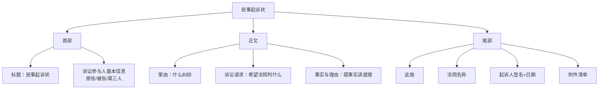

# 第53课：手把手教你写好起诉状

## Learning Objectives

- 掌握民事起诉状的三段式结构
- 学会撰写明确具体的诉讼请求
- 理解案由与法律关系的对应关系
- 了解当事人信息填写要点和证据准备方法

---

## 一、什么是民事起诉状？

> [!law] 《民事诉讼法》第120条第1款
> 起诉应当向人民法院递交起诉状，并按照被告人数提出副本。

民事起诉状是当事人向法院递交的**第一份文书**，也是整个民事诉讼中最**基础**的文书。被告围绕它答辩，法院围绕它裁判——起诉状怎么写，直接关系到诉讼的胜败。

---

## 二、起诉状的三段式结构



### 2.1 首部——诉讼参与人信息

**原告/被告信息**（自然人与法人不同）：

| 当事人类型 | 必备信息 |
|------------|----------|
| **自然人** | 姓名、性别、年龄、民族、职业、工作单位、住所、联系方式 |
| **法人/组织** | 名称、住所、法定代表人/主要负责人姓名、职务、联系方式 |

> [!tip] 如何查对方信息
> - 对方是法人：使用**国家企业信用信息公示系统**、天眼查、企查查等
> - 对方是自然人：尽可能提供身份证号、工作单位、住址、电话，方便法院送达

### 2.2 正文——案由

案由即"什么纠纷"，例如：**离婚纠纷**、**民间借贷纠纷**、**侵权纠纷**、**买卖合同纠纷**等。

> [!example] 案由区分
> - 小明借小张10万未还，小张找小明要钱时被打伤
>   - 起诉要求**还钱** → 民间借贷纠纷
>   - 起诉要求**赔偿医疗费** → 侵权纠纷

### 2.3 正文——诉讼请求

> [!danger] 诉讼请求是**法院审理的核心**，必须：具体、全面、有依据

| 常见问题 | 后果 | 解决方式 |
|----------|------|----------|
| 请求不明确 | 法官法庭上要求你"明确诉讼请求" | 写清楚时间、金额、比例 |
| 请求不全面（如漏利息） | 漏掉的只能**另案起诉** | 一次性列明全部请求 |
| 提出无依据的请求 | 增加诉讼费、混淆焦点 | 只提有法律依据的请求 |

> [!example] 好的诉讼请求 vs 不好的诉讼请求
> 
> **不好的**："要求被告还钱"
> 
> **好的**："请求判令被告张三向原告李四归还借款本金人民币**10万元**，并支付自**2023年1月1日起**至实际清偿之日止按**年利率15%** 计算的利息。"

### 2.4 正文——事实与理由

> [!tip] 写事实的原则
> - **按时间顺序**简要陈述
> - **不需要事无巨细**——过于详细会暴露全部底牌
> - **法律依据**——不写"欠债还钱"的大白话，写"依据《民法典》第XX条"
> - **与证据一致**——确保陈述与已有书面证据匹配

### 2.5 尾部

```
此致
XX市XX区人民法院

起诉人：XXX（手写签名）
XXXX年XX月XX日

附件：
1. 起诉状副本X份
2. 证据材料X份
3. ...
```

---

## 三、郝律师的四条建议

### 建议一：全面掌握案件事实

- 事无巨细地向律师讲述情况
- 避免在起诉状中出现**基础事实错误**
- 核对事实与**书面证据**是否一致

### 建议二：准确定性法律关系

> [!tip] 法律三段论
> - **小前提**：案件事实
> - **大前提**：法律规范
> - **结论**：找到匹配的法律关系类型（主体、客体、内容）

### 建议三：诉讼请求要具体全面

| 事项 | 具体要求 |
|------|----------|
| 本金 | 明确金额 |
| 利息 | 明确起止时间、利率标准 |
| 费用 | 诉讼费、律师费等 |
| 其他 | 是否要求对方承担全部诉讼费用 |

### 建议四：列明适格的诉讼当事人

- **原告**：与本案有直接利害关系
- **被告**：明确且适格（如夫妻共同债务需列配偶为共同被告）
- **已故债务人**：厘清是否有继承人，列继承人为被告
- **公司 vs 个人**：确认实际法律关系主体是谁

> [!warning] 信息不准确可能导致法院无法送达，影响诉讼进程

---

## 四、课后思考题

> [!question] 思考题
> 大刘经营一家工厂，与合作厂家业务员小王签订了一份买卖合同，约定交付定金后送货、货到付款。但交付定金后迟迟未收到货，也联系不上业务员了。大刘打算起诉，应该列谁为被告？信息应该怎么写？

> [!done]- 思考题答案
> 被告主体应当是**送货单位**，也可以把**业务员小王**列为**共同被告**。
>
> 获取单位信息的方法：到**国家企业信用信息公示系统**查询企业的全称、统一社会信用代码、住所地、法定代表人等。
>
> 风险提示：签署合同时应**到对方单位核实**，并要求业务员出示**授权委托书**，以确保这是单位行为而非个人行为。

---

> [!summary] 本课小结
> - 起诉状三段式：**首部**（当事人信息）→ **正文**（案由/请求/事实理由）→ **尾部**（致送法院/签名/附件）
> - 诉讼请求要**具体、全面、有依据**
> - 事实陈述要**抓住重点**，勿暴露全部底牌
> - 当事人信息要**准确详细**，方便法院送达
> - 法律关系定性是写好起诉状的**前提**