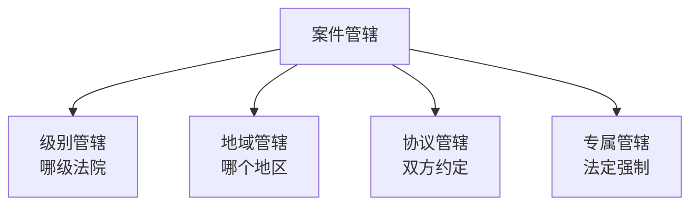
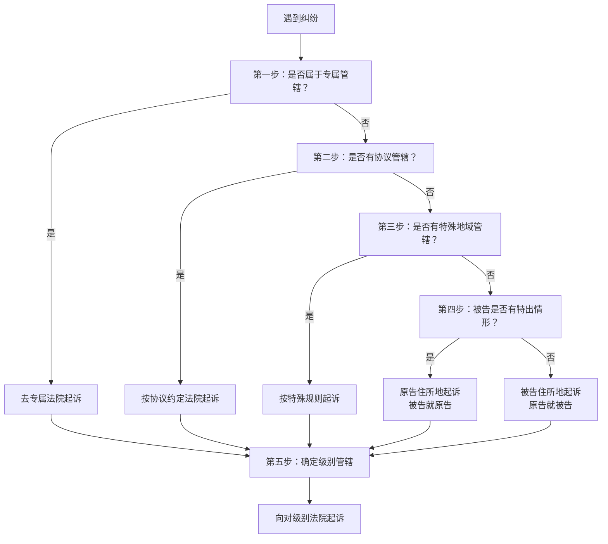

# 第54课：不得不打官司了，该向哪个法院起诉呢？

## Learning Objectives

- 掌握民事案件管辖的四大分类
- 理解"原告就被告"原则及例外情形
- 学会判断合同纠纷的管辖法院
- 了解专属管辖的适用范围

---

## 一、管辖的四大分类

### 1.1 级别管辖——去哪个级别的法院？

| 法院级别 | 受理范围 |
|----------|----------|
| **基层人民法院** | 普通一审案件 |
| **中级人民法院** | 重大涉外案件、本辖区内重大影响案件 |
| **高级人民法院** | 本辖区内有重大影响案件、标的额大的案件 |
| **最高人民法院** | 全国有重大影响的案件 |

### 1.2 地域管辖——去哪个地区的法院？

#### 基本原则：原告就被告

> [!law] 原告就被告
> 原告应当到**被告住所地**或**户籍所在地**的法院起诉。

| 被告类型 | 管辖地 |
|----------|--------|
| **自然人** | 被告住所地 / 经常居住地（人户分离时）|
| **法人/组织** | 主要办事机构所在地 / 注册地 |

> [!tip] 经常居住地认定
> **经常居住地** = 离开住所地后**连续居住一年以上**的地方（住院就医除外）。
>
> 例：小明常居深圳，在北京协和医院住院一年多——经常居住地仍是**深圳**。

#### 多个被告时

> 同诉讼的多个被告住所地在不同法院辖区的，**各该法院都有管辖权**。原告可任选一个。如果多人分别在多个法院立案，由**先受理的法院**管辖。

---

## 二、地域管辖的例外：被告就原告

以下几种情况可以在**原告所在地**起诉：

1. **对不在中国境内的人**提起的身份关系诉讼（如离婚）
2. **对下落不明或宣告失踪的人**提起的身份关系诉讼
3. **对被采取强制性教育措施的人**提起的诉讼
4. **对被监禁的人**提起的诉讼

---

## 三、特殊地域管辖——合同纠纷

合同纠纷可以选择以下法院之一起诉：

- **被告住所地**
- **合同履行地**

### 合同履行地的认定

| 情形 | 履行地 |
|------|--------|
| **有约定** | 从约定 |
| **无约定：信息网络交付标的** | 买受人**住所地** |
| **无约定：其他方式交付** | **收货地** |
| **给付货币** | **接收货币一方**所在地 |

> [!example] 网购纠纷
> 小明网购一批书，收到后发现瑕疵，卖家拒绝退款。
> **结果**：小明可以在自己**收货地**（住所地）的法院起诉。

> [!example] 借款纠纷
> 小明起诉小红要求还钱（归还借款本息），在没有约定管辖的情况下：
> **结果**：小明是**接收货币的一方**，可以选择**小明所在地**为合同履行地起诉。

---

## 四、协议管辖

> [!law] 协议管辖
> 合同或其他财产权益纠纷的当事人，可以**书面协议**选择以下法院之一管辖：
> - 被告住所地
> - 合同履行地
> - 合同签订地
> - 原告住所地
> - 标的物所在地

> [!warning] 协议管辖的限制
> 协议约定**不得违反**级别管辖和专属管辖的规定。
>
> 例：涉外案件标的额一个亿，双方约定由**区法院**管辖→ 无效！涉外大额案件应由**中级以上法院**管辖。

---

## 五、专属管辖——法定强制，不可协议变更

| 类型 | 管辖法院 |
|------|----------|
| **不动产纠纷** | **不动产所在地**法院 |
| **港口作业纠纷** | **港口所在地**法院 |
| **继承遗产纠纷** | **被继承人死亡时住所地**或**主要遗产所在地**法院 |

> [!tip] "不动产纠纷"≠所有涉及房子的纠纷
> **不动产纠纷**指关于不动产**权利的确认、分割、相邻关系**等引起的**物权纠纷**。
>
> 以下也按不动产纠纷确定管辖：
> - 农村土地承包经营权合同纠纷
> - **房屋租赁合同纠纷**
> - 建设工程施工合同纠纷
> - 政策性房屋买卖合同纠纷

---

## 六、确定管辖的"五步法"

---

## 七、课后思考题

> [!question] 思考题
> 甲是A县人，在A县工作期间认识了B县的乙。2015年双方登记结婚。后乙工作调动，常年在C县工作。两人聚少离多感情破裂，2020年协议离婚。离婚协议约定双方共有的位于**A县的房屋**所有权归甲，甲给予乙30万补偿。离婚后乙仍在C县工作。双方因房屋所有权发生纠纷，甲应向哪个地方的法院起诉？
>
> - 乙户籍所在地：B县
> - 乙工作地：C县
> - 房屋所在地：A县

> [!done]- 思考题答案
> 甲应向**C县法院**起诉。
>
> **分析**：
> 1. 这是**离婚后的财产纠纷**，属于婚姻家庭纠纷，**不是**不动产纠纷（不适用不动产专属管辖）
> 2. 适用**原告就被告**原则（被告住所地管辖）
> 3. 乙户籍地在B县，但长期在C县工作，住所地与经常居住地不一致
> 4. 应以**经常居住地C县**为管辖地

---

> [!summary] 本课小结
> - **级别管辖**：看案件类型和标的额，确定去哪一级法院
> - **地域管辖**：原则是**原告就被告**，四种例外可**被告就原告**
> - **专属管辖**：不动产、港口作业、继承遗产，法定不可变更
> - **协议管辖**：双方可约定管辖法院，但不得违反级别和专属管辖
> - **确定管辖五步法**：专属→协议→特殊地域→被告特出→级别