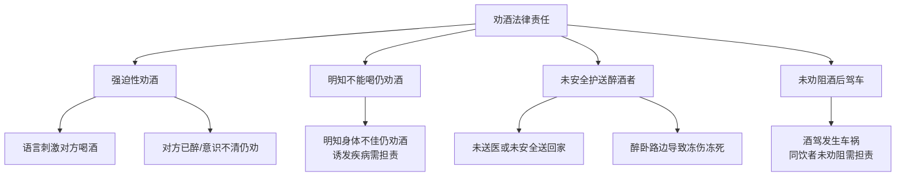

# 补充课01：盘点过年期间容易中招的法律盲区

## Learning Objectives

- 识别春节消费中的常见陷阱与应对方法
- 掌握劝酒行为的法律责任边界
- 了解微信红包和个人信息保护要点
- 了解烟花爆竹燃放、压岁钱归属等常见争议的法律规则

---

## 一、春节消费避坑指南

### 1.1 保留消费凭证

> 到超市购买商品，务必保留电脑小票。万一出现质量问题，这是最重要的凭证。

### 1.2 "最终解释权归商家"无效

> 商家促销活动中声明"本次活动最终解释权归商家所有"，该声明没有法律效力。

- 对民商事交易行为，只有**法律**才有最终解释权
- 对商家出具的格式条款，法律将做出**对消费者有利的解释**

### 1.3 禁止自带酒水 / 招牌菜不许打包

> 这些声明和规定侵犯了消费者的消费自由。

- 消费者有权选择在何处消费
- 对于已付费的商品，消费者有权自行处置

---

## 二、春节聚餐与劝酒法律责任

### 四种需要承担法律责任的劝酒情形

> [!warning] 以下四种劝酒行为需承担法律责任
>
> 1. **强迫性劝酒**：用语言刺激对方喝酒，或对方已醉、意识不清时仍劝酒
> 2. **明知不能喝仍劝酒**：明知对方身体不佳，仍劝其饮酒导致疾病发作
> 3. **未安全护送醉酒者**：未将醉酒者送医或安全送回家，导致冻伤、冻死等意外
> 4. **未劝阻酒后驾车**：同饮者未劝阻酒驾导致车祸等损害

---

## 三、微信红包与个人信息保护

### 红包规则

- 微信拜年发红包需遵守平台规则
- 注意保护个人信息不泄露
- 警惕以红包为名的信息收集陷阱

### 春节期间的网络安全

> [!tip]
> - 不点击不明链接的"红包"
> - 不参与要求填写个人信息的"红包游戏"
> - 注意区分"拼手气红包"与钓鱼链接

---

## 四、其他春节常见法律问题

### 烟花爆竹

> [!note] 地方性法规差异性
> - 不同城市对烟花爆竹燃放有不同规定，需查询当地禁放/限放政策
> - 违反规定燃放可能面临行政处罚
> - 因燃放烟花爆竹造成他人损害的，依法承担侵权责任

### 压岁钱归属

- 压岁钱在法律上属于**赠与行为**
- 一旦交付给未成年人，原则上属于未成年人个人财产
- 父母作为监护人，可以代为保管，但不得随意处分（民法典第35条）
- 大额压岁钱应遵循"最有利于被监护人"原则使用

### 春运途中纠纷

| 场景 | 法律要点 |
|------|----------|
| 火车/飞机延误 | 承运人负有及时告知、安排改签或退票的义务 |
| 行李丢失/损坏 | 可要求承运人赔偿 |
| 旅客人身损害 | 承运人承担严格责任（除非证明是旅客自身健康原因或故意/重大过失） |
| 倒卖车票 | 属于违法行为，情节严重的可构成犯罪 |

---

## 知识图谱

- [[lessons/s02-consumer-protection|补充课02：常见消费避坑事例和维权指南]] → 消费者权益保护的延伸
- [[lessons/0012-privacy-protection|第11课：个人信息被贩卖、被盗用该怎么办？]] → 个人信息保护
- 相关法律：民法典第35条（监护人职责）、第1198条（安全保障义务）、第1245条（动物侵权）

---

> 笔记来源：补充课01 春节法律盲区
> 核心观点：春节期间的法律风险集中在消费陷阱、劝酒担责、烟花爆竹、压岁钱归属四大领域，事前预防远优于事后补救